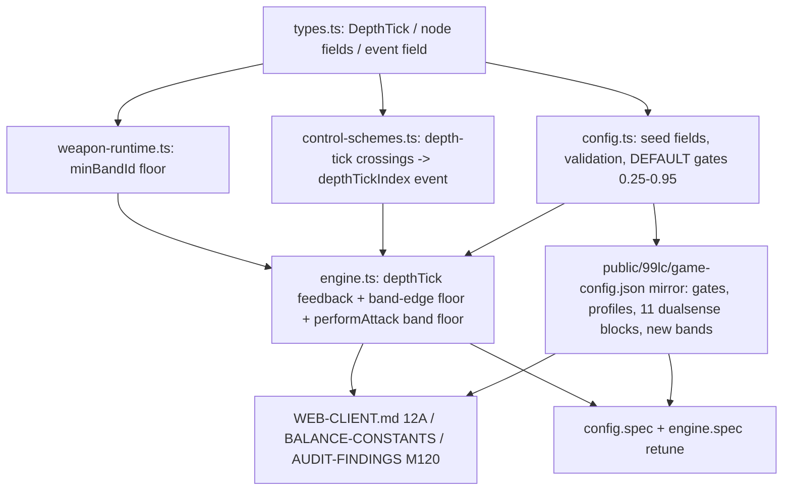

# 99LC DualSense: four-gate trigger ladder, charge rumble, push-through cues

> **SUPERSEDED by `dual-sense.md`** (2026-07-25). Do not implement from this file — its anchors predate stamina, the sword rhythm/fatigue rework, spear-v2 and «Клык Уробороса». Its fixed scope decisions were carried over into `dual-sense.md`.

## Context

The 99 Last Chances mini-game (`Web/VueClient/src/features/last-chances/`) already has one DualSense pass: discrete gate ticks, pulse-count charge bands, per-weapon commit patterns, persistent trigger detents, spider wriggle. What it lacks is *a ladder the hand can count*. Gates sit at irregular `0.22/0.48/0.72/0.90`, most weapons fire only 2–3 distinct trigger actions, holding at a gate teaches nothing about what will fire, and there is no cue inviting a "push all the way through" finisher.

This change gives every weapon the same four-rung grammar — **25% / 50% / 75% / 95%** — where each rung fires a real action, holding at a rung rumbles what you will get, a distinct cue invites the push-through, and per-weapon sub-gate texture ticks give each weapon its own feel under the finger.

User-fixed scope (do not revisit): **depth selects charge band** (weapons short on gestures route the same gesture at several rungs with an escalating band floor, no invented attacks); **no perfect-release timing window** (bands stay monotonic; "release correctly" = release in the band the rumble names); **sub-gate ticks are pure per-weapon texture**, no gameplay meaning.

## What was verified against the code (and two corrections)

All load-bearing anchors in the original draft check out:

| Claim | Verified at |
|---|---|
| `resolveLastChancesChargedAttack` picks band via sorted `.filter(minMs).at(-1)` | `weapon-runtime.ts:44-47` |
| Charge guard refuses uncharged-band attacks | `engine.ts:2915` (`if (sourceAttack.charge && !charged.band) return`) |
| Band-edge rumble block (currently 3 profiles, pattern length `bandIndex+1`) | `engine.ts:3782-3810` |
| `requiredChargeBandId` resolves against **`hold.charge.bands`** in *two* places | `engine.ts:2318` **and** `engine.ts:5896` |
| Node id derived `id: node.gesture`; `next`/filter key on gesture name | `config.ts:702-705` |
| Enabled gesture routed **exactly once** | `config.ts:2435` |
| activation `0.22`, release `0.16`, hysteresis `0.06`, gates `0.22/0.48/0.72/0.90` | `config.ts:192-208` |
| `armTriggerDetent` re-arm path | `engine.ts:886` |

**Correction 1 — phantom doc file.** `plans/99lc/control-scheme-test.md` **does not exist** (there is no `plans/99lc/` directory; only `plans/empires-endgame/`). Drop that documentation task entirely; fold anything worth keeping into `docs/WEB-CLIENT.md` §12A, which is the real home for this subsystem's spec.

**Correction 2 — the readiness pre-check has TWO sites.** `requiredChargeBandId` is looked up at both `engine.ts:2318` (input/arming) and `engine.ts:5896` (readiness). The `chargeBandOverrideId` floor must be threaded through *both* or a depth rung on a charged attack is refused. The draft mentioned one pre-check; there are two.

## Data / control flow of the change



Edit order follows the arrows: **types → (weapon-runtime, control-schemes, config) → engine → json → docs/specs.**

## The ladder

Gate positions become `shallow 0.25 / medium 0.50 / deep 0.75 / final 0.95`, activation `0.25`. Release stays `0.16`, hysteresis `0.06` (`0.25 − 0.16 = 0.09 ≥ 0.06`, still valid). `0.95` (not `1.00`) leaves margin on worn triggers and keeps `startPosition ≤ endPosition` overrides authorable. Every one of the 11 attack-set blocks gets four rungs, each dispatching a real action; where a weapon lacks four distinct gestures, deeper rungs repeat a gesture with a higher band floor.

## New types (`types.ts`)

```ts
/** Positional haptic ruler tick; fires once per pull when the press crosses position (rising only). */
export interface LastChancesDepthTickDefinition {
  position: number
  tick: LastChancesGateTickDefinition
}
```
- `LastChancesWeaponHapticsDefinition` (`types.ts:382-391`) gains `depthTicks?: LastChancesDepthTickDefinition[]`.
- `LastChancesDualSenseComboNodeDefinition` (`types.ts:334-354`) gains `chargeBandOverrideId?: string`, `armedCue?: LastChancesFeedbackPulseDefinition[]`, `armedTriggerOverride?: Partial<LastChancesAdaptiveTriggerProfileDefinition>`.
- `LastChancesSemanticInputEvent` (`control-schemes.ts:16-40`) gains `depthTickIndex?: number` (feedback-only).

All fields optional → **no schemaVersion bump** (v4 stays).

## Steps

**1. `types.ts`** — add the three definitions above.

**2. `weapon-runtime.ts` — depth-floored band resolution.** `resolveLastChancesChargedAttack` (`:36-62`) gains an optional third param `minBandId?: string`. After the `.at(-1)` selection (`:44-47`), if `minBandId` names a band in the sorted list, take whichever of the two sits **later** in that sorted list. Multipliers/`overrides` downstream unchanged.

**3. `control-schemes.ts` — depth-tick crossings.** In `updateTrigger` (`:428`), capture `previous = state.value` before the assignment (`:437`). After the `if (!state.active) return` guard (`:472`), walk `controls?.dualsense.haptics?.depthTicks` and emit a `commit:false` event carrying `depthTickIndex` for every tick where `previous < position && normalized >= position` (rising edge only). Both gamepad polling and keyboard emulation funnel through here, so one path covers both.

**4. `engine.ts` — feedback + band wiring.**
- `handleSemanticInput` (`:2295`): first branch inside the dualsense block — if `event.depthTickIndex !== undefined`, emit `{state:'charge', profile:'click', hand, tick}` from the authored depth tick and return. `click` priority (20) is evicted by a same-frame `gate`(50)/`followUp`(55) tick; off/reduced modes filter it in the controller.
- Band-edge block (`:3782-3810`): resolve the active node and its armed `next` branch. Compute `bandIndex` as the **later of** the hold-time `activeBand` and the active node's `chargeBandOverrideId`. If the armed branch authors `armedCue`, play it instead of the generated pulse array; if it authors `armedTriggerOverride`, re-arm the detent via `armTriggerDetent` (`:886`) so the wall opens. Keep the existing `bandLight/bandMedium/bandStrong` profile map (≥2 → strong covers rung 3/4).
- Thread the active node's `chargeBandOverrideId` into `performAttack`'s band resolution so **both** readiness sites (`:2318` and `:5896`) and the real resolution (`:2915`, via the new `minBandId` param) floor the band identically.

**5. `config.ts` — builder, validation, defaults.**
- `AttackSetControlSeed`/`dualSenseNode` (`:220-265`): accept an optional explicit `id` plus the three new node fields.
- `buildAttackSetControls` (`:701-707`): use `node.id ?? node.gesture`; filter `next` against the set of surviving **node ids** (currently filters by gesture name, `:702-706`).
- Relax `config.ts:2435` from exactly-once to **at least once** for enabled gestures (disabled stay at zero). Leave the mylorik exactly-once check (`:2319`) untouched. Graph acyclicity/reachability/branch-ambiguity checks key on `entryContext|activationThreshold`, so repeated gestures at distinct rungs pass unchanged.
- Validate the new fields: `depthTicks` (1–8 entries, unit positions strictly increasing, `tick` via `validateGateTick`); `chargeBandOverrideId` against **the node's own gesture's** bands (new lookup alongside the existing hold-band lookup near `:2318`); `armedCue` like `commitPattern`; `armedTriggerOverride` via `validateAdaptiveProfile(..., partial=true)`. `armedCue`/`armedTriggerOverride` are **errors without `requiredChargeBandId`**.
- `DEFAULT_DUALSENSE_INPUT` (`:191-217`): activation `0.25`, gates `0.25/0.50/0.75/0.95`.
- `DEFAULT_ADAPTIVE_PROFILES` (`:85-176`): move gate-anchored starts — `gate` `0.48→0.50` / end `0.78→0.80`; `ramp` start `0.22→0.25`.
- Apply the authoring table (below) to `ATTACK_SET_CONTROL_SEEDS` (`:267-687`).

**6. `public/99lc/game-config.json` — mirror everything.** Input thresholds + gate positions, the two profile retunes, all 11 `controls.*.dualsense` blocks (node ids, thresholds, `adaptiveOverride` positions, `chargeBandOverrideId`, `armedCue`, `armedTriggerOverride`, `depthTicks`), and the new charge bands below.

> **Correctness rule for every new `charge` block:** it must include a base band at `minMs: 0` with neutral (omitted) multipliers. Otherwise `engine.ts:2915` refuses the attack for legacy and mylorik players, who never touch a gate. This is the one genuine correctness risk in the change.

## Per-weapon authoring

Rungs are `0.25 / 0.50 / 0.75 / 0.95`. "floor X" = `chargeBandOverrideId: 'X'`. Existing personalities preserved and sharpened.

| Set | 25% | 50% | 75% | 95% | Depth ticks |
|---|---|---|---|---|---|
| **spear:primary** — lance gearbox | `hold` замах, floor `early` | `hold` замах, floor `middle` | `doubleTapHold` ram, floor `ram-short` | `holdThenDoubleTap` spin (press), requires `middle`, floor `spin-middle`, **armedCue** | .85, .90 approach |
| **spear:secondary** — pole brace | `hold` stance (channel) | `doubleTapHold` kick, floor `brace` | `doubleTapHold` kick, floor `kick` | `holdThenDoubleTap` vault (stance ctx) | .85 pole-plant |
| **chain:primary** — tension spool | `hold` hook, floor `hook-near` (channel, silent) | `doubleTap` spin (press) | `doubleTapHold` throw, floor `wrap` (spin ctx) | `holdThenDoubleTap` bind (press, tether ctx) | .35/.45/.60/.85 spool links |
| **claws:primary** — predator spring | `doubleTap` rend | `hold` dash, floor `claw-dash-short` | `doubleTapHold` disarm | `holdThenDoubleTap` deep strike (press, dash ctx) | none (crisp identity) |
| **spider-knife:primary** — ratcheting impale | `doubleTap` impale | `hold` flurry (channel) | `holdThenDoubleTap` twist (flurry ctx) | `doubleTapHold` throw, floor `spider-throw-ready` | .35/.45/.60/.85/.90 ratchet |
| **axe:primary** — grapple lever | `doubleTap` grapple (press) | `doubleTapHold` throw, floor `axe-aim` (grapple ctx) | `doubleTapHold` throw, floor `axe-heave` | `doubleTapHold` throw, floor **`axe-max`** *(new band)* | .90 near-lock warning |
| **axe:secondary** — flywheel | `hold` spin (press, channel) | `holdThenDoubleTap` leap, floor `axe-leap-near` (spin ctx) | `holdThenDoubleTap` leap, floor `axe-leap-far` | `holdThenDoubleTap` leap, floor **`axe-leap-max`** *(new band)* | .60, .85 flywheel notches |
| **katana:primary** — draw-and-flow rail | `doubleTap` overhead | `hold` charge, floor `katana-charge` | `doubleTapHold` flurry (continuation) | `holdThenDoubleTap` dance (press), requires `katana-charge`, **armedCue** | none (smooth rail) |
| **katana:secondary** | `doubleTap` hop | `hold` iaido, floor `iaido-ready` | `doubleTapHold` hop-slash (continuation) | `holdThenDoubleTap` flash (press), requires `iaido-ready`, **armedCue** | none |
| **sword:primary** — opening breaker | `doubleTap` Oberhau, floor **`ober-light`** | `doubleTap` Oberhau, floor **`ober-solid`** | `doubleTapHold` Unterhau, floor **`unter-solid`** | `doubleTapHold` Unterhau, floor **`unter-breaker`** | .60, .88 climb to the wall |
| **sword:secondary** | `doubleTap` opening, floor **`open-light`** | `doubleTap` opening, floor **`open-solid`** | `doubleTapHold` follow-up, floor **`follow-solid`** | `doubleTapHold` follow-up, floor **`follow-breaker`** | .60, .88 |

**New charge bands to author** (each with a `minMs: 0` neutral base band per the correctness rule):
- `twohand-axe` `doubleTapHold`: add `axe-max` after `axe-heave`.
- `twohand-axe` secondary `holdThenDoubleTap`: add `axe-leap-max` after `axe-leap-far`.
- `hybrid-sword` `doubleTap`: new charge — `ober-light` (0 ms, neutral), `ober-solid` (500 ms).
- `hybrid-sword` `doubleTapHold`: new charge — `unter-solid` (0 ms, neutral), `unter-breaker` (550 ms).
- `hybrid-sword` secondary `doubleTap` / `doubleTapHold`: mirror as `open-*` / `follow-*`.

Damage/range multipliers for new bands follow the existing per-weapon escalation shape (~+25–35% per rung); tune against neighbouring weapons in `BALANCE-CONSTANTS.md`, don't invent a new curve. Sword has **no** charge bands today and Axe:secondary `doubleTap`/`doubleTapHold` are disabled — those sets need bands authored before depth can select them. Existing per-weapon `baseTrigger`/`gateTick`/`bandTick`/`commitPattern`/`wriggle` carry over unchanged except where a rung moves (`adaptiveOverride` positions shift with their gate). Spear gains a `bandTick` so its gearbox climb is countable.

## Documentation (same change-set, per CLAUDE.md)

- **`docs/WEB-CLIENT.md` §12A** (paragraphs are the numbered lines): line 194 (four-rung ladder + depth-selected bands), 216 (activation 0.25), 218 (grammar — depth-tick ruler, armed cue, band count reflects the depth floor; keep the "rumble is never continuous" rule), 220 (`armedTriggerOverride` joins the moving-detent description), 222 (Builder raw-JSON field list + new gate values). **Also fold in** the tactile-grammar / state-machine / routing content the draft aimed at the phantom `control-scheme-test.md` — §12A is its real home.
- **`docs/BALANCE-CONSTANTS.md`**: update row 78 to activation 0.25 / release 0.16 / hysteresis 0.06 / gates 0.25–0.95; retune rows 80–82 (gate start/end, ramp start) to the new anchors; add rows for depth ticks and depth-floored bands; add the new charge bands to affected per-weapon rows.
- **`docs/AUDIT-FINDINGS.md`**: add **M120** — BALANCE row 78 drifted from shipped config during the previous rework (documented release 0.14 / hysteresis 0.08 vs shipped 0.16 / 0.06; profile ms/magnitudes in rows 80–82 likewise stale). Mark fixed in the same change-set.
- **Commit message → `docs/commit-messages/2026-07-19.md`** (add `-2`, `-3` if taken). **Do not commit or push** — the user commits.

## Specs (no new spec files, per the user)

Two existing files carry golden values the retune breaks; both are minimal in-place value edits:
- `config.spec.ts:32-230` — `EXPECTED_SHIPPED_CONTROL_ROUTES` golden strings encode thresholds + node counts; regenerate for the new ladder (verified: strings hard-code `0.22/0.48/0.72`).
- `engine.spec.ts` — literal trigger drives `0.22/0.48/0.72/0.9` → `0.25/0.50/0.75/0.95` (~38 sites, verified by count), plus the baseline-detent assertion at `:3465-3487`.

Unaffected: `control-schemes.spec.ts` (self-contained inline fixtures), `feedback.spec.ts`, the three `dualsense-*.spec.ts`, `gamepad`/`gestures`/`preferences`/`weapon-runtime` specs.

## Verification

1. `cd Web/VueClient && pnpm build` — the type gate (`pnpm type-check` is broken env-wide; `pnpm lint` for style).
2. `pnpm test:99lc` — green once the two spec files are retuned; any remaining failures should be confined to them.
3. `bash tools/verify-docs.sh --changed`.
4. Manual DualSense pass at `/99lc?qa=1&fixture=controls`, per weapon: four distinct press-release actions at the four rungs; holding a rung ticks 1/2/3 pulses matching the outcome that fires; spear/katana arm with a distinct cue, the detent softens, the push to 0.95 lands the finisher; depth ticks read as that weapon's texture (chain spool, axe ratchet, katana silence); Tier 1 (no WebHID) still telegraphs by rumble alone; reduced mode = blocked/impact only, off = full silence incl. wriggle; keyboard Q/E climb still reaches 0.95; **legacy and mylorik schemes play identically to before** (confirms the `minMs: 0` base-band rule).
5. `/99lc/dualsense-harness.html` for Tier-2 byte sanity if packets misbehave.

## Risks

- **Newly charged attacks leaking into legacy/mylorik** — the only real correctness risk; the `minMs: 0` neutral base band prevents it and the step-4 legacy/mylorik play-check confirms it.
- Relaxing exactly-once routing removes an orphan-guard; reachability + ambiguity checks still hold, and the "at least once" floor keeps the important half.
- 0.95 may be hard on worn triggers — Builder-tunable; fall back to 0.92 if hardware testing complains.
- Depth ticks near a gate could feel noisy — authored positions stay clear of gate values, and the priority queue drops them when a gate tick lands the same frame.
- Existing v4 browser overrides keep the old ladder until re-applied — pre-existing documented behavior, no migration.