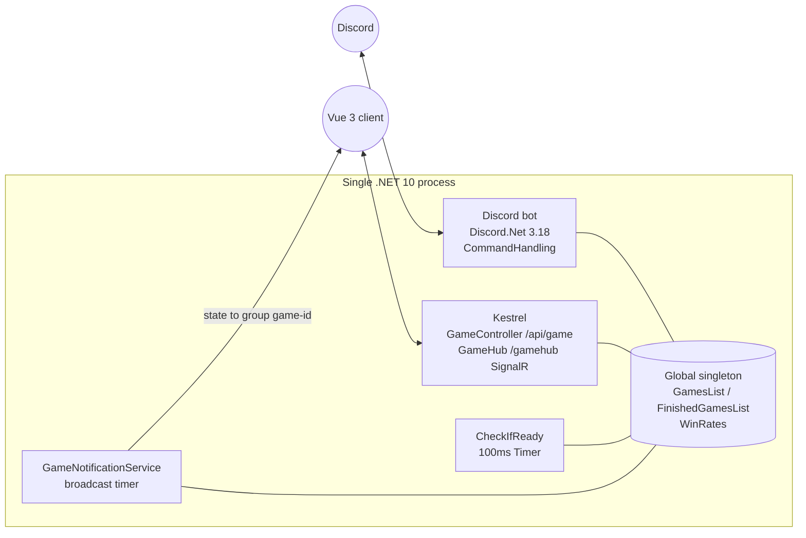
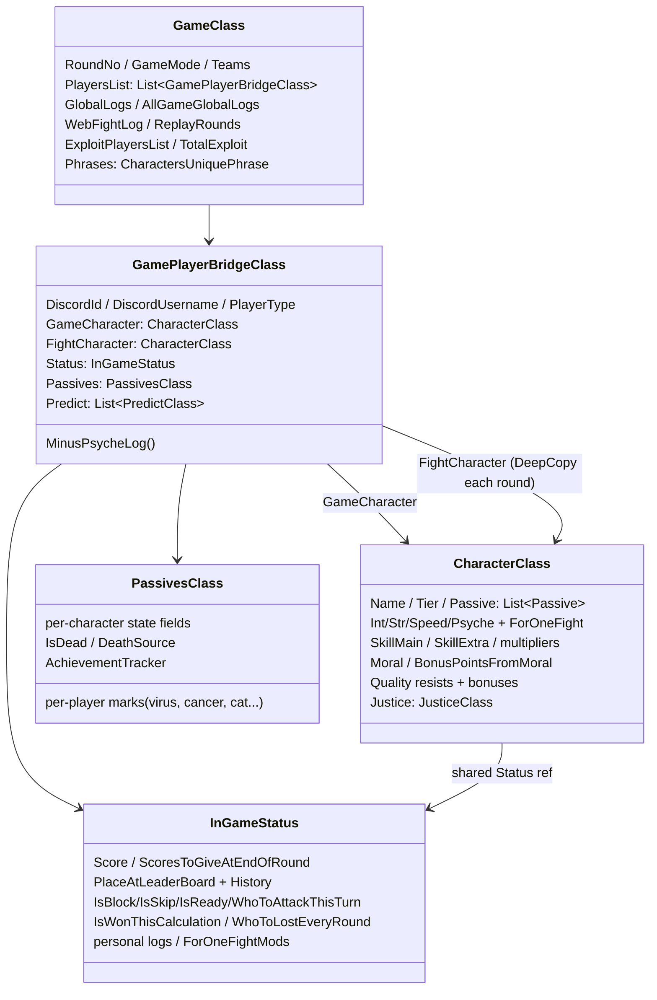

# King of the Garbage Hill — Architecture

> Code-verified against the working tree of 2026-07-01 (v4.1.8). Companion docs: [GAME-DESIGN.md](GAME-DESIGN.md), [CHARACTERS.md](CHARACTERS.md), [AUDIT-FINDINGS.md](AUDIT-FINDINGS.md).

## 1. Process topology

One process hosts both frontends:



- **Program.cs** starts the Discord bot thread and Kestrel in parallel; port via `KOTGH_PORT` (default 80).
- **Global.cs** holds the live `GamesList` — the single source of truth shared by both frontends. No database: accounts are flat JSON files (`DataBase/UserAccounts/discordAccount-{id}.json`) loaded into a `ConcurrentDictionary` at startup (`UsersDataStorage.cs`).
- **DI**: Lamar; anything implementing `IServiceSingleton`/`IServiceTransient` is auto-registered (`AddSingletonAutomatically`).
- **Game loop driver**: `CheckIfReady.LoopingTimer` ticks every 100 ms over all games (`CheckIfReady.cs:63-74, 917-943`), guarded by an interlocked re-entrancy latch and per-game `IsCheckIfReady` flag.
- **Web push**: `GameNotificationService` broadcasts mapped state to SignalR group `game-{gameId}`; `GameStateMapper` produces per-viewer DTOs (each player sees only what they should).
- Deploy: `deploy_to_prod` → build, tar, scp to EC2, systemd unit `kotgh`.

## 2. Core state model



### GameCharacter vs FightCharacter — the rule that breaks people

Each bridge holds **two** `CharacterClass` instances (`GamePlayerBridgeClass.cs:30-31`):

- **`GameCharacter`** — persistent truth. All lasting changes (`AddIntelligence`, `AddExtraSkill`, `AddMoral`…) go here.
- **`FightCharacter`** — snapshot taken **once per round** at the start of calculation (`DeepCopyGameCharacterToFightCharacter`, `DoomsdayMachine.cs:135-141, 235`). The fight engine (`CalculateRounds.cs`) reads **only** `FightCharacter`.

`DeepCopy` is `MemberwiseClone` + explicit deep-copy of the `Passive` list (`CharacterClass.cs:36-48`). Consequences:
- Value-type stats are independent per copy.
- **`Status` and `Justice` are intentionally the SAME instance** on both copies — Justice edits work from either side; anything reached through `Status` is shared.
- If you add a mutable reference field (List/Dictionary) to `CharacterClass`, you **must** add a deep-copy line, or both copies will share it.

**ForOneFight overrides** (sentinel `-228`): `SetIntelligenceForOneFight`, `SetStrengthForOneFight`, `SetSpeedForOneFight` (+`AddSpeedForOneFight` delta), `SetPsycheForOneFight`, `SetSkillForOneFight`, `SetJusticeForOneFight`. Each records a `ForOneFightMod` (for the web fight animation) and raises a flag on shared `Status`; `ResetFight` clears the override on **both** copies after every single fight (`DoomsdayMachine.cs:79-123`).

Rules of thumb (violations are real bugs — see CLAUDE.md):
- ForOneFight overrides must be set on **FightCharacter** (CalculateRounds reads it). Justice is the one exception (shared).
- Stat *reads* inside before-fight handlers should use **FightCharacter** so earlier overrides are respected.
- Persistent changes go to **GameCharacter**; they take effect next round (or immediately for anything read from GameCharacter, e.g. skill gains land in the *current* fight only via the class-perk calls that use GameCharacter directly).

## 3. Passive hook execution order

All hooks live in `CharacterPassives.cs` (~6.9k lines) as `switch (passive.PassiveName)` dispatchers. Call sites verified:

| # | Hook | Called from | When / notes |
|---|---|---|---|
| 1 | `HandleEventsBeforeFirstRound` (63) | game creation / draft & ARAM confirm | initial marks, L assignment, stat rewrites |
| 2 | `HandleDefenseBeforeFight` (379) | fight loop, defender first (`DoomsdayMachine.cs:440`) | defensive ForOneFight overrides |
| 3 | `HandleAttackBeforeFight` (976) | fight loop, after defense (`:451`) | offensive overrides — sees defender's mods |
| 4 | block path | `:474-518` | attacker −1 bonus, defender justice, then hooks 8/9 for defender |
| 5 | skip path | `:527-560` | hook 9 for defender |
| 6 | `HandleDefenseAfterFight` (788) | after resolution (`:1078`) | defender-only reactions (counter effects) |
| 7 | `HandleAttackAfterFight` (1638) | `:1083` | attacker-only rewards/steals |
| 8 | `HandleDefenseAfterBlockOrFight` (708) | fight `:1079` + block `:512` | block-inclusive defensive effects |
| 9 | `HandleDefenseAfterBlockOrFightOrSkip` (771) | fight `:1080` + block `:513` + skip `:555` | always-trigger defensive effects |
| 10 | `HandleCharacterAfterFight` (2372) | both sides, all outcomes incl. own block/skip (`:402, 510-511, 553-554, 1086-1087`) | per-interaction cleanup/rewards |
| 11 | `HandleShark` (6668) | after each fight (`:1089`) | "Лежит на дне" neighbor check |
| 12 | `HandleEndOfRound` (3408) | once per round (`:1205`) | flags still set; round-end effects |
| 13 | `HandleNextRound` (4707) | after `RoundNo++` (`:1266`) | per-round setup, trigger rolls |
| 14 | `HandleNextRoundAfterSorting` (5842) | after sort/swaps/drops (`:1502`) | position-dependent effects |
| 15 | `HandleBotPredict` (6353) | `:1503` | bot prediction heuristics |

Special dispatchers outside the table: `HandleJews` (win-point stealing, `:6688`), `HandleOctopus` (defensive fake-loss, `:6767`), `HandleEventsBeforeCalculation` (PointFunnel, `DoomsdayMachine.cs:143`), plus per-character logic embedded in `CheckIfReady` (forced attacks, last-round scoring), `GameReactions` (level-up overrides), `BotsBehavior`, `GameUpdateMess` (leaderboard icons), `CharacterClass` (moral/harm interceptors), `InGameStatusClass` (PointFunnel), `GamePlayerBridgeClass` (psyche immunity).

**Passive-matching convention**: logic keys on **exact `PassiveName` strings** from `characters.json`; some places key on **character `Name`** instead. Both are stringly-typed — renames in JSON silently orphan code branches (this has happened; see AUDIT-FINDINGS C1, m1, m3 and D4).

## 4. Logging system

- **Personal logs** (`Status.AddInGamePersonalLogs`, auto-called by most stat mutators): visible to that player only. Stat methods log by default — pass `isLog: false` to suppress; do **not** double-log.
- **Global logs** (`game.AddGlobalLogs`): all players; per-round buffer is re-sorted at end of round (`SortGameLogs`) then reset. `HiddenGlobalLogSnippets`/`KiraHiddenLogSnippets` strip fight lines for non-admins per feature.
- **Phrases** (`Game/MemoryStorage/CharactersPhrases.cs`): `PhraseClass` objects with `.SendLog(player, delete)` / web variants; media via `WebMediaMessages` (audio/images, round-scoped).
- **FightingData** (`Status.AddFightingData`): verbose per-fight numeric trace (admin/debug view + web fight animation source).

## 5. Score plumbing

`InGameStatus.Score` is private; mutation paths:
- `AddRegularPoints` → round buffer → `CombineRoundScoreAndGameScore` multiplies (×1/×2/×4; Подсчет override) and commits (`InGameStatusClass.cs:193-300`).
- `AddWinPoints` = regular points + Баг PointFunnel redirect handling (`:172-191`).
- `AddBonusPoints` → immediate, floor-at-0 unless "Никому не нужен" (`:221-233`); `HardKittyMinus` bypasses the floor.
- `SetScoreToThisNumber` (Октопус restore etc.).
`ScoreEntries`/`PreviousRoundScoreEntries` feed the web score breakdown; `GetBonusPointsEarnedThisRound` feeds passives like Выгодная сделка.

## 6. Web layer (state → screen)

```
GameClass ──GameStateMapper.MapPlayer(viewer-specific)──▶ GameStateDto
   │                                                        ├─ PlayerDto (per player: stats*, marks, flags)
   │                                                        └─ PassiveAbilityStatesDto (owner widgets + "…OnMe" marks)
   └─GameNotificationService (timer) ─▶ SignalR group game-{id} ─▶ Vue store (Pinia) ─▶ PlayerCard/SkillsPanel/Game.vue
```

- Mapper keys widgets on **PassiveName** (`GameStateMapper.cs:347-738`) and a few on character Name; per-player marks (SellerMark, virus, cancer, cat, pawn, monster-type…) are mapped for the affected player after the switch (`:742-828`).
- Some character state rides directly on `PlayerDto` instead of `PassiveAbilityStatesDto`: DeathNote, PortalGun, ExploitState, TsukuyomiState, choice flags (Darksci/YoungGleb/Dopa).
- Frontend mirror: `signalr.ts` `PassiveAbilityStates` (camelCase 1:1), widgets in `PlayerCard.vue`, per-member skill UI in `SkillsPanel.vue` (TheBoys special-cased), sounds keyed by character name in `sound.ts`/`store/game.ts`.
- Web auth via Discord ID as string; web-only accounts via `RegisterWebAccount`. Spectate + Replay (`ReplayService` snapshots each round; final capture in `HandleLastRound`).
- **Turn actions** (`WebGameService.{Attack,Block,AutoMove,ConfirmSkip}`, exposed via `GameHub`/`GameController`) set `IsReady`/`ConfirmedSkip` — the web analogue of Discord's fight buttons. They enforce the level-up gate Discord gets for free from `MoveListPage 3` (which hides the fight controls until points are spent): `WebGameService.LevelUpGate` blocks all four while `LvlUpPoints > 0`, mirrored client-side by the `mustSpendLevelUp` store computed (`store/game.ts`) that disables the buttons and tightens `:can-attack` in `Game.vue` (finding M15). `LevelUp`/`ChangeMind` stay ungated so points can be spent / un-readied.

## 7. Per-character plumbing pattern (the "~14 files")

For character **X** with passive "P" (details per character in CHARACTERS.md):

1. `DataBase/characters.json` — name, stats, tier, avatar, passives (`PassiveName`/`PassiveDescription`/`Visible`/`Standalone`).
2. `Game/Characters/X.cs` — nested state classes (counters, cooldowns, trigger schedules). ⚠ file/class names don't always match the character (`Panth.cs`→class `Spartan`→"Загадочный Спартанец в маске", `Mitsuki.cs`→"Злой Школьник", `Shark.cs`→"Братишка"; `Баг` has no file).
3. `Game/Classes/PassivesClass.cs` — instances of those state classes per player; also per-player marks other characters put on you.
4. `Game/MemoryStorage/CharactersPhrases.cs` — `PhraseClass` fields + registration.
5. `Game/GameLogic/CharacterPassives.cs` — `case "P":` in the relevant hooks (§3).
6. `Game/GameLogic/DoomsdayMachine.cs` — only for core-fight-mechanics characters (block/skip conversions, fight injection, damage multipliers, position swaps).
7. `Game/GameLogic/CheckIfReady.cs` — forced attacks / turn-flow injection / last-round scoring.
8. `Game/ReactionHandling/GameReactions.cs` — level-up overrides (`GetLvlUp` and friends), moral-button overrides.
9. `Game/GameLogic/BotsBehavior.cs` — bot moral thresholds + action selection when a bot plays X.
10. `Game/DiscordMessages/GameUpdateMess.cs` — leaderboard icons/prefixes (`CustomLeaderBoardBeforeNumber`/`AfterPlayer`).
11. `API/DTOs/GameStateDto.cs` — `XStateDto` + member on `PassiveAbilityStatesDto` (or `PlayerDto`); per-player marks follow the `SellerMark` pattern.
12. `API/Services/GameStateMapper.cs` — `case "P":` in the widget switch; marks after it.
13. `Web/VueClient/src/services/signalr.ts` — TS interface mirror.
14. `Web/VueClient/src/components/PlayerCard.vue` (+`SkillsPanel.vue`, `sound.ts`) — widget/UI/audio.

## 8. File map (backend, sizes as of this tree)

| File | Lines | Role |
|---|---|---|
| `Game/GameLogic/CharacterPassives.cs` | 6874 | all passive hooks (§3 line map) |
| `Game/GameLogic/BotsBehavior.cs` | 2759 | bot AI + Nanobot preference model |
| `Game/GameLogic/DoomsdayMachine.cs` | 1559 | fight execution + round pipeline |
| `Game/GameLogic/CheckIfReady.cs` | 1382 | turn loop, forced actions, game end |
| `Game/GameLogic/CalculateRounds.cs` | 497 | pure fight math (3 steps) |
| `Game/GameLogic/StartGameLogic.cs` | 425 | rolls (normal/ARAM/draft), tiers |
| `Game/Classes/CharacterClass.cs` | 1751 | stats, skill, moral, justice, quality |
| `Game/Classes/InGameStatusClass.cs` | 426 | score, place, flags, personal logs |
| `Game/Classes/PassivesClass.cs` | 355 | per-player passive state container |
| `Game/Classes/GameClass.cs` | 170 | game container, exploit roll |
| `Game/Classes/GamePlayerBridgeClass.cs` | 140 | account↔player bridge, MinusPsycheLog |
| `Game/ReactionHandling/GameReactions.cs` | ~1300 | buttons: lvl-up, moral, predictions |
| `Game/DiscordMessages/GameUpdateMess.cs` | ~1700 | Discord rendering |
| `API/Services/GameStateMapper.cs` | ~1200 | web DTO mapping |

Legacy/dead code exists and is catalogued in AUDIT-FINDINGS (LolGod.cs, Saldorum.cs vs Salldorum.cs, `GameDesign.txt` future characters).

## 9. Conventions & pitfalls (verified)

- Namespaces `King_of_the_Garbage_Hill.*`; JSON CamelCase; mixed RU/EN comments; RU game-term strings are load-bearing identifiers.
- `Passive` has a 3-arg constructor + `Standalone` property (object-initializer style only for `Standalone`).
- No `AddJustice` — only `AddJusticeForNextRoundFromSkill/FromFight` (buffered) or `AddRealJusticeNow`/`SetRealJusticeNow` (immediate, rare).
- Psyche loss goes through `player.MinusPsycheLog(...)` (immunity + global log), never raw `AddPsyche(-N)` (exceptions: unique-logged effects like Дизмораль).
- Score: `AddBonusPoints` = immediate; `AddRegularPoints` = multiplied at round end; `GetScore()` = committed total (buffered regular points are *not* included mid-round).
- Round-10 nuance: `BonusPointsFromMoral` staged after the round-10 flush must be flushed manually (see CLAUDE.md).
- Transferred/copied passives (Goblin Ziggurat learns any `Standalone: true` passive; Котики cats carry Минька/Штормяк; mylorik's Акула transform) need their own immunity checks — the passive-name dispatch will happily run the case for the new holder.
- The `-228` sentinel means "not set" for every ForOneFight field; don't use −228 as a real value (there is a joke passive "Skill 228" that caps skill at 228 — unrelated).
- Randomness: the `SecureRandom` service is **not** cryptographic — it wraps plain `System.Random` (the crypto implementation is commented out, `Helpers/SecureRandom.cs:25-45`). Semantics: `Random(min,max)` is **inclusive** of max; `Luck(x)` ≈ x% ; `Luck(a,b)` ≈ a-in-b (internally rounded to a whole percent, rolled against 0–100). Ironically `PassivesClass` carries its own private copy that *does* use `RandomNumberGenerator` (`PassivesClass.cs:281-300`). A few places use `new Random()`/`Random.Shared` directly (trigger schedules, justice phrases, forced-target picks).

## 10. Simulation harness (headless bot games)

`dotnet run -- --sim …` (wrapper: `bash tools/simulate.sh`, default `--games 100 --coverage 1`) mass-runs all-bot games through the production loop with **no Discord login and no Kestrel** — the behavioral safety net for a repo without tests. 518 games take ~14s.

- **Entry**: `Program.cs:61` — after the Lamar container is built (the `CheckIfReady` 100ms timer is already running from its constructor), `--sim` branches into `SimulationRunner.RunAsync` and exits with its code; Discord login/Kestrel are never reached. `ClaudeHaikuService.Disabled` is set first (`Program.cs:63`) so sims never spend Anthropic API credits (Geralt hints fall back to static).
- **Game creation**: `CreateBotGameAsync` (`Game/Simulation/BotGameFactory.cs:14-19, 46`) — verbatim extraction of the old `*stb` loop body; the Discord command calls the same method now (`General.cs:98`). All-bot games self-advance one round per timer tick: zero humans → the ready-check never waits (`CheckIfReady.cs:946`).
- **Forced line-ups**: `forcedCharacters` on `HandleCharacterRoll` (`StartGameLogic.cs:55-56`) assigns characters by list order, bypassing the roll (`StartGameLogic.cs:131-152`). Needed because `CharacterToGiveNextTime` only works for non-null IUser slots (part #1 reservation, `StartGameLogic.cs:87-97`). The caller owns line-up constraints: LeCrisp/Толя never together, ≤1 Tier-4 per game, no `TeamModeOnly` (`StartGameLogic.cs:75-77`).
- **Modes** (flag parsing `Game/Simulation/SimulationRunner.cs:72-76`): smoke `--games N` = natural bot roll (tier-skewed — bots skip Tier<4 except Кира, so smoke alone does NOT cover all characters); coverage `--coverage K` = generated line-ups so every rollable non-team character appears ≥ K times (`SimulationRunner.cs:116`); matchup `--characters "6 comma-separated names"` = fixed line-up, validated (`SimulationRunner.cs:98`), for bug repros and testing a just-changed character. Smoke+coverage are additive; matchup replaces both.
- **Failure capture**: `Global.SimErrorSink` (`Global.cs:52`) receives every per-game exception from the loop's catch (`CheckIfReady.cs:1359`). The Discord error-report inside that catch is now wrapped in its own try/catch — previously it NRE'd whenever the client wasn't connected, escaping the `async void` timer handler. **Every other service-channel debug send in the hot path now goes through the null-safe `Global.TrySendServiceMessage` (`Global.cs:54`)** — before M13 the un-propagated siblings (`BotsBehavior.cs:2484/2497`, its `HandleBotAttack` catch, `CheckIfReady.cs:1261`) still NRE'd in headless mode; the 1261 one aborted round resolution and *froze* the game (~1/1000), while the `HandleBotAttack` catch masked the real exception (M14's IndexOutOfRange) — so that catch now logs + feeds `SimErrorSink` **before** the (guarded) send. Watchdog (`SimulationRunner.cs:25-26`): a game with no round progress for 30s is recorded as stuck (frozen games = `IsCheckIfReady` left false after a mid-calculation throw, `CheckIfReady.cs:1083`) and removed so the batch completes; no progress on *any* game for 60s (a hung round-calc pins the single timer thread) or the `--timeout-min` cap (`SimulationRunner.cs:74`) aborts the batch.
- **Report**: JSON to `DataBase/Simulations/sim-<timestamp>.json` (gitignored) — per-game outcomes (characters, scores, places, deaths, rounds), per-character top1–6/winrate/avg score/avg place, errors with stack + line-up, stuck games. Exit codes: **0** clean, **1** errors and/or stuck games (each is a finding — triage via `/fix-finding`), **2** harness failure (bad args, missing config).
- **Data isolation**: the wrapper runs from the project dir, so relative DataBase/* paths resolve to the *source* tree — sims read the **current** `characters.json` (the bin/Debug copy goes stale: only blackjack_words.json and wwwroot have csproj copy rules) and sim bot accounts live in the project-level DataBase/UserAccounts, never touching real account files under bin/. Bot accounts (ids ≤ 1 000 000, auto-created by `GetAccount`, `UserAccounts.cs:78-84`) are reset at sim start (`SimulationRunner.cs:136`) for comparable runs; short runs persist nothing (accounts flush on a 60s timer, `UserAccounts.cs:110-121`).
- **Large sweeps**: `bash tools/sweep.sh [total] [batch]` (default 100 000 × 1 000, ~1 h) runs simulate.sh in batches and merges the reports into one winrate table (`merged.json`). Each batch runs `--coverage ${KOTGH_SWEEP_COVERAGE:-1}` so every rollable non-team character appears (smoke alone covers only ~22 of 36 — bots skip Tier<4 except Кира); set `KOTGH_SWEEP_COVERAGE=0` for the old smoke-only sweep. Coverage games are forced line-ups, so the merged table reads as bot-meta for Tier≥4 and as forced-matchup rough signal for Tier<4. Batching is mandatory at that scale — all games of one process run concurrently, so past ~10k live games the single timer thread's tick time trips the 30s stuck-watchdog and `GetFreeBot` mints 6 bot accounts per live game for the 60s account flush to write out.
- **Caveats**: don't run a sim while a dev server shares the same `DataBase/` (JSON file races); winrate tables are bot-meta statistics (heuristic bots, tier-skewed smoke rolls) — use them for *drift* detection at N ≥ several hundred games, not as human-meta balance truth. RNG is not seeded (golden replays are a planned follow-up; see `_New-Task`).
