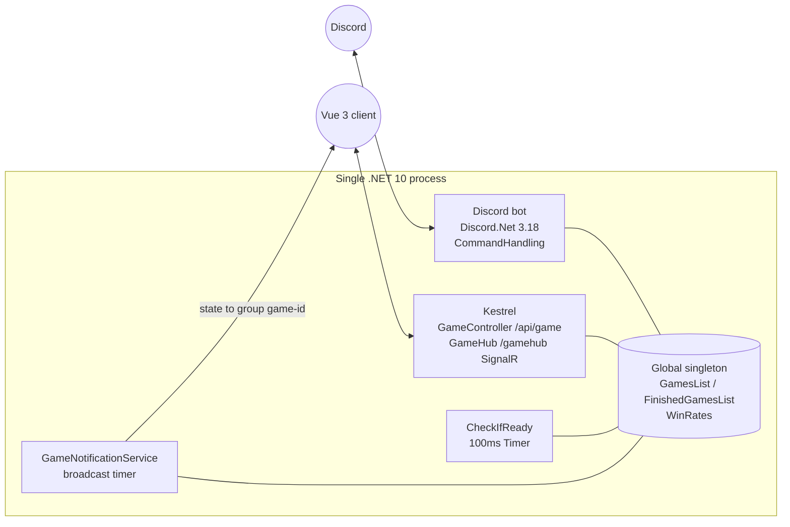
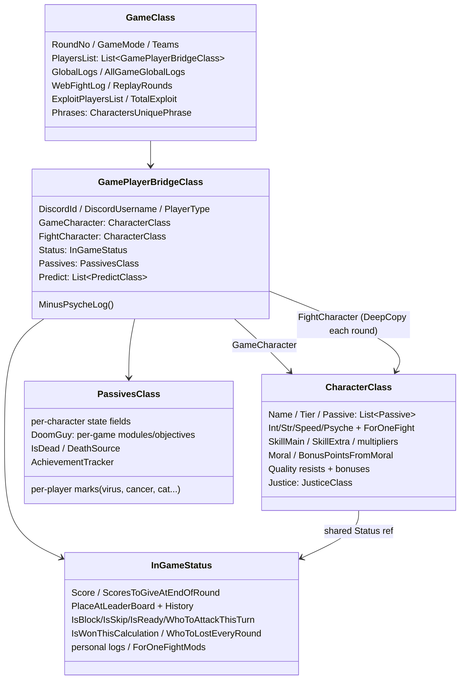

# King of the Garbage Hill — Architecture

> Code-verified against the working tree of 2026-07-12 (v4.3.37). Companion docs: [GAME-DESIGN.md](GAME-DESIGN.md), [CHARACTERS.md](CHARACTERS.md), [AUDIT-FINDINGS.md](AUDIT-FINDINGS.md); account progression: [DAILY-QUESTS.md](DAILY-QUESTS.md), [ACHIEVEMENTS.md](ACHIEVEMENTS.md); interface deep-dives: [WEB-BACKEND.md](WEB-BACKEND.md), [WEB-CLIENT.md](WEB-CLIENT.md), [DISCORD-INTERFACE.md](DISCORD-INTERFACE.md).

## 1. Process topology

One process hosts both frontends:



- **Program.cs** starts the Discord bot thread and Kestrel in parallel; port via `KOTGH_PORT` (default 80).
- **Global.cs** holds the live `GamesList` — the single source of truth shared by both frontends. No database: accounts are flat JSON files (`DataBase/UserAccounts/discordAccount-{id}.json`) loaded into a `ConcurrentDictionary` at startup (`UsersDataStorage.cs`).
- **DI**: Lamar; anything implementing `IServiceSingleton`/`IServiceTransient` is auto-registered (`AddSingletonAutomatically`).
- **Game loop driver**: `CheckIfReady.LoopingTimer` ticks every 100 ms over all games (`CheckIfReady.cs:63-74, 917-943`), guarded by an interlocked re-entrancy latch and per-game `IsCheckIfReady` flag.
- **Web push**: `GameNotificationService` broadcasts mapped state to SignalR group `game-{gameId}`; `GameStateMapper` produces per-viewer DTOs (each player sees only what they should).
- Deploy: `deploy_to_prod` → build, tar, scp to EC2, systemd unit `kotgh`.

## 2. Core state model



### GameCharacter vs FightCharacter — the rule that breaks people

Each bridge holds **two** `CharacterClass` instances (`GamePlayerBridgeClass.cs:30-31`):

- **`GameCharacter`** — persistent truth. All lasting changes (`AddIntelligence`, `AddExtraSkill`, `AddMoral`…) go here.
- **`FightCharacter`** — snapshot taken **once per round** at the start of calculation (`DeepCopyGameCharacterToFightCharacter`, `DoomsdayMachine.cs:135-141,243`). The fight engine (`CalculateRounds.cs`) reads **only** `FightCharacter`.

`DeepCopy` is `MemberwiseClone` + explicit deep-copy of the `Passive` list (`CharacterClass.cs:36-48`). Consequences:
- Value-type stats are independent per copy.
- **`Status` and `Justice` are intentionally the SAME instance** on both copies — Justice edits work from either side; anything reached through `Status` is shared.
- If you add a mutable reference field (List/Dictionary) to `CharacterClass`, you **must** add a deep-copy line, or both copies will share it.

Reward state deliberately follows the same lifetime split. `PassivesClass.AchievementTracker` is per-match and JSON-ignored; Daily Quests read its character-neutral observations only at settlement. `DiscordAccountClass.Achievements`, `Quests`, `PendingLootBoxes` and ZBS are persistent account state (`PassivesClass.cs:155-165`; `DiscordAccountClass.cs:29-43`; quest facts `QuestClass.cs:358-412`). The final payout attaches the persistent `AchievementData` reference to the player only so the personalized finished-game mapper can carry that account's unacknowledged unlocks (`CheckIfReady.cs:717-754`; `GameStateMapper.cs:174-209`).

**ForOneFight overrides** (sentinel `-228`): `SetIntelligenceForOneFight`, `SetStrengthForOneFight`, `SetSpeedForOneFight` (+`AddSpeedForOneFight` delta), `SetPsycheForOneFight`, `SetSkillForOneFight`, `SetJusticeForOneFight`. Each records a `ForOneFightMod` (for the web fight animation) and raises a flag on shared `Status`; `ResetFight` clears the override on **both** copies after every single fight (`DoomsdayMachine.cs:79-123`).

Rules of thumb (violations are real bugs — see CLAUDE.md):
- ForOneFight overrides must be set on **FightCharacter** (CalculateRounds reads it). Justice is the one exception (shared).
- Stat *reads* inside before-fight handlers should use **FightCharacter** so earlier overrides are respected.
- Persistent changes go to **GameCharacter**; they take effect next round (or immediately for anything read from GameCharacter, e.g. skill gains land in the *current* fight only via the class-perk calls that use GameCharacter directly).

## 3. Passive hook execution order

All hooks live in `CharacterPassives.cs` (~7.3k lines) as `switch (passive.PassiveName)` dispatchers. Call sites verified:

| # | Hook | Called from | When / notes |
|---|---|---|---|
| 1 | `HandleEventsBeforeFirstRound` (112) | game creation / draft & ARAM confirm | initial marks, L assignment, stat rewrites |
| 2 | `HandleDefenseBeforeFight` (463) | fight loop, defender first (`DoomsdayMachine.cs:547`) | defensive ForOneFight overrides |
| 3 | `HandleAttackBeforeFight` (1067) | fight loop, after defense (`DoomsdayMachine.cs:558`) | offensive overrides — sees defender's mods |
| 4 | block path | `DoomsdayMachine.cs:594-668` | attacker −1 bonus, defender justice, then hooks 8/9 for defender |
| 5 | skip path | `DoomsdayMachine.cs:672-711` | hook 9 for defender |
| 6 | `HandleDefenseAfterFight` (908) | after resolution (`DoomsdayMachine.cs:1345`) | defender-only reactions (counter effects) |
| 7 | `HandleAttackAfterFight` (1764) | `DoomsdayMachine.cs:1350` | attacker-only rewards/steals |
| 8 | `HandleDefenseAfterBlockOrFight` (808) | fight `DoomsdayMachine.cs:1346` + block `DoomsdayMachine.cs:663` | block-inclusive defensive effects |
| 9 | `HandleDefenseAfterBlockOrFightOrSkip` (891) | fight `DoomsdayMachine.cs:1347` + block `DoomsdayMachine.cs:664` + skip `DoomsdayMachine.cs:707` | always-trigger defensive effects |
| 10 | `HandleCharacterAfterFight` (2465) | both sides, all outcomes incl. own block/skip (`DoomsdayMachine.cs:442,661-662,705-706,1353-1354`) | per-interaction cleanup/rewards |
| 11 | `HandleShark` (7205) | after each fight (`DoomsdayMachine.cs:1356`) | "Лежит на дне" neighbor check |
| 12 | `HandleEndOfRound` (3715) | once per round (`DoomsdayMachine.cs:1566`) | flags still set; round-end effects |
| 13 | `HandleNextRound` (5077) | after `RoundNo++` (`DoomsdayMachine.cs:1622-1635`) | per-round setup, trigger rolls |
| 14 | `HandleNextRoundAfterSorting` (6341) | after sort/swaps/drops (`DoomsdayMachine.cs:1875-1878`) | position-dependent effects |
| 15 | `HandleBotPredict` (6868) | `DoomsdayMachine.cs:1886` | bot prediction heuristics |

Special dispatchers outside the table include `HandleJews`, `HandleOctopus`, PointFunnel's `HandleEventsBeforeCalculation`, and `HandleRumblingAfterFights`. Naruto adds an explicit cross-pipeline coordinator rather than duplicating four passive cases: `InitializeTeam` runs before the first passive hook; `ResolveHaremQueues`/`TryCancelHaremFights` operate on finalized and dynamically expanded target queues; `SnapshotJustice` feeds per-fight Расенган; and `SettleShadowClones` is called immediately after Rumbling as the second post-fight settlement (`Naruto.cs`; `DoomsdayMachine.cs:381-388`; `DoomsdayMachine.cs:490-545`; `DoomsdayMachine.cs:1508-1510`). Further per-character logic is embedded in `CheckIfReady`, `GameReactions`, `BotsBehavior`, `GameUpdateMess`, `CharacterClass`, `InGameStatusClass` and `GamePlayerBridgeClass`.

Salldorum also has a readiness-stage coordinator: unless Вечное Цукуеми already erased the action, `Salldorum.ResolveShenDashes` consumes the next real attack, mutates the live order, assigns places, arms the current-round random-target magnet and injects the below-position pull. Madara/Naruto sanitation is then repeated over that newly changed queue before Madara's incoming-attacker re-snapshot. A same-cell aged cola pickup is queued in passive state; its +5 Speed is applied to `FightCharacter` by the ordinary defense/attack-before hooks after DeepCopy (`CheckIfReady.cs:1433-1454`; `Salldorum.cs` `FindRandomTargetMagnet`; `CharacterPassives.cs` before-fight hooks).

**Passive-matching convention**: logic keys on **exact `PassiveName` strings** from `characters.json`; some places key on **character `Name`** instead. Both are stringly-typed — renames in JSON silently orphan code branches (this has happened; see AUDIT-FINDINGS C1, m1, m3 and D4).

## 4. Logging system

- **Personal logs** (`Status.AddInGamePersonalLogs`, auto-called by most stat mutators): visible to that player only. Stat methods log by default — pass `isLog: false` to suppress; do **not** double-log.
- **Global logs** (`game.AddGlobalLogs`): all players; per-round buffer is re-sorted at end of round (`SortGameLogs`) then reset. `HiddenGlobalLogSnippets`/`KiraHiddenLogSnippets` strip fight lines for non-admins per feature.
- **Phrases** (`Game/MemoryStorage/CharactersPhrases.cs`): `PhraseClass` objects with index-paired canonical `PassiveLogRus` and authored `PassiveLogEng` arrays loaded from `DataBase/phrases.en.json`. `.SendLog` stores both selected renderings in a replay-safe payload; media stores paired fields; consumed variants are removed from both arrays together (`Helpers/PhraseLocalization.cs`).
- **FightingData** (`Status.AddFightingData`): verbose per-fight numeric trace (admin/debug view + web fight animation source).

## 5. Score plumbing

`InGameStatus.Score` is private; mutation paths:
- `AddRegularPoints` → round buffer → `CombineRoundScoreAndGameScore` multiplies (×1/×2/×4; Подсчет override) and commits (`InGameStatusClass.cs` `AddRegularPoints`, `GetRoundScoreMultiplier`, `CombineRoundScoreAndGameScore`).
- `AddWinPoints` = regular points + Баг PointFunnel redirect handling (`:172-191`).
- `AddBonusPoints` → immediate, floor-at-0 unless "Никому не нужен" (`:221-233`); `HardKittyMinus` bypasses the floor.
- `SetScoreToThisNumber` (Октопус restore etc.).
`ScoreEntries`/`PreviousRoundScoreEntries` feed the web score breakdown; `GetBonusPointsEarnedThisRound` feeds passives like Выгодная сделка.

Naruto's clone settlement uses the same canonical `GetRoundScoreMultiplier` as ordinary round commit and Eren's projected Rumbling order. `DrainSettledScoreForTransfer` converts committed + pending clone score exactly once; `AddSettledScore` credits the original without exposing the historical pot as fresh Цукуеми earnings. After dispersal, `ResolveScoreSuccessor` redirects delayed liabilities (Saitama/Octopus/Mitsuki/virus/Tsukuyomi) to the original that inherited the pot, while later genuinely new clone rewards are suppressed and every sort reasserts zero-score/bottom-place death state (`InGameStatusClass.cs:246-322`; `Naruto.cs:313-429`).

## 6. Web layer (state → screen)

```
GameClass ──GameStateMapper.MapPlayer(viewer-specific)──▶ GameStateDto
   │                                                        ├─ PlayerDto (per player: stats*, viewer-scoped flags)
   │                                                        └─ PassiveAbilityStatesDto (owner widgets only)
   └─GameNotificationService (timer) ─▶ SignalR group game-{id} ─▶ Vue store (Pinia) ─▶ PlayerCard/SkillsPanel/Game.vue
```

- Mapper keys widgets on **PassiveName** (`GameStateMapper.cs:362-825`) and a few on character Name. Cross-character marks stay server-side and are projected only to the passive owner through their widget/leaderboard annotations; affected players receive no `…OnMe` state unless a mechanic explicitly declares the effect public (`GameStateMapper.cs:351-360,360-823`; `GameUpdateMess.cs:219-811`).
- Some character state rides directly on `PlayerDto` instead of `PassiveAbilityStatesDto`: DeathNote, PortalGun, ExploitState, TsukuyomiState, choice flags (Darksci/YoungGleb/Dopa).
- Naruto's `PlayerDto.IsNarutoAlly` is viewer-scoped rather than a widget: it is true only for the other two members of the requesting Naruto's initialized trio, allowing Vue to suppress illegal attack affordances without revealing anything to unrelated viewers or spectators (`GameStateMapper.cs` `MapPlayer`; `GameStateDto.cs` `PlayerDto`).
- Frontend mirror: `signalr.ts` `PassiveAbilityStates` (camelCase 1:1), widgets in `PlayerCard.vue`, per-member skill UI in `SkillsPanel.vue` (TheBoys special-cased), sounds keyed by character name in `sound.ts`/`store/game.ts`.
- Web auth via Discord ID as string; web-only accounts via `RegisterWebAccount` (`signalr.ts:1488-1494`). Spectate + Replay: format-v2 `ReplayService` stores action-locked pre-fight state, pre-transition combat logs, and an atomic post-setup score/place/death result for each same-numbered round. `HandleLastRound` refreshes that existing result and emits only explicit final log suffixes; legacy boundary files are aligned by the Vue adapter (`ReplayService.cs:35-164`; `CheckIfReady.cs:823-831`; `replay.ts:21-120,133-268`). The post-game AI story consumes those same captured round numbers and fight pairs, with settlement kept as a non-round epilogue, so normal stories stop at 10 while Kratos extensions remain visible (`GameStoryService.cs:168-314`).
- This section is the overview only — the full interface catalogs live in [WEB-BACKEND.md](WEB-BACKEND.md) (every endpoint/hub method/event + visibility rules), [WEB-CLIENT.md](WEB-CLIENT.md) (routes/stores/contract/widgets), and [DISCORD-INTERFACE.md](DISCORD-INTERFACE.md) (commands/custom-ids/DM flow).
- Account rewards and the character store use separate owner-only request paths rather than the 300 ms game broadcast: game-end hooks populate the account under its monitor; quests/achievements/loot retain their snapshot and acknowledgement contracts; `RequestStore` returns only the caller's seen-character roll weights and all store spends/refunds save before publishing the replacement snapshot (`GameHub.cs:581-619`; `WebGameService.cs:1139-1337`). Full reward rules: [DAILY-QUESTS.md](DAILY-QUESTS.md) and [ACHIEVEMENTS.md](ACHIEVEMENTS.md).
- **Turn actions** (`WebGameService.{Attack,Block,AutoMove,ConfirmSkip}`, exposed via `GameHub`/`GameController`) set `IsReady`/`ConfirmedSkip` — the web analogue of Discord's fight buttons. They enforce the level-up gate Discord gets for free from `MoveListPage 3` (which hides the fight controls until points are spent): `WebGameService.LevelUpGate` blocks all four while `LvlUpPoints > 0`, mirrored client-side by the `mustSpendLevelUp` store computed (`store/game.ts`) that disables the buttons and tightens `:can-attack` in `Game.vue` (finding M15). `LevelUp`/`ChangeMind` stay ungated so points can be spent / un-readied.
- DooM Guy splits state deliberately: `DiscordAccountClass.DoomFortress` is persistent unlocked/equipped account data (`DiscordAccountClass.cs:41`), while `PassivesClass.DoomGuy` is the per-match active modules, BFG/Railgun charges, finite Rune grant counters, Counter-attack expiry marks, temporary Shark stance and objective progress (`PassivesClass.cs:264-265`, `DoomGuy.cs` `DoomGuyState`). Every bridge-creation or human seat-substitution path initializes the match snapshot from the current account loadout (`DoomGuy.cs` `InitializeForGame`; `WebGameService.cs:253-263,286-310`). The mutable fight queue carries separate BFG-direction and Railgun-bypass metadata: BFG extends a winning branch and suppresses Step-3 randomness, while Railgun pre-expands one board side and bypasses each target's Block/Skip without skipping the ordinary per-fight hooks/reset (`DoomsdayMachine.cs:450-501,810-881`).
- Эрен splits owner state (`PassivesClass.Eren`, including Attack-Titan cooldown) from hatred marks stored on each affected player's `ErenHatredMark`; the owner-only DTO aggregates those per-player marks (`PassivesClass.cs:267-274`; `GameStateMapper.cs:384-405`). His round-wide Titan boost is implemented as a per-fight `FightCharacter` override reapplied in both attack/defense hooks, because `ResetFight` correctly clears each override after one fight (`CharacterPassives.cs:62-72,517-521,1119-1123`). Round-10 bot targeting is an early BotsBehavior action override, so legitimate unable-to-act states return before it and every difficulty level shares the same rule (`BotsBehavior.cs:73-105,3769-3801`).
- Мадара keeps match state in `PassivesClass.Madara`, not `CharacterClass`, so its attacker sets and illusion-target dictionary are persistent per player and do not belong in `CharacterClass.DeepCopy` (`PassivesClass.cs:169-173`; `Madara.State`). His combat Skill 100 is still written to `FightCharacter` in both before-fight hooks. On round 8 Madara stays action-locked; live strict bots wait 30 seconds, spend pending level-ups, receive an exact Madara prediction, then use the ordinary AI action path—no attack is precommitted (`Madara.ForceRoundEightBotPrediction`; `BotsBehavior.HandleBotBehavior`; `CheckIfReady.TickAsync`). Active `Вечное Цукуеми` is an **authoritative round-10 total Skip plus final per-viewer projection**: all real queues are cleared before combat, fight conversions/injections are suppressed, and only the ordinary non-combat/post-round pipeline mutates scores. Madara receives that real empty round and real result; non-Madara viewers receive output-only synthetic wins/place/score-source, with their fight animation completing before the podium/theme; spectators receive no result data (`Madara.PrepareEternalTsukuyomiRound`; `GameStateMapper.ApplyEternalTsukuyomiProjection`; `Game.vue`; `FightAnimation.vue`). A replay/story is shared rather than viewer-scoped, so activated games still suppress both artifacts (`CheckIfReady.HandleLastRound`; `GameNotificationService`).

## 7. Per-character plumbing pattern (the "~14 files")

For character **X** with passive "P" (details per character in CHARACTERS.md):

1. `DataBase/characters.json` — name, stats, tier, avatar, passives (`PassiveName`/`PassiveDescription`/`Visible`/`Standalone`).
2. `Game/Characters/X.cs` — nested state classes (counters, cooldowns, trigger schedules). ⚠ file/class names don't always match the character (`Panth.cs`→class `Spartan`→"Загадочный Спартанец в маске", `Mitsuki.cs`→"Злой Школьник", `Shark.cs`→"Братишка"; `Баг` has no file).
3. `Game/Classes/PassivesClass.cs` — instances of those state classes per player; also per-player marks other characters put on you.
4. `Game/MemoryStorage/CharactersPhrases.cs` — `PhraseClass` fields + registration.
5. `Game/GameLogic/CharacterPassives.cs` — `case "P":` in the relevant hooks (§3).
6. `Game/GameLogic/DoomsdayMachine.cs` — only for core-fight-mechanics characters (block/skip conversions, fight injection, damage multipliers, position swaps).
7. `Game/GameLogic/CheckIfReady.cs` — forced attacks / turn-flow injection / last-round scoring.
8. `Game/ReactionHandling/GameReactions.cs` — level-up overrides (`GetLvlUp` and friends), moral-button overrides.
9. `Game/GameLogic/BotsBehavior.cs` — bot moral thresholds + action selection when a bot plays X.
10. `Game/DiscordMessages/GameUpdateMess.cs` — leaderboard icons/prefixes (`CustomLeaderBoardBeforeNumber`/`AfterPlayer`).
11. `API/DTOs/GameStateDto.cs` — `XStateDto` + owner-only member on `PassiveAbilityStatesDto` (or an explicitly viewer-scoped `PlayerDto` flag).
12. `API/Services/GameStateMapper.cs` — `case "P":` in the owner-widget switch. Do not serialize another character's mark to the affected player unless the design explicitly makes it public.
13. `Web/VueClient/src/services/signalr.ts` — TS interface mirror.
14. `Web/VueClient/src/components/PlayerCard.vue` (+`SkillsPanel.vue`, `sound.ts`) — widget/UI/audio.

DooM Guy exercises the expanded form of this pattern: its persistent Home surface also touches `DiscordAccountClass`, `GameHub` meta methods, `store/game.ts`, `pages/Home.vue` and `components/Home/FortressOfDoom.vue`; BFG and Railgun mutate the live target queue inside `DoomsdayMachine` so every secondary fight still traverses the standard hook/reset pipeline (`DoomsdayMachine.cs:450-501,810-881`). Runtime copies used by **Щит-акула** and **Приручить дракона** add existing load-bearing passive names rather than duplicating their dispatch logic; Shark's copy is removed at round end, Dragon's remains for the match.

Naruto is another expanded form: roster eligibility and two strict-bot seat conversion touch `StartGameLogic`/`WebGameService`; sibling legality is enforced independently in Discord/web menus, the shared action handler, bot target selection, forced-target sanitization and the core loop; final death/score ownership crosses `DoomsdayMachine`, `CheckIfReady` and `InGameStatus`. The helper identity is the original player's Guid stored in all three `PassivesClass.Naruto` states; the clones receive fresh deserialized `CharacterClass` and `PassivesClass` instances so no status, stat, level-up or passive state is shared (`Naruto.cs:17-147`).

## 8. File map (backend, sizes as of this tree)

| File | Lines | Role |
|---|---|---|
| `Game/GameLogic/CharacterPassives.cs` | 6874 | all passive hooks (§3 line map) |
| `Game/GameLogic/BotsBehavior.cs` | 3724 | bot AI + Nanobot preference model; difficulty-gated global mechanics and persistent per-character plans (`Smart()`/`Omni()`, L1 unchanged) |
| `Game/GameLogic/DoomsdayMachine.cs` | 1559 | fight execution + round pipeline |
| `Game/GameLogic/CheckIfReady.cs` | 1382 | turn loop, forced actions, game end |
| `Game/GameLogic/CalculateRounds.cs` | 497 | pure fight math (3 steps) |
| `Game/GameLogic/StartGameLogic.cs` | 425 | rolls (normal/ARAM/draft), tiers |
| `Game/Classes/CharacterClass.cs` | 1751 | stats, skill, moral, justice, quality |
| `Game/Classes/InGameStatusClass.cs` | 426 | score, place, flags, personal logs |
| `Game/Classes/PassivesClass.cs` | 355 | per-player passive state container |
| `Game/Classes/GameClass.cs` | 170 | game container, exploit roll |
| `Game/Classes/GamePlayerBridgeClass.cs` | 140 | account↔player bridge, MinusPsycheLog |
| `Game/Classes/AchievementClass.cs` | ~590 | V2 definitions, match observations, best-single-match evaluation and unlock rewards |
| `Game/Classes/QuestClass.cs` | ~920 | Daily Quest V2 catalog/metrics/selection/rewards/migration plus server-owned loot odds, pity and idempotent opening |
| `Game/ReactionHandling/GameReactions.cs` | ~1300 | buttons: lvl-up, moral, predictions |
| `Game/DiscordMessages/GameUpdateMess.cs` | ~1700 | Discord rendering |
| `API/Services/GameStateMapper.cs` | ~1200 | web DTO mapping |

Legacy/dead code is catalogued in AUDIT-FINDINGS; the m6 batch (2026-07-04) deleted the known dead files (LolGod.cs, single-L Saldorum.cs and their orphaned passive cases/state/phrases, CraboRack.BokoBoole). `GameDesign.txt` still holds unbuilt future characters by design.

## 9. Conventions & pitfalls (verified)

- Namespaces `King_of_the_Garbage_Hill.*`; JSON CamelCase; mixed RU/EN comments; RU game-term strings are load-bearing identifiers.
- `Passive` has a 3-arg constructor + `Standalone` property (object-initializer style only for `Standalone`).
- No `AddJustice` — only `AddJusticeForNextRoundFromSkill/FromFight` (buffered) or `AddRealJusticeNow`/`SetRealJusticeNow` (immediate, rare).
- Psyche loss goes through `player.MinusPsycheLog(...)` (immunity + global log), never raw `AddPsyche(-N)` (exceptions: unique-logged effects like Дизмораль).
- Score: `AddBonusPoints` = immediate; `AddRegularPoints` = multiplied at round end; `GetScore()` = committed total (buffered regular points are *not* included mid-round).
- Round-10 nuance: `BonusPointsFromMoral` staged after the round-10 flush must be flushed manually. Rumbling then runs first after combat and Naruto's Теневые settlement second; delayed liabilities against a dispersed clone must resolve through its original rather than against the zeroed dead seat.
- Transferred/copied passives (Goblin Ziggurat learns any `Standalone: true` passive; Котики cats carry Минька/Штормяк; mylorik's Акула transform) need their own immunity checks — the passive-name dispatch will happily run the case for the new holder.
- The `-228` sentinel means "not set" for every ForOneFight field; don't use −228 as a real value (there is a joke passive "Skill 228" that caps skill at 228 — unrelated).
- Randomness: unified (m21 fixed) — `SecureRandom` really is cryptographic now: the static core `SecureRandom.Next(min,max)` wraps `RandomNumberGenerator.GetInt32` (thread-safe, `Helpers/SecureRandom.cs:17-25`); the instance `Random(min,max)` and `Luck` delegate to it, and `PassivesClass` trigger schedules call the same static (its former private crypto copy is deleted). Semantics unchanged: `Random(min,max)` is **inclusive** of max; `Luck(x)` ≈ x% ; `Luck(a,b)` ≈ a-in-b (internally rounded to a whole percent, rolled against 0–100). A few places still use `new Random()`/`Random.Shared` directly (justice phrases `CharacterClass.cs:1657-1684`, Мишень initial roll `CharacterClass.cs:831`, forced-target picks in `CheckIfReady.cs`, Blackjack, the Sirinoks team bias `General.cs:380`) — exclusive-max semantics, deliberately left alone.
- Every account-economy mutation that can race—game-end rewards, Daily Quest rerolls, lobby loot, paid web/Discord draft picks, and both store frontends—uses the same account monitor (web store `WebGameService.cs:1139-1337`; Discord store `StoreReactions.cs:150-515`). User-triggered quest/loot/spend/ack operations save before confirming and restore their in-memory snapshot if the write fails; game-end retains the settled in-memory state for the 60 s retry after logging a critical save failure. `SaveAccount` reports success while serializing under that monitor, and storage replaces the account JSON through a unique same-directory temporary file (`UserAccounts.cs:113-139`; `UsersDataStorage.cs:28-80`). The loader accepts only canonical numeric account filenames (`UsersDataStorage.cs:83-116`).

### 9.1 Localization boundary

Russian character/passive/action strings remain canonical, load-bearing state. Per-account RU/EN translation happens only at Discord/web presentation boundaries through `GameLocalization`; the Vue layer likewise changes rendered text without mutating Pinia values (`GameLocalization.cs:16-20`; see `Web/VueClient/src/i18n.ts`). Both presentation engines apply dynamic rules plus longest-first exact fragments inside composite/multi-line values, so localization does not depend on a whole log or DOM node matching one catalog key (`GameLocalization.cs:89-142`; `Web/VueClient/src/i18n.ts:47-61,155-196`). The catalog contains every character biography and unique passive description, keyed by the canonical Russian identifiers. Full contract and extension workflow: [LOCALIZATION.md](LOCALIZATION.md).

## 10. Simulation harness (headless bot games)

`dotnet run -- --sim …` (wrapper: `bash tools/simulate.sh`, default `--games 100 --coverage 1`) mass-runs all-bot games through the production loop with **no Discord login and no Kestrel** — the behavioral safety net for a repo without tests. 518 games take ~14s.

- **Entry**: `Program.cs:61` — after the Lamar container is built (the `CheckIfReady` 100ms timer is already running from its constructor), `--sim` branches into `SimulationRunner.RunAsync` and exits with its code; Discord login/Kestrel are never reached. `ClaudeHaikuService.Disabled` is set first (`Program.cs:63`) so sims never spend Anthropic API credits (Geralt hints fall back to static).
- **Game creation**: `CreateBotGameAsync` (`Game/Simulation/BotGameFactory.cs:14-19, 46`) — verbatim extraction of the old `*stb` loop body; the Discord command calls the same method now (`General.cs:98`). All-bot games self-advance one round per timer tick: zero humans → the ready-check never waits (`CheckIfReady.cs:957`).
- **Forced line-ups**: `forcedCharacters` on `HandleCharacterRoll` (`StartGameLogic.cs:64-65`) assigns characters by list order, bypassing the roll (`StartGameLogic.cs:150-175`). Needed because `CharacterToGiveNextTime` only works for non-null IUser slots (part #1 reservation, `StartGameLogic.cs:102-116`). The caller owns LeCrisp/Толя and ≤1 Tier-4 constraints. Natural coverage still excludes `TeamModeOnly`; explicit `--characters` validation intentionally permits team-only characters through the existing admin/test force path, so Napoleon and Support pilots can be measured (`SimulationRunner.cs:120-153`; `BotGameFactory.cs:41-49`).
- **Modes** (flag parsing `Game/Simulation/SimulationRunner.cs:76-85`): smoke `--games N` = natural bot roll (tier-skewed — bots skip Tier<4 except Кира, so smoke alone does NOT cover all characters); coverage `--coverage K` = generated line-ups so every rollable non-team character appears ≥ K times (`SimulationRunner.cs:120-155`); matchup `--characters "6 comma-separated names"` = fixed line-up, validated (`SimulationRunner.cs:125-141`), for bug repros and team-only/character testing. Smoke+coverage are additive; matchup replaces both.
- **AI difficulty** `--ai-difficulty N` (0-3, **default 3**; validated at `SimulationRunner.cs:79-112`; clamped at `BotGameFactory.cs:87`; echoed to `options.aiDifficulty`; stored on `GameClass.AiDifficulty` `:69`). **0** = legal pure-random sim control; **1** = frozen legacy behavior; **2** = visible-information global-mechanic mastery plus persistent character plans; **3** = L2 plus auto-filled true predictions from `AiFullKnowledgeRound` (`GameClass.cs:72`) and exact composite fight-edge targeting. The L2/L3 plan is stored once in `GamePlayerBridgeClass.AiPlaystyle` (`:57-59`) and controls targeting, block/Moral choices and build; the roster/picker is `BotsBehavior.cs:107-175`. No Discord/web picker exists; real games use the default. Full rule catalogue: `docs/BALANCE-CONSTANTS.md` → “Bot AI difficulty”.
- **AI measurement probe** `--ai-probe N` (0-3) + optional `--ai-probe-char "Name"` runs one bot at a different level from the field (override `GamePlayerBridgeClass.AiDifficulty`; resolve `BotsBehavior.cs:45-50`; set `BotGameFactory.cs:92-97`). `--ab-char "Name" [--ab-test N] [--ab-control N]` is the paired form: same process, line-up and per-game seed for both arms (`SimulationRunner.cs:405-542`). Every player result includes `AiPlaystyle` (`SimReport.cs:91-98`; mapper `SimulationRunner.cs:630-643`), so aggregate gains can be split by persistent branch instead of allowing one strong build to hide a weak one.
- **Failure capture**: `Global.SimErrorSink` (`Global.cs:52`) receives round-pipeline exceptions (`CheckIfReady.cs:1415-1423`) and bot-action exceptions (`BotsBehavior.cs:3343-3346`). Service-channel diagnostics use null-safe `Global.TrySendServiceMessage` (`Global.cs:58-70`; bot fallbacks `BotsBehavior.cs:3284-3303`). Watchdog constants are `SimulationRunner.cs:25-26`; a game with no round progress for 30s is removed as stuck, while no global progress for 60s or the `--timeout-min` cap (`SimulationRunner.cs:78, 348-374`) aborts the batch.
- **Report**: JSON to `DataBase/Simulations/sim-<timestamp>.json` (gitignored) — per-game outcomes (characters, bot playstyle, scores, places, deaths, rounds), per-character top1–6/winrate/avg score/avg place, errors with stack + line-up, stuck games. Exit codes: **0** clean, **1** errors and/or stuck games (each is a finding — triage via `/fix-finding`), **2** harness failure (bad args, missing config).
- **Data isolation**: the wrapper runs from the project dir, so relative DataBase/* paths resolve to the *source* tree — sims read the **current** `characters.json` (the bin/Debug copy goes stale: only blackjack_words.json and wwwroot have csproj copy rules) and sim bot accounts live in the project-level DataBase/UserAccounts, never touching real account files under bin/. Bot accounts (ids ≤ 1 000 000, auto-created by `GetAccount`, `UserAccounts.cs:78-84`) are reset at sim start (`SimulationRunner.cs:136`) for comparable runs; game-end skips immediate bot-account disk I/O, while the guarded 60 s fallback remains (`CheckIfReady.cs:786-788`; `UserAccounts.cs:123-139`).
- **Large sweeps**: `bash tools/sweep.sh [total] [batch] [extra flags]` (default 100 000 × 1 000, ~1 h) runs simulate.sh in batches and merges the reports into one winrate table (`merged.json`). Any args after the two positionals are forwarded verbatim to every batch's simulate.sh (`EXTRA` `sweep.sh:40,80`) — use it for `--ai-difficulty`/`--ai-probe`/`--ai-probe-char`/`--characters` (a batched probe is the low-noise way to measure one character's AI-headroom; **don't** pass `--games`/`--coverage`/`--report`/`--timeout-min` — sweep.sh owns those). Each batch runs `--coverage ${KOTGH_SWEEP_COVERAGE:-1}` so every rollable non-team character appears (smoke alone covers only ~22 of 36 — bots skip Tier<4 except Кира); set `KOTGH_SWEEP_COVERAGE=0` for the old smoke-only sweep. Coverage games are forced line-ups, so the merged table reads as bot-meta for Tier≥4 and as forced-matchup rough signal for Tier<4. Batching is mandatory at that scale — all games of one process run concurrently, so past ~10k live games the single timer thread's tick time trips the 30s stuck-watchdog and `GetFreeBot` mints 6 bot accounts per live game for the 60s account flush to write out.
- **Seeded determinism + paired A/B** `--seed N`: runs games **sequentially, one at a time**, reseeding the game RNG per game (`SecureRandom.SetSeed`, `Helpers/SecureRandom.cs`) and reproducing the line-up plan. `--ab-char "Name" [--ab-test N=3] [--ab-control N=1]` plays the plan twice and prints paired win%/avgPlace/avgScore deltas with 95% CIs (wrapper: `bash tools/ab.sh <char> [test] [coverage] [seed] [control]`; runner `SimulationRunner.cs:405-542`). For multi-plan bots, group the `AiPlaystyle` result field (`SimReport.cs:91-98`) before accepting the aggregate: each branch must be checked independently. A few hash-order-sensitive characters (notably Goblins/Cats) keep residual nondeterminism; raise coverage for them.
- **Caveats**: don't run a sim while a dev server shares the same `DataBase/` (JSON file races); winrate tables are bot-meta statistics (heuristic bots, tier-skewed smoke rolls) — use them for *drift* detection at N ≥ several hundred games, not as human-meta balance truth.
