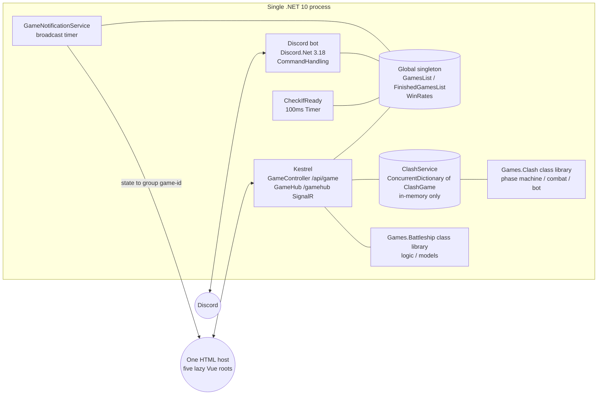
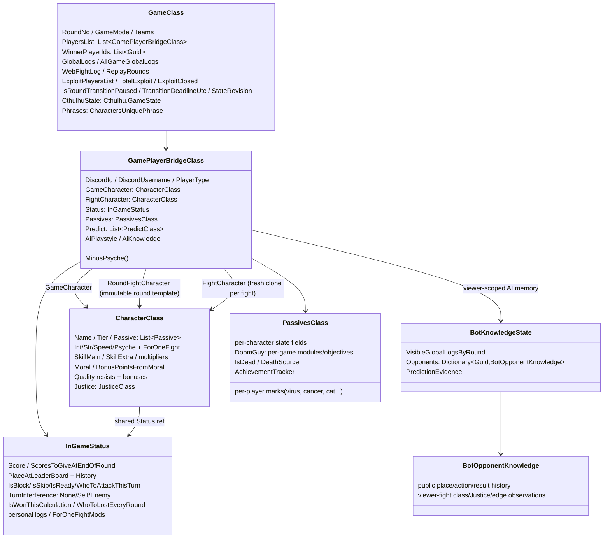

# King of the Garbage Hill — Architecture

> Code-verified against the working tree of 2026-07-30 (v5.2.2). Companion docs: [GAME-DESIGN.md](GAME-DESIGN.md), [CHARACTERS.md](CHARACTERS.md), [AUDIT-FINDINGS.md](AUDIT-FINDINGS.md); account progression: [DAILY-QUESTS.md](DAILY-QUESTS.md), [ACHIEVEMENTS.md](ACHIEVEMENTS.md); interface deep-dives: [WEB-BACKEND.md](WEB-BACKEND.md), [WEB-CLIENT.md](WEB-CLIENT.md), [DISCORD-INTERFACE.md](DISCORD-INTERFACE.md); bot policy review: [BOT-AI-DESIGNER-REVIEW.md](BOT-AI-DESIGNER-REVIEW.md).

## 1. Process topology

One process hosts both frontends:



- **Program.cs** starts the Discord bot thread and Kestrel in parallel; port via `KOTGH_PORT` (default 80).
- **Deployable boundary**: there is still one executable and one deployment. The host project references `King-of-the-Garbage-Hill.Games.Battleship` and `King-of-the-Garbage-Hill.Games.Clash`; it excludes those directories from its own compile so their `Logic/` and `Models/` compile exactly once behind real assembly boundaries. `BattleshipService`, `ClashService` and `GameHub` remain in the host. `GameHub` is therefore the transitional shared transport facade, not a domain module: new game rules belong in the corresponding class library, while transport splitting can happen without recombining the cores (`King-of-the-Garbage-Hill.csproj`; `Battleship/King-of-the-Garbage-Hill.Games.Battleship.csproj`; `Clash/King-of-the-Garbage-Hill.Games.Clash.csproj`).
- **Global.cs** holds the live ordinary-game `GamesList` — the single source of truth shared by the Discord and normal web frontends. It is a plain `List<GameClass>` read by the timer thread while web/Discord/sim threads create and remove games, so **every `Add`/`Remove` must `lock (_global.GamesList)`** and `CheckIfReady.TickAsync` iterates a snapshot taken under that lock (M111; the race previously killed the process via a null slot read). Network Clash is the explicit exception: `ClashService` owns an independent in-memory dictionary and never inserts a `GameClass`. No database: accounts are flat JSON files (`DataBase/UserAccounts/discordAccount-{id}.json`) loaded into a `ConcurrentDictionary` at startup (`UsersDataStorage.cs`).
- **DI**: Lamar; anything implementing `IServiceSingleton`/`IServiceTransient` is auto-registered (`AddSingletonAutomatically`).
- **Game loop driver**: `CheckIfReady.LoopingTimer` ticks every 100 ms over all ordinary games (`CheckIfReady.cs:63-74, 917-943`), guarded by an interlocked re-entrancy latch and per-game `IsCheckIfReady` flag. It does not tick Clash; accepted Clash commands advance the synchronous engine under the match lock, while a deduplicated asynchronous completion pump holds nonterminal combat in `ResolvingClash` through its animation deadline before opening reinforcement and continuing the bot.
- **Web push**: `GameNotificationService` broadcasts ordinary mapped state to SignalR group `game-{gameId}`; `GameStateMapper` produces per-viewer DTOs (each player sees only what they should). Clash instead maps participant-specific `ClashGameStateDto` snapshots inside `ClashService`; `GameHub` sends state and timed resolution traces directly to the current registered connections of each human participant. There is no Clash spectator projection.
- Deploy: `deploy_to_prod` → build, tar, scp to EC2, systemd unit `kotgh`.

## 2. Core state model



### GameCharacter vs RoundFightCharacter vs FightCharacter — the rule that breaks people

Each bridge holds three `CharacterClass` lifetimes (`GamePlayerBridgeClass`):

- **`GameCharacter`** — persistent truth. All lasting changes (`AddIntelligence`, `AddExtraSkill`, `AddMoral`…) go here.
- **`RoundFightCharacter`** — immutable combat template frozen once after all approved round-wide preparation and before the fight loop (`DoomsdayMachine.FreezeRoundFightCharacters`). No fight hook may mutate or replace it.
- **`FightCharacter`** — a fresh deep clone of that template for each actual attacker/defender pair (`PrepareIndependentFightCharacters`). `CalculateRounds` and all current-fight stat/class/Justice reads use only this clone.

`DeepCopy` is `MemberwiseClone` plus explicit deep copies of the `Passive` list and `Justice` (`CharacterClass.DeepCopy`). Consequences:
- Value-type stats are independent per copy.
- **`Status` is intentionally shared** for logging, result flags and batch coordination.
- **`Justice` is intentionally detached.** Every fight begins from the same template value; a current-fight override cannot change a parallel fight. A lasting gain/drain must be settled explicitly through `GameCharacter.Justice`.
- If you add a mutable reference field (List/Dictionary) to `CharacterClass`, you **must** add a deep-copy line, or both copies will share it.

This is the strict simultaneity boundary. The loop is still scheduled deterministically for logs and mechanics that explicitly own an order, but one fight result must not change another fight's input stats, class or Justice. Legitimate self-contained ForOneFight changes remain true: Геральт may change the current clone's stats/class for this fight without rewriting the round template. Kimiko and **Убийственная Парочка** demonstrate the split for resource effects: their fight clone receives the Justice change used by combat math, while the persistent transfer is separately applied to `GameCharacter` and becomes visible only after the batch.

Reward state deliberately follows the same lifetime split. `PassivesClass.AchievementTracker` is per-match and JSON-ignored; Daily Quests read its character-neutral observations only at settlement. `DiscordAccountClass.Achievements`, `Quests`, `PendingLootBoxes`, ZBS, paid `CharacterChances`, `LootBoxCharacterQueue`, `GameplayMode` and `EloRating` are persistent account state (`DiscordAccountClass`; quest facts in `QuestClass`). Loot boxes do not own or mutate any character-chance component. `GamePlayerBridgeClass.AccountGameplayMode` captures the effective mode for the match; a Tier-0/PRO assignment captures Pro even when a later bridge replacement changes the character. `GamePlayerBridgeClass.IsLootBoxCharacterReward` remains only an ephemeral draft-lock marker after the FIFO head is assigned. The final payout attaches the persistent `AchievementData` reference to the player only so the personalized finished-game mapper can carry that account's unacknowledged unlocks (`CheckIfReady.HandleLastRound`; `GameStateMapper.ToDto`).

Strict-bot knowledge has a third, separate lifetime: `GamePlayerBridgeClass.AiKnowledge` persists on the seat for one match and is neither part of `CharacterClass` nor copied into `FightCharacter`. After a resolved round, `BotInformation.CaptureVisibleRound` freezes only what that viewer could retain: sanitized global logs, public places/actions/results and, when the bot participated in the fight, the class/Justice/fight-edge detail shown to that participant. `BotPredictionEvidence` distinguishes fallible hypotheses from exact player-facing reveals. The memory is not serialized to clients or replays. L2/L3 action and prediction code consumes this projection plus the bot's own current/previous personal logs and owner-visible leaderboard annotations; direct opponent `GameCharacter`, `Passives`, score, Justice, private logs and current action flags are outside the ordinary boundary. The four designer-scripted exceptions are the exact round-8 Madara prediction, deliberately random-wrong Monster prediction, exact round-10 Eren-first/Monster-fallback target, and a Naruto reading another living Naruto's submitted target for the shared `+3` focus. `GamePlayerBridgeClass.ConsecutiveBotBlocks` is another seat-level AI field: it counts successful voluntary blocks for levels 1–3 and resets on an attack or forced Skip; it is likewise outside `CharacterClass.DeepCopy` (`BotsBehavior.HandleFairBotAttack`; `CharacterPassives.HandleFairBotPredict`/`EnforceMonsterWrongPrediction`).

**ForOneFight overrides** (sentinel `-228`): `SetIntelligenceForOneFight`, `SetStrengthForOneFight`, `SetSpeedForOneFight` (+`AddSpeedForOneFight` delta), `SetPsycheForOneFight`, `SetSkillForOneFight`, `SetJusticeForOneFight`. Each records a `ForOneFightMod` (for the web fight animation) and raises a flag on shared `Status`; `ResetFight` clears the working override after the fight. The next fight starts from a fresh round-template clone rather than the prior working copy.

Rules of thumb (violations are real bugs — see CLAUDE.md):
- ForOneFight overrides, including Justice, must be set on **FightCharacter**.
- All current-fight stat, class, Мишень, nemesis and Justice reads inside fight hooks use **FightCharacter**, so earlier legitimate overrides in that same fight are respected.
- Persistent changes go to **GameCharacter**. They accumulate as lasting consequences but must not be re-read as combat input by another fight in the active batch.
- A cross-fight effect must first collect immutable fight events, then aggregate them after the loop under an explicit designer rule (sum / max / last / priority / one resource use per batch).

**AI/MAINTAINER SIMULTANEITY CONTRACT:** when adding a fight hook or resource mutation, test one player in two same-round fights in both queue orders. If reversing the queue changes either combat result without an explicitly documented priority mechanic, the implementation is wrong. Do not read live `GameCharacter` to obtain current combat class/Justice and do not mutate `RoundFightCharacter`.

## 3. Passive hook execution order

All hooks live in `CharacterPassives.cs` as `switch (passive.PassiveName)` dispatchers. Call sites verified:

| # | Hook | Called from | When / notes |
|---|---|---|---|
| 1 | `HandleEventsBeforeFirstRound` (114) | game creation / draft & ARAM confirm | initial marks, L assignment, stat rewrites; final Джон step moves him to place 4 and arms Черный Замок before numeric places are assigned |
| 2 | `HandleDefenseBeforeFight` (467) | fight loop, defender first (`DoomsdayMachine.cs:632`) | defensive ForOneFight overrides |
| 3 | `HandleAttackBeforeFight` (1082) | fight loop, after defense (`DoomsdayMachine.cs:643`) | offensive overrides — sees defender's mods |
| 4 | block path | `DoomsdayMachine.cs` block branch | attacker −1 bonus; for each attacker actually stopped, Близнец buffers that fight clone's pre-hook Justice +1, pays bonus equal to copied Justice and queues the attacker's pre-hook highest stat; otherwise the defender gains generic next-round Justice; then hooks 8/9 run for the defender |
| 5 | skip path | `DoomsdayMachine.cs:779-815` | hook 9 for defender |
| 6 | `HandleDefenseAfterFight` (923) | after resolution (`DoomsdayMachine.cs:1510`) | defender-only reactions (counter effects) |
| 7 | `HandleAttackAfterFight` (1828) | `DoomsdayMachine.cs:1515` | attacker-only rewards/steals |
| 8 | `HandleDefenseAfterBlockOrFight` (822) | fight `DoomsdayMachine.cs:1511` + block `DoomsdayMachine.cs:765` | block-inclusive defensive effects |
| 9 | `HandleDefenseAfterBlockOrFightOrSkip` (906) | fight `DoomsdayMachine.cs:1512` + block `DoomsdayMachine.cs:766` + skip `DoomsdayMachine.cs:811` | always-trigger defensive effects |
| 10 | `HandleCharacterAfterFight` (2485) | both sides, all outcomes incl. own block/skip (`DoomsdayMachine.cs:513,763-764,809-810,1518-1519`) | per-interaction cleanup/rewards |
| 11 | `HandleShark` (7739) | after each resolved fight (`DoomsdayMachine.cs:1521`) | "Лежит на дне" neighbor check |
| 12 | `HandleEndOfRound` (3766) | once per round (`DoomsdayMachine.cs:1738`) | flags still set; round-end effects; Gordon's resumable failure or one-time successful release decision is checked immediately afterward |
| 13 | `HandleNextRound` (5222) | after `RoundNo++`, but only after the early Eternal-Tsukuyomi terminal check | per-round setup, trigger rolls; Близнец applies queued stat copies here |
| 14 | `HandleNextRoundAfterSorting` (6443) | after sort/swaps/drops (`DoomsdayMachine.cs:2080`) | position-dependent effects |
| 15 | `HandleBotPredict` (7401) | `DoomsdayMachine.cs:2088` | difficulty-routed bot prediction heuristics; L2/L3 use the fair viewer projection |

Special dispatchers outside the table include `HandleJews`, `HandleOctopus`, unknown_bug's `HandleEventsBeforeCalculation`/resolved-fight observer, and `HandleRumblingAfterFights` (`CharacterPassives.cs:3687`; call `DoomsdayMachine.cs:1633`). `UnknownBug.SelectStreamTarget` chooses one deterministic primary target after every authoritative action-isolation layer is finalized. `RecordResolvedFight` is the sole authoritative observer for resolved-fight payload stacks: it copies the selected target's win and records unknown_bug defeating the active Exploit carrier from either side without fabricating a second combat result. It runs before `TryCommitExploit`, so a direct attacking win is already in the pot and commit must not add it again. Block/Skip exits may still close the objective without a resolved-win stack; active Harem deliberately uses that ordinary Skip exit while exempting unknown_bug, while captured Eternal Tsukuyomi ends before any round-10 action isolation or combat. Naruto adds an explicit cross-pipeline coordinator rather than duplicating four passive cases: `InitializeTeam` runs before the first passive hook; `ResolveHaremQueues` replaces only the original's action, `HaremSkipAppliesTo`/`RewardHaremDonation` extend the ordinary per-fight Skip path without rewriting an attacker's queue, `SnapshotJustice` feeds per-fight Расенган, `RecordResolvedTripleRasengan` observes only a fight that survived Block/Skip, and `SettleShadowClones` is called immediately after Rumbling as the second post-fight settlement. Voluntary sibling choices are rejected at the action boundary, but authoritative forced queue rewrites are deliberately preserved through readiness and the core fight loop; `TryForceCloneSiblingAttack` is also the last-resort no-Block/no-Skip clone fallback (`UnknownBug.RecordResolvedFight` / `TryCommitExploit`; `Naruto.cs`; `GameReactions.HandleAttack`/`AttackInsteadOfBlock`; `DoomsdayMachine` Harem activation/fight loop; M200–M201). Dopa's duplicate-target decision is a round-keyed action invariant rather than a live-passive check: `EnforceDuplicateTargetSkip` clears all forced/contract expansion, runs before Живое Оружие can inspect the revived queue, and runs again after `HandleEventsBeforeCalculation`. `ReassertMacroPrediction` restores only the earned target row and deliberately leaves `ConfirmedPredict` untouched (`Dopa.ActivateDuplicateTargetSkip`/`EnforceDuplicateTargetSkip`/`ReassertMacroPrediction`; `DoomsdayMachine.CalculateAllFights`; m71–m72). Further per-character logic is embedded in `CheckIfReady`, `GameReactions`, `BotsBehavior`, `GameUpdateMess`, `CharacterClass`, `InGameStatusClass` and `GamePlayerBridgeClass`.

TheBoys adds two ordered boundaries around those ordinary hooks. After finalized Harem/action queues and the Kratos action override—and after the first round-keyed Dopa Skip reassertion—`TheBoys.DisablePassivesBeforeFights` clears every non-Block/non-Skip Живое Оружие target's persistent and already-created fight-snapshot passive lists before the round combat templates are frozen. A duplicate-target Dopa is already a Skip here, so a Monster no-escape or other late action cannot expose Макро to shutdown before its absolute turn cancellation is restored. The permanent marker guards later name-based helpers, while Homelander's direct passive-keyed helpers receive an explicit shutdown notification that freezes his virtual Seven score and clears an armed laser target. During each fight, `TheBoys.ApplyKillingCoupleJustice` runs only after both ordinary before-fight hooks and DooM module overrides, but before Block/Skip resolution and `CalculateStep1`; it first proves that the fight will resolve, then evaluates TooGood/TooStronk without Justice. The fight clone loses/transfers Justice for current math, while the lasting resource transfer is separately settled on both `GameCharacter` instances and cannot alter another fight template. Kimiko x1+ follows the same two-ledger pattern. unknown_bug is rejected at both boundaries (`DoomsdayMachine.CalculateAllFights`; `Dopa.EnforceDuplicateTargetSkip`; `TheBoys.ApplyKillingCoupleJustice`; `CharacterPassives` Kimiko defense; `Homelander.OnPassivesDisabled`; m71).

Salldorum also has a readiness-stage coordinator: `Salldorum.ResolveShenDashes` consumes the next real attack. The selected target's exact pre-dash cell is used from either direction; removing/reinserting the holder shifts every intervening row by one, stores the cell through the following action round, arms the current-round random-target magnet and replaces—never appends—only the selected target's first real action. `ApplyShenPositionHolds` runs after readiness movers and after end-sort movers, with Ziggurat locks authoritative. Sealed-Madara sanitation is repeated over the redirected queue before Madara's incoming-attacker re-snapshot; an authoritative Naruto sibling redirect remains a real fight. A same-cell aged cola pickup is queued in passive state; its +5 Speed is applied to `FightCharacter` by the ordinary defense/attack-before hooks after DeepCopy (`CheckIfReady.cs` readiness pipeline; `DoomsdayMachine.cs` sort pipeline; `Salldorum.cs` coordinators; `CharacterPassives.cs` before-fight hooks).

Gordon adds a resumable inter-round boundary rather than another passive hook. Immediately after `HandleEndOfRound`, `GordonFreeman.PrepareHalfLifeSettlement` may pause either a failed human Halflife 3 review or the one-time successful Release/Wait offer for 20 seconds. `DoomsdayMachine` stores that game's `ReplayRoundDto` and stopped calculation watch in a per-game continuation, then returns before action/status reset, regular-score settlement, replay finalization, `RoundNo++`, next-round hooks and timer restart. `GameClass.IsRoundTransitionPaused`, `TransitionDeadlineUtc` and monotonic `StateRevision` expose the pause to both frontends; failure timeout defaults to Freeze and successful review timeout defaults to Release. On actual release `HalfLifeReleaseSerial` increments as a public presentation event. On later ticks, `CheckIfReady` tries `ResumePendingRound` before ordinary readiness; an unresolved game is skipped while the loop continues processing other games, and a submitted decision or expired deadline enters the same `CompleteRoundAsync` tail exactly once (`DoomsdayMachine.ResumePendingRound`; `GordonFreeman.PrepareHalfLifeSettlement`/`ResolveHalfLifeTimeout`; `GameClass` transition fields).

**Passive-matching convention**: logic keys on **exact `PassiveName` strings** from `characters.json`; some places key on **character `Name`** instead. Both are stringly-typed — renames in JSON silently orphan code branches (this has happened; see AUDIT-FINDINGS C1, m1, m3 and D4).

## 4. Logging system

- **Personal logs** (`Status.AddInGamePersonalLogs`, auto-called by most stat mutators): visible to that player only. Stat methods log by default — pass `isLog: false` to suppress; do **not** double-log.
- **Global logs** (`game.AddGlobalLogs`): all players; per-round buffer is re-sorted at end of round (`SortGameLogs`) then reset. `HiddenGlobalLogSnippets`/`KiraHiddenLogSnippets` strip fight lines for non-admins per feature.
- **Phrases** (`Game/MemoryStorage/CharactersPhrases.cs`): `PhraseClass` objects with index-paired canonical `PassiveLogRus` and authored `PassiveLogEng` arrays loaded from `DataBase/phrases.en.json`. `.SendLog` stores both selected renderings in a replay-safe payload; media stores paired fields; consumed variants are removed from both arrays together (`Helpers/PhraseLocalization.cs`).
- **FightingData** (`Status.AddFightingData`): verbose per-fight numeric trace (admin/debug view + web fight animation source).

## 5. Score plumbing

`InGameStatus.Score` is private; mutation paths:
- `AddRegularPoints` → round buffer → `CombineRoundScoreAndGameScore` multiplies (×1/×2/×4; Подсчет override) and commits (`InGameStatusClass.cs` `AddRegularPoints`, `GetRoundScoreMultiplier`, `CombineRoundScoreAndGameScore`).
- `AddWinPoints` = ordinary fight-win regular points, except unknown_bug's own base win point is discarded. PointFunnel copies are outcome-observer calls to `AddRegularPoints(1)` and therefore ignore the source winner's payout transforms (`InGameStatusClass.AddWinPoints`; `UnknownBug.RecordResolvedFight`).
- `AddBonusPoints` → immediate, floor-at-0 unless "Никому не нужен" (`:221-233`); `HardKittyMinus` bypasses the floor.
- `SetScoreToThisNumber` (Октопус restore etc.).
`ScoreEntries`/`PreviousRoundScoreEntries` feed the web score breakdown; `WasRoundScoreMultiplierReducedByTolya` snapshots a consequential Подсчет reduction at settlement so the following live state and replay can expose only the text-only negative source `Вас обсчитали`. `GetBonusPointsEarnedThisRound` feeds passives like Выгодная сделка. Natural victory points are explicitly tagged by `AddWinPoints`, including the Еврей, **Sharing is CARRYING!** and Штормяк redirect paths. The shared ability-income projection excludes those tagged entries, keeps positive bonus income and applies the appropriate regular multiplier to positive net regular ability income (including Gordon's settlement adjustment). `GetPreviousRoundAbilityPoints` reads only the prior settled ledger for ScamRat's Block explosion. `LifetimeAbilityPointsEarned` accumulates the same settled projection, while `GetLifetimeAbilityPoints` adds current-round positive entries for Гарем но джутсу and DooM Guy's Инфернальная энергия without guessing from source strings. Инфернальная энергия snapshots only the eligible source IDs at turn setup and re-reads the current projection for the eventual transfer (`InGameStatusClass`; `ScamRat.ExplodeOnBlock`; `Naruto.RewardHaremDonation`; `DoomGuy.RefreshInfernalEnergySources`/`TryStealInfernalEnergy`).

Джон Сноу's **Король Сервера** is implemented at the central bonus receiver boundary: `AddBonusPointsCore` doubles positive and negative amounts before logging/flooring and labels them королевские, but only while the visible King passive exists and Jon is not at place 4. `Status.IsFightBatchActive` defers `TryBecomeKing` while main and Нечто combat results are being fixed; the deferred transformation runs after Rumbling/Теневые/Нечто and before ordinary end-of-round dispatch, so Skill from one fight cannot change a parallel fight's bonus payout. Transformation then moves the existing hidden King object into Тупой бастард's exact passive-list slot. Initial setup moves Jon to place 4 and arms the three-action-round Castle hold; later leaderboard rules are applied by `Naruto.OrderLeaderboard` after alive/dead/score sorting and by Eren's projected Rumbling order: an active hold restores exact place 4, otherwise the King floors at place 3. Homelander's Seven is a different central `GetScore` modifier with history-dependent sorting: while active its +7 participates in the first ordering pass and can retain the lead; if that effective score loses first place, `OrderLeaderboard` freezes it and repeats the score sort without +7. A frozen Seven reactivates only after the underlying score reaches first place, while explicit movers update availability without undoing their authoritative movement. At fight-phase start `ApplyRighteousness` snapshots whether Homelander is the leader: that state suppresses all rage charges for the turn. Every main-fight winner passes through `RecordResolvedWin`, and the isolated Нечто resolver calls the same observer for its winning attacker; `SettleRighteousnessMoral` runs after both sources and pays +7 Moral only when the round-stamped win matches the current top-1 snapshot (`InGameStatusClass.GetScore`; `Homelander.UpdateSevenPointsAvailability`/`ApplyRighteousness`/`RecordResolvedWin`/`SettleRighteousnessMoral`; `Cthulhu.ResolveNechtoAttacks`; `Naruto.OrderLeaderboard`). Explicit movers still run after the ordinary sort and may break score-derived places (`InGameStatusClass.AddBonusPointsCore`; `DoomsdayMachine.CalculateAllFights`; `JonSnow.TryBecomeKing`/`FinalizeInitialPositions`/`ApplyLeaderboardRules`; `ErenYeager.ProjectRoundEndLeaderboard`).

unknown_bug adds a receiver invariant above those ordinary paths: a negative regular, bonus or direct score mutation is a no-op, so its committed and buffered score never decrease. Transfer-shaped callers also filter unknown_bug before recording a debt, loss log or paired taker credit, rather than minting the nominal amount from an immune target. Its `GetRoundScoreMultiplier` branch ignores Толя's reduction and retains the normal round ×1/×2/×4. Negative-effect immunity follows the same receiver-boundary pattern across the central character/resource mutators and direct target branches: drains, marks, kills/fight fan-out, action and position rewrites are rejected before source rewards/progress are created; match-wide Rumbling also filters it from the victim set. The resolved-fight pipeline has a narrower Sirinoks receiver boundary too: after round-10 **Дракон** awakens at 228+ Skill, `Sirinoks.BlocksAutowinFrom` rejects non-Bug forced outcomes, preserves known autowin charges/uses and restores generic `IsAbleToWin` state before math. unknown_bug is explicitly excluded from that guard; the terminal pipeline reapplies its AutoWin after every replacer and therefore still guarantees a Bug win from either side (`UnknownBug.Is`; `Sirinoks.IsAutowinProtectedDragon`; `InGameStatusClass`; `CharacterClass`; `GamePlayerBridgeClass`; readiness/passive guards; `DoomsdayMachine` terminal outcome; `CharacterPassives.HandleRumblingAfterFights`).

Naruto's clone settlement uses the same canonical `GetRoundScoreMultiplier` as ordinary round commit and Eren's projected Rumbling order. `DrainSettledScoreForTransfer` converts committed + pending clone score exactly once; `AddSettledScore` credits the original without exposing the historical pot as fresh Цукуеми earnings. After dispersal, `ResolveScoreSuccessor` redirects delayed liabilities (Saitama/Octopus/Mitsuki/virus/Tsukuyomi) to the original that inherited the pot, while later genuinely new clone rewards are suppressed. Central `OrderLeaderboard` sorts every dead seat below every living seat and keeps dispersed clones last (`InGameStatusClass.cs:253-329`; `Naruto.cs` `ResolveScoreSuccessor`/`SettleShadowClones`/`OrderLeaderboard`).

Score mutation has one central floor contract: `AddBonusPointsCore` and `AddScoreWithMultiplier` clamp ordinary characters at zero; HardKitty bypasses by passive and only audited lethal effects call `AddBonusPointsIgnoringFloor` (Kira arrest, Geralt pitchfork). Dead ordinary seats do not flush buffered regular points; the unknown_bug receiver guard is defense in depth against any stale death-state cleanup reducing its score. `GameClass.WinnerPlayerIds` records the authoritative declared winner(s) independently of raw place so profile settlement, special wins and simulation reports share one result source (`InGameStatusClass`; `DoomsdayMachine.CompleteRoundAsync`; `CheckIfReady.HandleLastRound`).

## 6. Web layer (state → screen)

The browser is one built artifact and one `index.html`, but not one global Vue application. `main.ts` asks `apps/registry.ts` to select a product from the URL before creating Vue, Pinia or a router, then lazy-loads one of five independent roots. King of the Garbage Hill, Battleship and network Clash each install their own router; 99 Last Chances and Empire's Endgame mount router-free roots inside `StandaloneGameShell`. `platform/bootstrap.ts` owns the shared Vue/Pinia/bootstrap work and installs the localization compatibility boundary for every root. Navigation inside the currently mounted routed product uses its router; cross-product navigation uses normal links, so entering another product tears down the old root rather than carrying its router/store state across projects (`Web/VueClient/src/main.ts`; `Web/VueClient/src/apps/registry.ts`; `Web/VueClient/src/platform/bootstrap.ts`; `Web/VueClient/src/App.vue`).

```
GameClass ──GameStateMapper.MapPlayer(viewer-specific)──▶ GameStateDto
   │                                                        ├─ PlayerDto (per player: stats*, viewer-scoped flags)
   │                                                        └─ PassiveAbilityStatesDto (owner widgets only)
   └─GameNotificationService (timer) ─▶ SignalR group game-{id} ─▶ Vue store (Pinia) ─▶ PlayerCard/SkillsPanel/Game.vue
```

Standalone network Clash follows a separate state path:

```
ClashService.ConcurrentDictionary<string, ClashGame>
   ├─ command under game.SyncRoot ─▶ ClashGameEngine ─▶ phase/public revision/resolution trace
   ├─ server-deadline completion pump ────────────────▶ reinforcement boundary
   ├─ ClashBotAI(personalized bot DTO) ───────────────▶ bounded phase continuation
   └─ ClashService.ToDto(participant) ─▶ GameHub ─▶ participant connections / clash-{id}
                                             └──────▶ useClashStore ─▶ ClashLobby/ClashGame components
```

- A Clash match is not a character-game variant: it has its own `ClashGame`/`ClashPlayer`/`ClashUnit` model, string ID, lobby, 2×side-length board, revisioned commands and phase enum. It never enters `Global.GamesList`, `CheckIfReady`, `DoomsdayMachine`, Discord game UI, `ReplayService`, account settlement or ordinary `GameStateMapper` (`Clash/Models/`; `Clash/Logic/`; `API/Services/ClashService.cs`).
- `ClashService` is an ASP.NET singleton registered alongside other web-only services. Reads and mutations lock the individual match; one process-wide dictionary supplies the public lobby. State exists only for that process lifetime. The cleanup timer runs every five minutes and removes lobby/finished matches idle for 30 minutes; active abandoned phases are retained. There is no durable match snapshot, replay/command log, seed recovery or cross-restart resume (`ClashService.CleanupStaleGames`).
- Hidden setup is a serialization and traffic boundary, not CSS fog: `ToDto` includes own reserve/placements, replaces the opponent's private hand/counts with empty/zero values and emits an unconfirmed opponent cell as `unit = null`. Place/remove returns a caller-only state without changing public revision or last activity; confirmation performs the public touch/reveal. `GetGameState` rejects nonparticipants before group join. Once confirmed, rows become public; a clash resolution is an ordered trace with server timestamps/impact offsets plus the authoritative final deployed units. Nonterminal state remains `ResolvingClash` through `StartedAtUtc + DurationMs`, after which the completion pump opens reinforcement. Resolution delivery enumerates current participant connections, and rebinding a connection to another identity removes its tracked old group. The public lobby never reveals membership: `RequestClashLobby` follows it with caller-personalized `ClashMyActiveGame {gameId|null}` so a fresh authenticated page can resume its sole nonfinished match (`ClashService.ToDto` / `MapPlayer` / `GetActiveGameId` / `CompleteResolution`; `ClashGameEngine.ResolveClash`; `GameHub.HandlePrivateClashMutation` / `PushClashResolutionToPlayers` / `BindConnectionToPlayer`).
- The network module is also separate from Empire's Endgame Phase 14 Clash. Production routes `/clash` and `/clash/:gameId` use SignalR and `useClashStore`. The Empire engine remains embedded only in the Empire campaign/QA surface; the redundant standalone QA route and page were removed. Full hub/event/privacy and client/timeline catalogs live in [WEB-BACKEND.md](WEB-BACKEND.md) §4/§10 and [WEB-CLIENT.md](WEB-CLIENT.md) §12C.

- Mapper keys widgets on **PassiveName** (`GameStateMapper.cs:367-830`) and a few on character Name. Cross-character marks stay server-side and are projected only to the passive owner through their widget/leaderboard annotations; affected players receive no `…OnMe` state unless a mechanic explicitly declares the effect public (`GameStateMapper.cs:356-365,360-823`; `GameUpdateMess.cs:219-811`).
- Some character state rides directly on `PlayerDto` instead of `PassiveAbilityStatesDto`: DeathNote, PortalGun, owner-only `TerminalState`, TsukuyomiState and the Darksci/YoungGleb choice flags. Dopa's replacement second level-up instead uses owner-only `PassiveAbilityStatesDto.Dopa.MetaChoiceReady` and the ordinary `LevelUp(1..4)` contract; the former top-level choice flag/action no longer exists. `IsTerminalMode` and every `HasTerminalMarker` bit are emitted only into that owner's projection; the neutral naming is intentional so the public client bundle contains no secret identity.
- Naruto's `PlayerDto.IsNarutoAlly` is viewer-scoped rather than a widget: it is true only for the other two members of the requesting Naruto's initialized trio, allowing Vue to suppress illegal attack affordances without revealing anything to unrelated viewers or spectators (`GameStateMapper.cs` `MapPlayer`; `GameStateDto.cs` `PlayerDto`).
- Gordon's `PassiveAbilityStatesDto.Gordon` is likewise owner-only: it carries crowbar/fight progress, wake state, active headcrab targets and countdowns, zombie/rescue totals, and the Halflife 3 release/decision payload including whether Подсчет disabled the super multiplier. The corresponding 🦀/🧟 leaderboard markers are rendered only in Gordon's viewer projection; affected players and spectators receive no identifying mark (`GameStateMapper.cs` Gordon projection; `GameUpdateMess.cs` `CustomLeaderBoardBeforeNumber`).
- Jon's `PassiveAbilityStatesDto.JonSnow` is owner-only and carries Skill/228 progress, transformation/castle status, removable Bastard Intelligence, hold countdown, loyalty victories, spent-Watch state and the two lowest-Skill non-Jon player names. The fixed place-4 `🏰` and both `🐺` marks are owner-visible leaderboard annotations too; unrelated viewers and spectators receive neither identity clue. Before the hidden Watch fires, the widget renders no hint; its empty passive description is never exposed (`GameStateMapper.cs` Jon projection; `GameUpdateMess.cs` `CustomLeaderBoardBeforeNumber`; `PlayerCard.vue` Jon block).
- ScamRat's `PassiveAbilityStatesDto.ScamRat` is owner-only and carries active/ever-sold GPU counts, Carry currency, maximum Justice, last check, last/total explosion points and current owner names. Viewer-scoped `🖥️`/`💥` web and Discord annotations distinguish active from exploded cards only for the mining holder. A copied Standalone mining passive uses the copied holder's independent `PassivesClass.ScamRat` state and Justice cap; the non-Standalone identity-gated Carry shop uses the ordinary `LevelUp(1..4)` transport without `LvlUpPoints`, so its `$+` controls never set `mustSpendLevelUp`. Each request succeeds only with both 1 Carry and at least 1 current score, then spends the point through the immediate bonus ledger (`GameStateMapper.cs` ScamRat projection; `GameUpdateMess.CustomLeaderBoardAfterPlayer`; `WebGameService.LevelUp`; `ScamRat.TryPurchaseStat`; `PlayerCard.vue` ScamRat/carry controls).
- Frontend mirror: `signalr.ts` `PassiveAbilityStates` (camelCase 1:1), widgets in `PlayerCard.vue`, per-member skill UI in `SkillsPanel.vue` (TheBoys special-cased), sounds keyed by character name in `sound.ts`/`store/game.ts`.
- Web auth via Discord ID as string; web-only accounts via `RegisterWebAccount` (`signalr.ts:1488-1494`). Spectate + Replay: format-v2 `ReplayService` stores action-locked pre-fight state, pre-transition combat logs, and an atomic post-setup score/place/death result for each same-numbered round. `HandleLastRound` refreshes that existing result and emits only explicit final log suffixes; legacy boundary files are aligned by the Vue adapter (`ReplayService.cs:35-164`; `CheckIfReady.cs:845-853`; `replay.ts:21-120,133-268`). Games containing unknown_bug are deliberately never persisted or story-generated; replay loaders reject legacy files containing either identity before returning/listing them (`GameNotificationService`; `ReplayService.ContainsPrivateRoster`; `GameStoryService.GenerateStoryAsync`). Normal post-game AI stories consume captured round numbers and fight pairs, with settlement kept as a non-round epilogue, so normal stories stop at 10 while Kratos extensions remain visible (`GameStoryService.cs:168-314`).
- This section is the overview only — the full interface catalogs live in [WEB-BACKEND.md](WEB-BACKEND.md) (every endpoint/hub method/event + visibility rules), [WEB-CLIENT.md](WEB-CLIENT.md) (routes/stores/contract/widgets), and [DISCORD-INTERFACE.md](DISCORD-INTERFACE.md) (commands/custom-ids/DM flow).
- Account rewards and the character store use separate owner-only request paths rather than the 300 ms game broadcast: game-end hooks populate the account under its monitor; quests/achievements/loot retain their snapshot and acknowledgement contracts; loot atomically mutates ZBS and the FIFO `LootBoxCharacterQueue`, but never character roll weights. `RequestStore` returns only the caller's seen-character paid roll weights, and all spends/refunds save before publishing the replacement snapshot (`GameHub` loot/store handlers; `WebGameService` character-store block). Full reward rules: [DAILY-QUESTS.md](DAILY-QUESTS.md) and [ACHIEVEMENTS.md](ACHIEVEMENTS.md).
- **Turn actions** (`WebGameService.{Attack,Block,AutoMove,ConfirmSkip}`, exposed via `GameHub`/`GameController`) set `IsReady`/`ConfirmedSkip` — the web analogue of Discord's fight buttons. They enforce the level-up gate Discord gets for free from `MoveListPage 3` (which hides the fight controls until points are spent): `WebGameService.LevelUpGate` blocks all four while `LvlUpPoints > 0`, mirrored client-side by the `mustSpendLevelUp` store computed (`store/game.ts`) that disables the buttons and tightens `:can-attack` in `Game.vue` (finding M15). `LevelUp`/`ChangeMind` stay ungated so points can be spent / un-readied. Dopa's second `LevelUp` is the deliberate non-stat exception: the same 1–4 index selects one meta, consumes the point and returns before the normal stat mutation. ScamRat is never granted scheduled `LvlUpPoints`; its same-index request instead spends one Carry plus one bonus score point and therefore cannot block any turn action (`GameReactions.GetLvlUp`; `Dopa.MetaChoiceClass.StatLevelUpsTaken`; `ScamRat.TryPurchaseStat`; `DoomsdayMachine.cs:2145`).
- **Turn-interference origin** lives on shared `InGameStatus`, not in character UI guesses. Setting `IsSkip=true` defaults the current round to `Self`; enemy mechanics overwrite it at their application boundary, while `IsSkip=false` clears it. Non-Skip action locks set the same enum explicitly (round-8/sealed Мадара and the Kratos event). The mapper emits only the generic `none`/`self`/`enemy` classification to that status's owner, never the passive or source player (`InGameStatus.IsSkip`/`TurnInterference`; `GameStateMapper.MapStatus`).
- DooM Guy splits state deliberately: `DiscordAccountClass.DoomFortress` is persistent unlocked/equipped account data (`DiscordAccountClass.cs:41`), while `PassivesClass.DoomGuy` is the per-match active modules, BFG/Railgun charges, finite Rune grant counters, Counter-attack expiry marks, temporary Shark stance, hidden Инфернальная энергия turn sources/victims and objective progress (`PassivesClass.cs` `DoomGuy`; `DoomGuy.cs` `DoomGuyState`). Every bridge-creation or human seat-substitution path initializes the match snapshot from the current account loadout (`DoomGuy.cs` `InitializeForGame`; `WebGameService` bridge-creation paths). The mutable fight queue carries separate BFG-direction and Railgun-bypass metadata: BFG extends a winning branch and suppresses Step-3 randomness, while Railgun pre-expands one board side and bypasses each target's Block/Skip without skipping the ordinary per-fight hooks/reset (`DoomsdayMachine` fight queue).
- Эрен splits owner state (`PassivesClass.Eren`, including Attack-Titan cooldown) from hatred marks stored on each affected player's `ErenHatredMark`; the owner-only DTO aggregates those per-player marks (`PassivesClass.cs:267-274`; `GameStateMapper.cs:389-410`). His round-wide Titan boost is implemented as a per-fight `FightCharacter` override reapplied in both attack/defense hooks, because `ResetFight` correctly clears each override after one fight (`CharacterPassives.cs:62-72,517-521,1119-1123`).
- Round-10 boss bot policy: after legitimate unable-to-act states return and the selectable target list applies death/round-10 bans, every AI level first attacks a selectable `Эрен Йегер` above it, including from place 6. `Монстр без имени` is the fallback when no mandatory selectable Eren qualifies. A Monster bot cannot target itself (`BotsBehavior.TryForceRoundTenBossAttack`).
- Мадара keeps match state in `PassivesClass.Madara`, not `CharacterClass`, so its attacker sets and illusion-target dictionary are persistent per player and do not belong in `CharacterClass.DeepCopy` (`PassivesClass.cs:169-173`; `Madara.State`). His combat Skill 100 is written to `FightCharacter` in both before-fight hooks (`CharacterPassives.cs:478-481,1128-1131`).
- Мадара bot policy: on round 8 he stays action-locked and the readiness flow retains its 30-second reaction delay. From the start of round 8 onward, every strict bot at every AI difficulty that has an ordinary prediction sheet (not ARAM, Kira, Madara, Admin or DooM Guy's Let's Roll) is forced to keep the exact Madara row. The row is installed before prediction inference, marked exact at 100% confidence, reasserted after every prediction path and again before bot action; on round 8 it arms the separate clone attack. Strict-bot Naruto/Sakura/Itachi additionally submit their ordinary attack against him after genuine forced-Skip handling (`Madara.EnforcePostRoundSevenBotPrediction`; `Madara.MustAcceptRoundEightBotChallenge`; `CharacterPassives.HandleBotPredict`; `BotsBehavior.HandleBotBehavior`; `CheckIfReady.TickAsync`).
- `Вечное Цукуеми` is an **early authoritative terminal boundary plus final per-viewer projection**. After round 9 has fully settled and `RoundNo++` produces 10, `Madara.TryCaptureEternalTsukuyomiEnding` sorts the legal raw board before hook 13. An already active ending qualifies regardless of place; otherwise unsealed Madara must be first. It stores the top living winner, marks `IsFinished` and returns from `CompleteRoundAsync`, so no round-10 `HandleNextRound`, action, fight, prediction, Naruto dispersal, AWDKA or ordinary final modifier can mutate the result. Madara, unknown_bug and a Gordon who spent the round-9 wake reservation receive the authoritative view; every other non-Madara viewer receives output-only synthetic wins/place/score-source, using a fallback synthetic win over Madara when no captured target exists. Spectators receive no result data (`Madara.TryCaptureEternalTsukuyomiEnding`/`PrepareEternalTsukuyomiRound`; `GordonFreeman.SeesEternalTsukuyomiReality`; `UnknownBug.Is`; `GameStateMapper.ApplyEternalTsukuyomiProjection`; `Game.vue`; `FightAnimation.vue`). A replay/story is shared rather than viewer-scoped, so activated games still suppress both artifacts (`CheckIfReady.HandleLastRound`; `GameNotificationService`).

## 7. Per-character plumbing pattern (the "~14 files")

For character **X** with passive "P" (details per character in CHARACTERS.md):

1. `DataBase/characters.json` — name, stats, tier, avatar, passives (`PassiveName`/`PassiveDescription`/`Visible`/`Standalone`).
2. `Game/Characters/X.cs` — nested state classes (counters, cooldowns, trigger schedules). ⚠ file/class names don't always match the character (`Panth.cs`→class `Spartan`→"Загадочный Спартанец в маске", `Mitsuki.cs`→"Злой Школьник", `Shark.cs`→"Братишка"; `UnknownBug.cs` owns the renamed ultra-secret character's identity, privacy helpers and mechanics).
3. `Game/Classes/PassivesClass.cs` — instances of those state classes per player; also per-player marks other characters put on you.
4. `Game/MemoryStorage/CharactersPhrases.cs` — `PhraseClass` fields + registration.
5. `Game/GameLogic/CharacterPassives.cs` — `case "P":` in the relevant hooks (§3).
6. `Game/GameLogic/DoomsdayMachine.cs` — only for core-fight-mechanics characters (block/skip conversions, fight injection, damage multipliers, position swaps).
7. `Game/GameLogic/CheckIfReady.cs` — forced attacks / turn-flow injection / last-round scoring.
8. `Game/ReactionHandling/GameReactions.cs` — level-up overrides (`GetLvlUp` and friends), moral-button overrides.
9. `Game/GameLogic/BotsBehavior.cs` — bot moral thresholds + action selection when a bot plays X.
10. `Game/DiscordMessages/GameUpdateMess.cs` — leaderboard icons/prefixes (`CustomLeaderBoardBeforeNumber`/`AfterPlayer`).
11. `API/DTOs/GameStateDto.cs` — `XStateDto` + owner-only member on `PassiveAbilityStatesDto` (or an explicitly viewer-scoped `PlayerDto` flag).
12. `API/Services/GameStateMapper.cs` — `case "P":` in the owner-widget switch. Do not serialize another character's mark to the affected player unless the design explicitly makes it public.
13. `Web/VueClient/src/services/signalr.ts` — TS interface mirror.
14. `Web/VueClient/src/components/PlayerCard.vue` (+`SkillsPanel.vue`, `sound.ts`) — widget/UI/audio.

**Cross-character targeting invariant — Most wanted:** when a new character/passive randomly assigns an eligible enemy a bonus, mark or equivalent persistent target, its selection path must first call `RickSanchez.FindMostWantedHolder` on that eligible pool and choose the living holder before falling back to randomness. Kira's initial **L** assignment is the sole exception and must keep its ordinary human-preferred random draw. Record every new interaction in the Rick Most wanted row of `docs/INTERACTION-MATRIX.md`.

Ктулху is an expanded exception to the ordinary per-player state pattern. Only the all-four-adept `Зов глубин` prompt reuses the blocking pre-game `IsDraftPickPhase` gate. An ordinary Ктулху roster completes initialization and opens round 1 on Ктулху; its owner action then sets a viewer-local ritual projection without turning the whole game back into draft. The adept choice replaces `GameCharacter`/`PassivesClass` but deliberately reuses the live seat `InGameStatus`, UI/session lists and player Guid; bot and Exploit reference caches are rebuilt, while durable event state remains on `GameClass.CthulhuState`. The selected mylorik's missed startup/round-1 hooks are applied explicitly after Морок establishes Psyche 0. Because availability excludes already-present adepts but does not rerun roster tier filtering, this transform deliberately permits a second Tier-4 character; an empty list never falls back to occupied templates. The synthetic place-7 entity is a cached off-roster bridge for isolated fight arithmetic and is never appended to `PlayersList`. `ResolveNechtoAttacks` runs only Step 1/2/3 against that bridge, pays the explicit +2 regular reward on an attacker win and appends the public fight row; it deliberately dispatches no ordinary before/after-fight hooks, Moral, Justice, Skill, Harm, win point or character resource. Its only cross-pipeline observers are equally narrow: a winning Homelander receives the current-round `RecordResolvedWin` stamp, and a participating Madara records one displayed fight for first/second/technique phrases. Neither observer manufactures an ordinary combat result (`Cthulhu.GameState`; `Cthulhu.ApplyAdeptChoice`/`ResolveNechtoAttacks`; `Homelander.RecordResolvedWin`; `Madara.RecordSpecialResolvedFight`; `CheckIfReady.TickAsync`).

DooM Guy exercises the expanded form of this pattern: its persistent Home surface also touches `DiscordAccountClass`, `GameHub` meta methods, `store/game.ts`, `pages/Home.vue` and `components/Home/FortressOfDoom.vue`; BFG and Railgun mutate the live target queue inside `DoomsdayMachine` so every secondary fight still traverses the standard hook/reset pipeline (`DoomsdayMachine.cs:487-538,810-881`). Runtime copies used by **Щит-акула** and **Приручить дракона** add existing load-bearing passive names rather than duplicating their dispatch logic; Shark's copy is removed at round end, Dragon's remains for the match.

Naruto is another expanded form: roster eligibility and two strict-bot seat conversion touch `StartGameLogic`/`WebGameService`; sibling legality is enforced independently in Discord/web menus, the shared action handler, bot target selection, forced-target sanitization and the core loop; final death/score ownership crosses `DoomsdayMachine`, `CheckIfReady` and `InGameStatus`. The helper identity is the original player's Guid stored in all three `PassivesClass.Naruto` states; the clones receive fresh deserialized `CharacterClass` and `PassivesClass` instances so no status, stat, level-up or passive state is shared. Count-based L0/L1 action odds add the two living illegal siblings back as virtual attack slots only, so the smaller legal menu does not inflate Block (`Naruto.cs` `InitializeTeam` / `GetBotActionTargetSlotCount`).

Omni-man is the match-ending expanded form: `OmniMan.cs` owns the holder's persistent marks, phrase bags, sleep selection, one-shot train state and delayed-invasion state; ordinary attack/defence hooks observe resolved wins or incoming attempts. The end-of-round coordinator calls **Стражи Земли** before Homelander's **Башня Vought**, then schedules the invasion. `CompleteRoundAsync` is the authoritative trigger boundary after current-round score settlement but before `RoundNo++`; it records the final replay result and stops without opening another action round. A same-round `CthulhuState.HorrorFired` cancels the pending invasion before that boundary and is rechecked by the winner lookup, making **Космический ужас** unconditional. `CheckIfReady.HandleLastRound` recognizes a surviving invasion ending, skips all ordinary final-score/passive rewrites, forces Omni-man's solo winner projection even in team mode and then reuses the normal atomic account/reward/persistence tail. The public `OmniManInvasionSerial` drives the all-viewer web overlay. `PlayerDto.OmniManIdiot`, `OmniManGuardiansAsleep`, Discord `🤡`/`😴`, and the train phrase/serial overlay are Omni-man-owner-scoped (`OmniMan.cs`; `DoomsdayMachine.CompleteRoundAsync`; `CheckIfReady.HandleLastRound`; `GameStateMapper.ToDto`/`MapPlayer`; `Game.vue` invasion/train watchers).

Gordon exercises a different expanded form: `GordonFreeman.cs` owns both the holder state and the headcrab mark placed on other players; `DoomsdayMachine` counts only fights that survive Block/Skip and owns the resumable Halflife 3 settlement boundary; `CheckIfReady` resumes the parked continuation; `GameReactions` and `GameUpdateMess` expose wake/release controls and private crab markers to Discord; `GameController`, `GameHub` and `WebGameService` provide REST/SignalR parity; and Vue adds the owner widget plus a focus-trapped release decision/wait overlay. The decision serial is part of the contract so a reconnect or duplicate click cannot resolve a newer release review (`GordonFreeman.cs`; `WebGameService.ResolveHalfLife3Decision`; `HalfLife3Transition.vue`).

Jon Snow exercises the cross-pipeline score/position/death form: `CharacterClass` Skill mutators detect the 228 transformation boundary immediately outside combat but defer it while `IsFightBatchActive`; `DoomsdayMachine` commits that pending transition only after main/Нечто combat results are fixed. `InGameStatusClass` owns royal bonus multiplication. Immediately after each pair receives fresh fight clones and before either passive hook, `JonSnow.CaptureDifficulty` evaluates Step 1 once; both the later one-fight Justice/stat boost and post-win Intelligence consume that immutable snapshot, so combat-earned stats cannot change either eligibility check. `CheckIfReady` redirects finalized weak-target queues and evaluates the final Castle place; `Naruto.OrderLeaderboard` and Eren's projection apply the exact-place/floor rules; the existing Kira/Kratos/Monster/Rumbling kill sites call the one-shot immediate resurrection helper while retaining their source rewards and counters. The `🏰`/`🐺` markers are owner-only like ordinary cross-character marks (`JonSnow.cs`; `CharacterPassives.cs`; `DoomsdayMachine.CalculateAllFights`; `CheckIfReady.cs`).

## 8. File map (backend)

| File | Role |
|---|---|
| `Game/GameLogic/CharacterPassives.cs` | all passive hooks (§3 line map) |
| `Game/GameLogic/BotsBehavior.cs` | bot action pipeline; legacy L1 plus viewer-scoped L2/L3 tactics, persistent plans, scripted finale/teamwork exceptions and bounded Block streaks (`HandleBotBehavior`, `HandleFairBotAttack`) |
| `Game/GameLogic/BotInformation.cs` | L2/L3 visibility boundary and persistent resolved-round observation helpers (`CaptureVisibleRound`, `VisibleCurrentGlobalLogs`) |
| `Game/GameLogic/DoomsdayMachine.cs` | fight execution + round pipeline |
| `Game/GameLogic/CheckIfReady.cs` | turn loop, forced actions, game end |
| `Game/GameLogic/CalculateRounds.cs` | pure fight math (3 steps) |
| `Game/GameLogic/StartGameLogic.cs` | rolls (normal/ARAM/draft), tiers |
| `Game/Classes/CharacterClass.cs` | stats, skill, moral, justice, quality |
| `Game/Classes/InGameStatusClass.cs` | score, place, flags, personal logs |
| `Game/Classes/PassivesClass.cs` | per-player passive state container |
| `Game/Classes/GameClass.cs` | game container, exploit roll |
| `Game/Classes/GamePlayerBridgeClass.cs` | account↔player bridge, `MinusPsyche`, `AiPlaystyle` and viewer-scoped `AiKnowledge` |
| `Game/Classes/AchievementClass.cs` | V2 definitions, match observations, best-single-match evaluation and unlock rewards |
| `Game/Classes/QuestClass.cs` | Daily Quest V2 catalog/metrics/selection/rewards/migration plus server-owned loot odds, pity and idempotent opening |
| `Game/ReactionHandling/GameReactions.cs` | buttons: lvl-up, moral, predictions |
| `Game/DiscordMessages/GameUpdateMess.cs` | Discord rendering |
| `API/Services/GameStateMapper.cs` | web DTO mapping |
| `Battleship/King-of-the-Garbage-Hill.Games.Battleship.csproj` | compiler-enforced Battleship core assembly; owns only `Logic/` and `Models/` |
| `Clash/King-of-the-Garbage-Hill.Games.Clash.csproj` | compiler-enforced network Clash core assembly; owns only `Logic/` and `Models/` |
| `Clash/Models/ClashEnums.cs`, `ClashModels.cs` | network Clash state, phases, terminal/event enums and SignalR DTOs |
| `Clash/Logic/ClashCatalog.cs` | strict live unit catalog plus field/morale limits |
| `Clash/Logic/ClashGameEngine.cs` | network placement, between-clash, simultaneous speed-band combat, movement and terminal state machine |
| `Clash/Logic/ClashBotAI.cs` | bot policy over the same personalized DTO boundary as a human |
| `API/Services/ClashService.cs` | in-memory match ownership, locking, revision/idempotency, bot pump and per-participant mapping |
| `API/GameHub.cs` | ordinary, Battleship and Clash SignalR entrypoints/groups/push routing |

Legacy/dead code is catalogued in AUDIT-FINDINGS; the m6 batch (2026-07-04) deleted the known dead files (LolGod.cs, single-L Saldorum.cs and their orphaned passive cases/state/phrases, CraboRack.BokoBoole). `GameDesign.txt` still holds unbuilt future characters by design.

## 9. Conventions & pitfalls (verified)

- Namespaces `King_of_the_Garbage_Hill.*`; JSON CamelCase; mixed RU/EN comments; RU game-term strings are load-bearing identifiers.
- `Passive` has a 3-arg constructor + `Standalone` property (object-initializer style only for `Standalone`).
- No `AddJustice` — only `AddJusticeForNextRoundFromSkill/FromFight` (buffered) or `AddRealJusticeNow`/`SetRealJusticeNow` (immediate, rare).
- A real Psyche-loss event goes through `player.MinusPsyche(game, -N, source)`. It always applies the unknown_bug/Homelander/reanimated-Madara/Спокойствие/M.M. guards and writes «игрок психанул» by default. `suppressDefaultGlobalLog: true` changes only the text decision (Дизмораль), never immunity. Raw negative `AddPsyche`/`SetPsyche` is limited to documented self-cost, temporary-stat rollback and structural transformation paths (`GamePlayerBridgeClass.MinusPsyche`; M172).
- Score: `AddBonusPoints` = immediate; `AddRegularPoints` = multiplied at round end; `GetScore()` = committed total (buffered regular points are *not* included mid-round).
- Dead-player dispatch is opt-out by invariant, not per-passive design: core fight selection drops dead sources/targets; readiness skips dead bots and forced sources; end/next-round dispatchers skip dead holders. Only `Глаз Шусуи` and `Боги мне не указ` may run while dead because their purpose is revival.
- Round-10 nuance: `BonusPointsFromMoral` staged after the round-10 flush must be flushed manually. Rumbling then runs first after combat and Naruto's Теневые settlement second; delayed liabilities against a dispersed clone must resolve through its original rather than against the zeroed dead seat.
- Transferred/copied passives (Goblin Ziggurat learns any `Standalone: true` passive; Котики cats carry Минька/Штормяк; mylorik's Акула transform) need their own immunity checks — the passive-name dispatch will happily run the case for the new holder.
- The `-228` sentinel means "not set" for every ForOneFight field; don't use −228 as a real value (there is a joke passive "Skill 228" that caps skill at 228 — unrelated).
- Randomness: unified (m21 fixed) — `SecureRandom` really is cryptographic now: the static core `SecureRandom.Next(min,max)` wraps `RandomNumberGenerator.GetInt32` (thread-safe, `Helpers/SecureRandom.cs:17-25`); the instance `Random(min,max)` and `Luck` delegate to it, and `PassivesClass` trigger schedules call the same static (its former private crypto copy is deleted). Semantics unchanged: `Random(min,max)` is **inclusive** of max; `Luck(x)` ≈ x% ; `Luck(a,b)` ≈ a-in-b (internally rounded to a whole percent, rolled against 0–100). A few places still use `new Random()`/`Random.Shared` directly (justice phrases `CharacterClass.cs:1657-1684`, Мишень initial roll `CharacterClass.cs:831`, forced-target picks in `CheckIfReady.cs`, Blackjack, the Sirinoks team bias `General.cs:380`) — exclusive-max semantics, deliberately left alone.
- Every account-economy mutation that can race—game-end rewards, Daily Quest rerolls, lobby loot, paid web/Discord draft picks, and both store frontends—uses the same account monitor (web store `WebGameService` store transaction methods; Discord `StoreReactions.ReactionAddedStore`). User-triggered quest/loot/spend/ack operations save before confirming and restore their in-memory snapshot if the write fails; game-end retains the settled in-memory state for the 60 s retry after logging a critical save failure. `SaveAccount` reports success while serializing under that monitor, and storage replaces the account JSON through a unique same-directory temporary file (`UserAccounts.cs:113-139`; `UsersDataStorage.cs:28-80`). The loader accepts only canonical numeric account filenames (`UsersDataStorage.cs:83-116`).

### 9.1 Localization boundary

Russian character/passive/action strings remain canonical, load-bearing state. New authored copy uses stable product-scoped keys from root `Localization/*.messages.json`; every definition has `ru`, `en` and explicit `public|owner|server` visibility. Backend `MessageCatalog` performs a duplicate-aware JSON walk and validates all files when the web host starts, including product prefixes, cross-file duplicate keys, both languages and equal placeholder occurrences. Vite performs the matching build-time checks and emits only `public` definitions into `virtual:message-catalogs`; owner/server copy never enters the browser bundle (`Localization/`; `King-of-the-Garbage-Hill/Localization/MessageCatalog.cs`; `vite.config.ts` `messageCatalogPlugin`; `platform/localization/messages.ts`).

`LocalizedMessage` carries a key plus arguments for reusable server-authored text, while `LocalizedText` carries paired RU/EN prose that cannot use a reusable template. The shared Vue `message()`/`localizedText()` boundary resolves those forms without duplicating wording inside components. The former `GameLocalization` arbitrary-string rules, `localization.en.json`, `phrases.en.json`, Vue DOM observer and replay marker decoder remain in place only as a legacy compatibility adapter for existing logs, replay files and not-yet-migrated surfaces; they are not the pattern for new UI copy (`King-of-the-Garbage-Hill/Localization/LocalizedText.cs`; `Web/VueClient/src/platform/localization/`; `Web/VueClient/src/i18n.ts`).

Account locale is server-owned after authentication: `Authenticate` returns the persisted normalized language and the client hydrates its shared locale from that value instead of overwriting it with a browser default. `SetLanguage` saves under the account lock before publishing the registry/event/state update, broadcasts the locale to every account connection, re-pushes any active-game projection even when invoked from another tab, and restores the old value if persistence fails (`GameHub.Authenticate` / `SetLanguage`; `store/game.ts` authentication handler). Full contract and extension workflow: [LOCALIZATION.md](LOCALIZATION.md).

## 10. Simulation harness (headless bot games)

`dotnet run -- --sim …` (wrapper: `bash tools/simulate.sh`, default `--games 100 --coverage 1`) mass-runs all-bot games through the production loop with **no Discord login and no Kestrel** — the KOTGH behavioral safety net. Automated `*.spec.*`, `*.test.*` and Cypress source is retained only for Empire's Endgame; `tools/audit-test-policy.sh`, also called by `tools/verify-docs.sh`, rejects it in KOTGH, Battleship, 99LC, network Clash and shared/platform code. 518 games take ~14s.

- **Entry**: `Program.cs:65` — after the Lamar container is built (the `CheckIfReady` 100ms timer is already running from its constructor), `--sim` branches into `SimulationRunner.RunAsync` (`Program.cs:65-74`) and exits with its code; Discord login/Kestrel are never reached. `ClaudeHaikuService.Disabled` is set first (`Program.cs:67`) so sims never spend Anthropic API credits (Geralt hints fall back to static), and `ReplayService.CaptureEnabled` is set false (`Program.cs:71`): the harness never saves or serves a replay, while capturing one costs a full six-player state projection — localization included — three times per round, which used to dominate the simulator's runtime and heap (finding M51; WEB-BACKEND.md §9).
- **Game creation**: `CreateBotGameAsync` (`Game/Simulation/BotGameFactory.cs:15-20, 46`) — verbatim extraction of the old `*stb` loop body; the Discord command calls the same method now (`General.cs:98`). All-bot games self-advance one round per timer tick: zero humans → the ready-check never waits (`CheckIfReady.cs:982`).
- **Forced line-ups**: `forcedCharacters` on `HandleCharacterRoll` assigns characters by list order, bypassing the roll (`StartGameLogic.cs:117-120,227-253`). Needed because `CharacterToGiveNextTime` only works for non-null IUser slots. The caller owns both mutual-exclusion constraints (the pairwise LeCrisp/Толя/ScamRat group and HardKitty/Эрен Йегер) plus ≤1 Tier-4; unlike live guaranteed/draft/admin-test replacements, a low-level forced constructor may intentionally bypass them for a targeted repro. The public `--characters` validator and generated coverage enforce the same group through `StartGameLogic.AreMutuallyExclusiveCharacters`; `ValidateMatchup` admits the one deliberate multi-Tier-4 exception when the exact four Ктулху adepts are present, allowing `Зов глубин` coverage. Natural coverage excludes `TeamModeOnly`; explicit `--characters` validation intentionally permits team-only characters through the existing admin/test force path, so Napoleon and Support pilots can be measured (`SimulationRunner.ValidateMatchup`/`Fits`; `BotGameFactory.cs:42-50`).
- **Modes** (flag parsing `Game/Simulation/SimulationRunner.cs:77-86`): smoke `--games N` = natural bot roll (tier-skewed — bots admit Tier 3+ and the sole lower-tier exception Кира, so smoke alone does NOT cover all characters); coverage `--coverage K` = generated line-ups so every rollable non-team character appears ≥ K times (`SimulationRunner.cs:121-156`); matchup `--characters "6 comma-separated names"` = fixed line-up, validated (`SimulationRunner.cs:126-142`), for bug repros and team-only/character testing. Smoke+coverage are additive; matchup replaces both.
- **AI difficulty** `--ai-difficulty N` (0-3, **default 3**; validated by `SimulationRunner.RunInternalAsync`, clamped by `BotGameFactory.CreateBotGameAsync`, echoed to `options.aiDifficulty`, stored on `GameClass.AiDifficulty`). **0** = legal pure-random simulation control; **1** = legacy behavior that may read privileged internal state; **2** = viewer-scoped strategy with broad character tactics and persistent character plans; **3** = the same legal information with longer memory, confidence-weighted prediction/rule inference, estimated opponent terms and best-target selection. Outside explicit scripts, L2/L3 never read a current opponent Block/Skip/action, true identity/stats/passives/score/Justice or private logs. Their plan is stored once in `GamePlayerBridgeClass.AiPlaystyle`; observations persist separately in `AiKnowledge` and are populated through `BotInformation.CaptureVisibleRound`. The simulation's historical exact prediction prefill runs **only for L1** (`BotGameFactory.CreateBotGameAsync`); L2/L3 use `CharacterPassives.HandleFairBotPredict` like live strict bots. The four explicit designer exceptions are the mandatory exact Madara prediction kept by every prediction-capable strict bot from round 8 onward (with Naruto/Sakura/Itachi also attacking him on round 8), the mandatory random-wrong Monster prediction, round-10 Eren-first/Monster-fallback targeting, and Naruto sibling target focus. Levels 1–3 additionally attack after two consecutive voluntary Blocks when a target exists (`GamePlayerBridgeClass.ConsecutiveBotBlocks`; `BotsBehavior.CanVoluntarilyBlock`). Ordinary Discord/web games use the default; the god-admin web staging lobby can override each explicitly added bot to Legacy/V2/V3 (1/2/3), while auto-filled empty seats inherit 3 (`AdminLobbyService.StartGameAsync`; `GamePlayerBridgeClass.AiDifficulty`). Full decision review: [BOT-AI-DESIGNER-REVIEW.md](BOT-AI-DESIGNER-REVIEW.md); tunables: `docs/BALANCE-CONSTANTS.md` → “Bot AI difficulty”.
- **AI measurement probe** `--ai-probe N` (0-3) + optional `--ai-probe-char "Name"` runs one bot at a different level from the field (override `GamePlayerBridgeClass.AiDifficulty`; resolve `BotsBehavior.cs:46-57`; set `BotGameFactory.cs:93-98`). `--ab-char "Name" [--ab-test N] [--ab-control N]` is the paired form: same process, line-up and per-game seed for both arms (`SimulationRunner.cs:417-557`). Every player result includes `AiPlaystyle` (`SimReport.cs:93-100`; mapper `SimulationRunner.cs:645-660`), so aggregate gains can be split by persistent branch instead of allowing one strong build to hide a weak one.
- **Failure capture**: `Global.SimErrorSink` (`Global.cs:52`) receives round-pipeline exceptions (`CheckIfReady.cs:1613-1621`) and bot-action exceptions (`BotsBehavior.cs:3562-3570`). Service-channel diagnostics use null-safe `Global.TrySendServiceMessage` (`Global.cs:58-70`; bot fallbacks `BotsBehavior.cs:3478-3516`). `CheckIfReady` increments a per-game `ReadinessLoopVisits` counter only when the single timer loop actually reaches that game (`GameClass.cs:210-212`; `CheckIfReady.cs:1132-1137`). The simulator removes a game as stuck after **5 visits at the same round**, so a slow pass or external CPU contention cannot freeze games that are merely waiting their turn (`StuckGameVisitsWithoutProgress`, `SimulationRunner.cs:28,324-349`). No global progress for 60s (a calculation pinning the loop) or the `--timeout-min` cap still aborts the batch (`SimulationRunner.cs:79,352-373`; finding M51).
- **Report**: JSON to `DataBase/Simulations/sim-<timestamp>.json` (gitignored) — per-game outcomes include authoritative `isWinner` and structural-clone flags alongside characters, playstyle, scores, places, deaths and rounds. Character winrate uses `GameClass.WinnerPlayerIds`, not place 1, and dispersed Naruto clone seats are excluded from both wins and denominator. Aggregates still include top1–6/avg score/avg place; failures contain stack + line-up. Each stuck row records `loopVisitsWithoutProgress` as the classification evidence and retains `secondsStalled` only as timing diagnostics. Exit codes: **0** clean, **1** errors and/or stuck games (each is a finding — triage via `/fix-finding`), **2** harness failure (`SimReport`; `SimulationRunner.BuildCharacterRows`).
- **Data isolation**: the wrapper runs from the project dir, so relative DataBase/* paths resolve to the *source* tree and sims read the **current** `characters.json` (the bin/Debug copy goes stale: only blackjack_words.json and wwwroot have csproj copy rules). Simulation mode sets `UserAccounts.DisableDiskPersistence` before the container is built (`Program.cs:40`), starts with an empty per-process account store and never writes it; bot accounts (ids ≤ 1 000 000, auto-created by `GetAccount`) therefore cannot touch real/dev account JSON or another simulator process (`UserAccounts.cs:100-107`).
- **Large AI comparison sweep**: `bash tools/sweep.sh [games-per-level] [batch]` builds once, then runs four independent arms for AI 0/1/2/3 concurrently. The default is **exactly 100 000 requested games per level / 400 000 total**, with batches of at most 5 000 (except when the chosen cap is smaller than one indivisible coverage pass). Each arm runs one coverage pass to calibrate its generated game count, chunks the remaining forced coverage under the same cap, then subtracts all coverage games from that arm's natural-roll budget, so coverage does not silently exceed 100k. The default coverage is `ceil(total/100)` appearances per rollable non-team character (1 000 at 100k), configurable through `KOTGH_SWEEP_COVERAGE` (`0` = natural-only). The 5k cap bounds the live per-process state and round latency; larger batches can be slower even with free RAM because each process advances all games on one timer thread (`tools/sweep.sh`).
- **Sweep reports**: each arm retains its batch JSON and receives an exact `merged.json`; `tools/sweep-report.py` then emits `comparison.json`, Excel-friendly `comparison.csv`, `summary.md`, an offline `index.html` dashboard and three SVG heatmaps (declared win rate, average place, average score). L1 is the visual baseline: blue means improvement, red regression, colour strength follows the combined standard error, and ★ marks an approximate 95% difference. Every cell also prints its sample count; the dashboard includes largest-gain/regression tables and confidence intervals. Aggregation replays the per-game `isWinner`/score/place rows rather than multiplying rounded batch averages or treating `top1` as a declared win (m37). Each arm is a **homogeneous field**, so its deltas show which character policies gain/lose relative to same-level opponents; use `--ai-probe` or `tools/ab.sh` for direct head-to-head AI strength. A failed sweep normally refuses a comparison because all arms must have their exact budget; to inspect surviving evidence only, run `python3 tools/sweep-report.py build <sweep-dir> <expected-games> --allow-partial`. It adds a prominent partial/unhealthy warning to every output and must not be used as a final comparison.
- **Parallel sims are safe, but only because the harness owns no disk state** (finding M52): the four sweep arms have empty, independent in-memory accounts and never read/write the shared account directory. Before that guard, one process could observe another process's replace gap and abort with exit 134, while each startup reset the other arms' pity/history and invalidated the experiment. Anything new the harness persists must be per-process or it reintroduces both bugs.
- **Why per-game cost remains important after the M51 watchdog fix**: one tick pass advances *every* live game on *one* thread, so the wall time between two rounds scales with batch size and competing CPU load. The old wall-clock watchdog therefore culled ~1 600 healthy games when a 2 000-game pass exceeded 30 seconds, then created secondary NREs by removing games mid-tick. Stuck classification now requires five actual visits to the same game at an unchanged round; a game waiting behind thousands of others has no new visits and cannot be falsely culled. The 60-second no-global-progress guard still catches a calculation that pins the loop. Per-game cost still controls sweep duration, so headless mode keeps viewer-facing work disabled — especially replay capture, which otherwise performs full six-player projections three times per round (`Program.cs:61-70`; WEB-BACKEND.md §9).
- **Seeded determinism + paired A/B** `--seed N`: runs games **sequentially, one at a time**, reseeding the game RNG per game (`SecureRandom.SetSeed`, `Helpers/SecureRandom.cs`) and reproducing the line-up plan. `--ab-char "Name" [--ab-test N=3] [--ab-control N=1]` plays the plan twice and prints paired win%/avgPlace/avgScore deltas with 95% CIs (wrapper: `bash tools/ab.sh <char> [test] [coverage] [seed] [control]`; runner `SimulationRunner.cs:417-557`). For multi-plan bots, group the `AiPlaystyle` result field (`SimReport.cs:92-99`) before accepting the aggregate: each branch must be checked independently. A few hash-order-sensitive characters (notably Goblins/Cats) keep residual nondeterminism; raise coverage for them.
- **Caveats**: winrate tables are bot-meta statistics (heuristic bots, tier-skewed smoke rolls, plus explicit forced coverage in `sweep.sh`) — use them for *drift* detection at N ≥ several hundred appearances, not as human-meta balance truth. Homogeneous L0/L1/L2/L3 arms compare per-character policy fit; average place and overall win share are structurally constrained across an all-bot field, so direct level strength needs the probe/paired A/B workflow.
