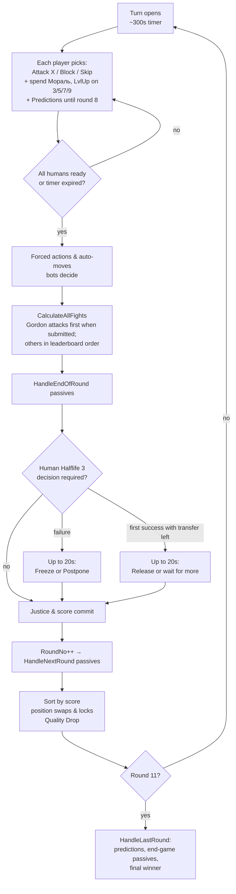
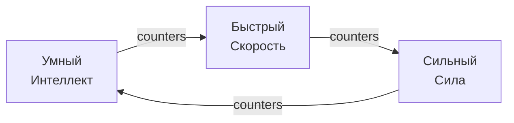
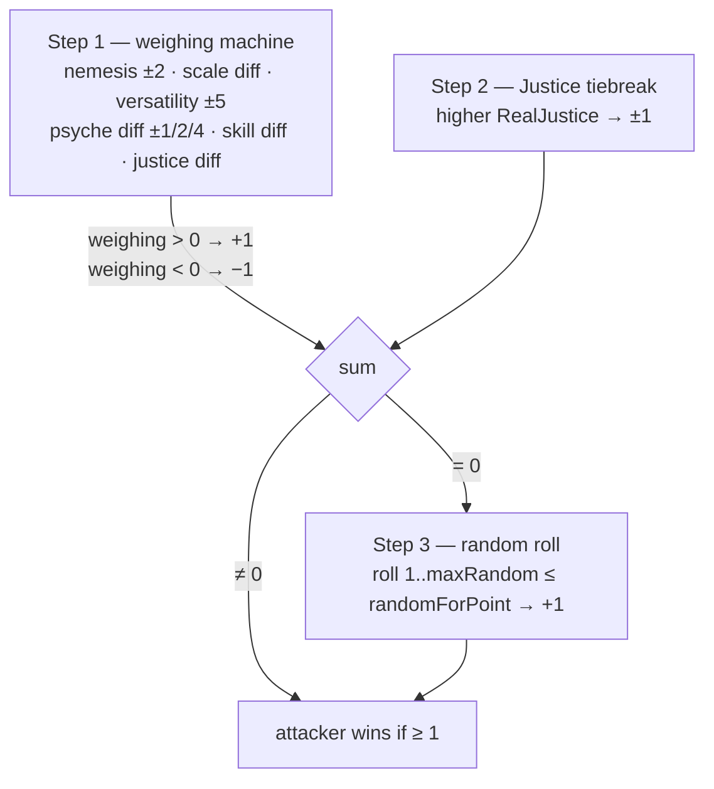

# King of the Garbage Hill — Game Design Document

> Code-verified against the working tree of 2026-08-05 (v5.2.17). Every mechanic below was read from the source, not from player-facing descriptions. File references are `path:line` as of this tree.
>
> Companion docs: [ARCHITECTURE.md](ARCHITECTURE.md) (code structure), [CHARACTERS.md](CHARACTERS.md) (all 47 character definitions, including special-purpose entries), [AUDIT-FINDINGS.md](AUDIT-FINDINGS.md) (design-vs-code audit).

## 1. What the game is

A 6-player simultaneous-turn king-of-the-hill game, 10 rounds long. Each player secretly plays one of 46 defined characters (some special-purpose) with hidden stats and passive abilities. Each round every player picks one action; all fights resolve at once; the leaderboard re-sorts by score. After round 10 the player with the most points normally wins ("Король Мусорной Горы"); **Космический ужас**, Omni-man's Вилтрумайт invasion and Мадара's **Вечное Цукуеми** are explicit match-ending exceptions. Цукуеми freezes the legal leader at the start-of-round-10 boundary; the horror retains unconditional priority over endings that can collide in one completed round (§7).

The fun is information warfare: you see usernames and behaviors, not characters. You infer who is who ("Предположения" — end-game prediction bonuses), read class tells from fight logs, and play around wildly asymmetric passive kits.

Runs as a Discord bot + web client (Vue/SignalR) in one process; humans and bots mix freely (see ARCHITECTURE.md).

## 2. Core loop

- Turn timer: default 300 s (`GameClass.cs:13`); a 100 ms timer polls readiness (`CheckIfReady.cs:63-74`).
- A human who does nothing gets an auto-move (bot picks for them, `CheckIfReady.cs:1132-1144`); a player who can't be auto-moved auto-blocks (`:1253`).
- Round 10 is the last fighting round. `RoundNo >= 11` ⇒ `HandleLastRound` (`CheckIfReady.cs:970`), except during the Kratos resurrection event (hard cap `RoundNo >= 20`, `:937`).

### Actions
| Action | Effect |
|---|---|
| **Attack X** | Fight X this round. You are the attacker; X defends (X keeps their own chosen action). |
| **Block** (Блок) | Fights against you don't happen; each blocked attacker loses 1 bonus point ("Блок"), you gain +1 next-round Justice — same `AddJusticeForNextRoundFromFight` as a fight loss. Naruto is the explicit replacement: **Гарем но джутсу** turns his own ready Block into Skip and removes only his action; each ordinary incoming fight is displayed as skipped while that attacker's other fights remain (`Naruto.ResolveHaremQueues`; `DoomsdayMachine` Skip path). |
| **Skip** (Пропуск) | Fights against you don't happen, attacker pays nothing. Mostly forced by passives (sleep, tilt, ban…). Voluntary skip isn't in the normal UI. |

Attackers with `IsArmorBreak` ignore blocks; `IsSkipBreak` ignores skips (granted by specific passives). Several characters can't block/skip or force others to fight (see CHARACTERS.md).

## 3. Stats and the class system

Four mechanical stats, integer **0–10** (clamps in `CharacterClass` stat setters). Рик's "Гигантские бобы" lets Intelligence exceed 10. Dopa keeps ordinary mechanical Intelligence but every player-facing surface labels it **IQ** and displays 7/8/9/10 as 200/209/218/228; below 7 each missing Intelligence subtracts one from 200 (`CharacterClass.GetIntelligenceString`; web `PlayerCard.dopaIq`).

| Stat | Fight role | Quality resist (see §7) | Stat-10 bonus (permanent flag) |
|---|---|---|---|
| **Интеллект** (Int) | scale + versatility; defines Умный class | pool 1/2/3 → breaking it costs −10% Skill | +10% Skill (`:469`) |
| **Сила** (Str) | scale + versatility; defines Сильный class | pool 1/2/3 → breaking it causes **Drop** | your Harm hits Str pools for −2 (`:482`) |
| **Скорость** (Speed) | scale + versatility; defines Быстрый class | pool 1/2/**5** = your **Harm reach** as attacker (§4/§7); never consumed by incoming Harm | +1 **kite** — shrinks incoming Harm reach (`:495`) |
| **Психика** (Psyche) | scale + own weighing term | pool 1/2/3 → breaking it costs −20% Мораль | +20% Мораль (`:508`, `:1085-1088`) |

### Class (Класс)
Your class = your **highest** of Int/Str/Speed, computed from the current combat character (`GetSkillClassType`; ties resolve Int > Str > Speed; all three 0 ⇒ **Буль**/None). During a fight, the fresh `FightCharacter` clone is authoritative, so a legitimate ForOneFight change such as Геральт's temporary stats also changes the true class for that fight without changing another simultaneous fight. Class is never stored in `characters.json`.

- **Nemesis (контр)**: rock-paper-scissors above (`NemesisOf`, `CharacterClass.cs:739-745`). Having nemesis over the opponent: +2 weighing, ×1.5 on your skill term (attacker side), +1 skill multiplier in the fight (`CalculateRounds.cs:74-95`). Losing a fight where nemesis fully decided it leaks your class to the victim's log ("вас обманул/пресанул/обогнал", `DoomsdayMachine.cs:39-53, 1061-1069`).
- **Class perks** (each fight, `DoomsdayMachine.cs:658-668, 754-755`): Умный +6×mult Skill when target has 0 Justice; Быстрый +2×mult Skill in every fight (both roles); Сильный +4×mult Skill on every win.
- **Мишень (class target)**: every player has a private rotating target class (`CurrentSkillTarget`), first randomly rolled, then cycling Int→Str→Speed each round (`RollSkillTargetForNextRound`, `CharacterClass.cs:826-838`). Attacking someone whose class matches your Мишень grants Main-Skill (diminishing 10,9,8…1 — and the same amount again as Extra Skill, so effectively 20,18,…,2 — `AddMainSkill`, `CharacterClass.cs:961-1000`) and writes their class tag into your notes.

## 4. Fight resolution

All in `CalculateRounds.cs` (called from `DoomsdayMachine.cs:797-938`). A fight computes `pointsWined` from the attacker's perspective: **Step 1 (stats)** ±1, **Step 2 (Justice)** ±1; if the sum is 0, **Step 3 (random)** decides ±1. Final ≥1 ⇒ attacker wins.

**Step 1 — weighing machine** (`CalculateRounds.cs:56-410`), accumulator starts at 0, `randomForPoint` starts at 50:
1. **Nemesis**: ±2 weighing; attacker with nemesis also gets `nemesisMultiplier = 1.5` on his skill term; each side with nemesis gets +1 fight skill multiplier.
2. **Scale**: `Int+Str+Speed+Psyche + Skill(mult)/60` per side; add the difference (`:130-132`).
3. **Versatility**: compare Int, Str, Speed head-to-head; the player winning more categories gets +5. On an exact 1–1 split with the third stat tied, compare the two **won stat categories** by the same RPS relation: Int beats Speed, Speed beats Str, Str beats Int; the player whose won category counters the opponent's won category gets +5 (`CalculateRounds.CalculateStep1`). Terminology note: historical player-facing texts call *this* bonus «Контр» and call the class-nemesis RPS «Анти-класс» — the meaning of "контр" flipped between those texts and the code/docs naming.
4. **Psyche diff**: 1–3 → ±1, 4–5 → ±2, ≥6 → ±4 (`:200-220`).
5. **TooGOOD**: |weighing| ≥ 13 ⇒ `randomForPoint` = 70 (or 30 against you) (`:228-251`).
6. **Skill difference**: `scaleMe×(1+mySkill/650×nemesisMult) − scaleTarget×(1+targetSkill/650) − scaleMe + scaleTarget` added to weighing (`:264-282`).
7. **TooSTONK**: |weighing| ≥ 30 ⇒ `randomForPoint` += weighing/2, capped ±20 (`:303-344`).
8. **Justice**: `+ (myJustice − targetJustice)` weighing (`:352`).
9. **Skill random modifier**: `randomForPoint += (mySkill − targetSkill)/60` — uncapped, so huge skill gaps effectively decide Step 3 (`:370-374`).

Madara's own TooGOOD/TooSTONK branches are attacker-count gated: >1 unique incoming enemy enables TooGOOD, >2 enables TooSTONK, and >3 sets his per-fight Skill to 100; the opposing character's thresholds still work normally (`Madara.cs:55-110`; `CalculateRounds.cs:228-344`).

**Step 2** (`CalculateRounds.CalculateStep2`): +1/−1 to whoever has higher Justice in this fight's fresh clone. The round template is immutable; a ForOneFight Justice change is true for this fight only.

**Step 3** (`:438-492`), only on a tie: `maxRandom = 100 − (myJustice×nemesisMult − targetJustice)×5` (when either side has Justice > 1); roll 1..maxRandom; roll ≤ randomForPoint ⇒ attacker wins. Justice therefore shrinks the loss window *and* shifts the threshold.

DooM Guy's human-only Shield module **Геймдизайнерский щит** rigs this stage without publishing a trigger: if the fight reaches ordinary Step 3 and DooM Guy did not lose the Step-2 Justice comparison from his own attacker/defender perspective, Step 3 is his win. The fight payload places the displayed needle exactly **0.1% of the random range** inside DooM Guy's winning side of the loss boundary; an out-of-range threshold is first clamped just far enough inside the bar to preserve that presentation. BFG resolves first and keeps its ordinary charge spend; later result replacers and terminal outcomes still run in their established order. Strict bots cannot unlock, receive as an option, select or activate this module (`DoomGuy.TryRigGameDesignerShieldRandom`; `DoomsdayMachine.cs:1144-1157`).

**Overrides after the math**: `IsAbleToWin=false` on a side adds ∓50. Two equal ordinary forced outcomes therefore cancel and deliberately fall back to normal fight math. A new forced-result source must receive an explicit designer collision rule: ordinary ±50, a named priority, or a terminal override, plus whether a limited use is spent on collision. Котики's Storm can nudge ±5 and redirect the win point; its intervention is stored in the fight/replay payload and shown in Fight Animation. Осьминожка's Неуязвимость/Itachi's Изанаги can flip the result outright. A successful Naruto **Призыв** is applied after those defensive replacers and is therefore a terminal attacker win. Homelander's charged **Праведность** laser is later still and forces his attacking win while breaking Block/Skip. An awakened round-10 Sirinoks **Дракон** with at least 228 Skill rejects every opponent autowin and falls back to ordinary fight math; source gates preserve known charges/uses, while the central `IsAbleToWin` restoration catches generic/future forced results. Мадара's round-7 **Клоны Сусано** is suppressed by this protection too. unknown_bug is the explicit rare exception: its final AutoWin priority is **666**, reapplied after every ordinary replacer from either direction, and it is the only autowin that can defeat the protected Dragon. Outside that matchup, round-7 Madara still settles his fights before weaker replacers can consume BFG, Изанаги or Осьминожка state (`UnknownBug.AutoWinPriority`; `Sirinoks.BlocksAutowinFrom`; `DoomsdayMachine` fight outcome path; `Homelander.ArmLaser`; `Madara.IsRoundSevenAutoWin`).

### Win/loss consequences (`DoomsdayMachine.cs:815-1024`)
- Winner: +1 **regular point** (`AddWinPoints`; Еврей or an eligible ScamRat **Sharing is CARRYING!** may redirect it; "Никому не нужен"/"INT" holders get **−1** instead when they attack-and-win). **На мели** is the defensive exception: Saitama gets no victory point when he wins as defender (`DoomsdayMachine.cs:1199-1220`). Any win sets `IsWonThisRound` (Justice reset at end of round), including an unpaid defensive Saitama win.
- Madara's **Вкус битвы** rider is separate from the natural win point: every non-team Madara win whose Madara-oriented Step-1 weighting is ≤10 pays +1 immediate bonus point and one random `Воскрешенное тело` personal phrase (`Madara.RewardBattleTaste`; `DoomsdayMachine.CalculateAllFights`).
- **Мораль transfer**: `moral = attackerPlace − defenderPlace`; flows only when the *lower-placed* side wins, and only from round 2 (`:798-815, 920-936`). Winner +moral, loser −moral (Минька deals no moral loss). After an attacking Мадара victory, **Второй метеорит** additionally attempts to reduce the defeated enemy's remaining Moral to 0 through the ordinary receiver interceptors (`Madara.ApplySecondMeteoriteMoral`).
- Loser: `AddJusticeForNextRoundFromFight()` (+1 next-round Justice). A loss staged by Saitama's **Неприметность** is the exception and grants him no Justice (`CharacterPassives.cs:667-690`; `DoomsdayMachine.cs:1061-1062`).
- **Вред (Harm)**: winner-attacker applies `LowerQualityResist` to the loser if the leaderboard distance ≤ attacker's Speed-resist range minus defender's kite bonus (`:913-926`). Butcher deals `1 + butcherState.PokerCount` base Harms; СуперМудень doubles the **complete** number, so Кочерга #4 = 5→10 (`DoomsdayMachine.cs:1001-1037`). Under СуперМудень, every Harm that underflows an Int/Strength/Psyche pool and actually applies its −10% Skill / Drop / −20% Moral effect queues one more Harm; new breaks recursively enqueue more (`CharacterClass.cs:296-345`; `DoomsdayMachine.cs:1012-1057`). It bypasses enemy Harm interceptors, lets a place-6 victim keep losing Drop points, stops at score 0, and caps at **50 actual Drops across the attacker's whole turn**; the counter resets next turn (`CharacterClass.cs:182-238`; `TheBoys.cs:60-67`; `CP:6319-6322`).
- **Madara exception**: `Воскрешенное тело` rejects ordinary incoming Harm, but Madara now deals ordinary attacker Harm. Skill, Moral, predictions and level-ups remain disabled; every negative persistent/one-fight stat mutation is rejected except Psyche loss/capping from `Морок` (`Madara.BlocksStatLoss`; `CharacterClass.cs:198-203,781-846,911-1167,1239-1605`; `DoomsdayMachine.CalculateAllFights`).
- **Homelander exception**: **Супер "Человек"** rejects receiver-side point/Moral/Skill/Psyche/stat/Justice loss, ordinary Harm and passive shutdown. Protected point-transfer attempts also suppress the paired thief credit. Existing control/state caveats remain: Ктулху's psyche cap/mad state, Gordon's infection/Intelligence cap, Толя's multiplier override and the direct Еврей/**Sharing is CARRYING!** victory-point redirects may still be established. Every direct interaction and mutual fight with TheBoys temporarily disables the protection; Живое Оружие then removes the kit and disables Homelander's name-based helpers too (`Homelander.IsProtected`/`CanTransferFrom`/`RunWithoutProtection`/`OnPassivesDisabled`; central mutator guards).
- Defender wins: symmetric, but no Harm is dealt (Harm is attacker-only). Toxic Mate's `INT` still applies its negative point; **На мели** suppresses Saitama's defensive victory point (`DoomsdayMachine.cs:1199-1215`).

## 5. Resources

### Skill (Скилл)
Two internal pools — `SkillMain` (only from Мишень) and `SkillExtra` (everything else). Effective skill = `(Main+Extra) × (SkillFightMultiplier + fight bonuses) × IntelligenceQualitySkillBonus`, hard-capped at 228 for "Skill 228" holders (`CharacterClass.cs:892-908`). Skill enters fights via the scale term (/60), the skill-difference term (/650), and the Step-3 modifier (/60). Multiplier knobs used by passives: `TargetSkillMultiplier` (Мишень gains), `ExtraSkillMultiplier` (extra gains), `ClassSkillMultiplier` (class perk gains), `SkillFightMultiplier` (combat usage).

### Justice (Справедливость)
Normally clamped **0–5** (`JusticeClass`). ScamRat's successful **Взрывной майнинг!** sales reduce that passive holder's personal maximum by 1 each, down to 0; current and one-fight Justice clamp immediately to the new maximum (`JusticeClass.ReduceMaximumRealJustice`; `ScamRat.TrySellGpu`). Justice is gained (next round) by losing a fight, being attacked into your block, or from skills (`AddJusticeForNextRoundFrom{Fight,Skill}`). **Близнец is the block exception**: for every attacker actually stopped by Monster's Block, it buffers that attacker's pre-hook fight Justice **plus the ordinary +1 block point**; these amounts sum across attackers and still clamp at 5 on settlement. It also awards immediate bonus points equal only to the copied enemy-Justice portion and queues each attacker's pre-hook highest stat for the next round. Block-bypassing fights do not count (`DoomsdayMachine` block path; `MonsterWithoutName.CaptureHighestStat`/`ApplyPendingStatCopies`). **Неприметность is the loss exception**: Saitama gains no Justice when he only pretends to lose (`CharacterPassives.cs:667-690`; `DoomsdayMachine.cs:1061-1062`). **Winning any fight this round zeroes your Justice before the buffer lands** (`HandleEndOfRoundJustice`, `JusticeClass`). Effects: weighing term, Step-2 tiebreak, Step-3 window shrink; "Умный" only milks skill from 0-Justice targets. Gordon has no additional Justice-to-stat conversion. `SeenJusticeNow` (what enemies can infer) only counts fight-sourced justice. Краборак's "Болевой порог" coin-flips each incoming justice point into a regular point instead (`JusticeClass.HandleEndOfRoundJustice`).

### Мораль (Moral)
A spendable currency, gained mostly by beating players placed above you (see §4). Spend at any time (`GameReactions.cs:45-133`):
| Мораль spent | → Skill (`HandleMoralForSkill`) | → Bonus points (`HandleMoralForScore`) |
|---|---|---|
| 1 / 2 / 3 | +2 / +6 / +10 | — |
| 5 | +18 | +1 |
| 7 (Еврей only) | +40 | — |
| 8 | +30 | +2 |
| 13 | +50 | +5 |
| 20 | +100 | +10 |

One tier per press, largest affordable tier first. Score conversion stages into `BonusPointsFromMoral`, flushed into real score at the start of the next round's calculation (`DoomsdayMachine.cs:237-243`). On round 10 all moral ≥5 is force-converted to score before the final fights (`CheckIfReady.cs:1357-1361`). Psyche ≥ 10 inflates displayed moral by +20% per bonus tier (`SetMoralBonus`). Blockers: Булькает zeroes moral, Геральт gains none, cancer blocks gains, Привет со дна fixes any gain at +4 and ignores losses, Спокойствие ignores losses (`CharacterClass.cs:1118-1177`).

### Psyche as a resource
No engine rule punishes 0 Psyche — all tilt/skip effects are per-character passives (Дизмораль, Буль, АФКА…). A real Psyche-loss event runs through `MinusPsyche`: all five receiver immunities apply and «{user} психанул» is global by default. A custom public phrase suppresses only that default line; self-costs, temporary-stat rollback and transformations remain low-level mutations rather than fake tilt events (`GamePlayerBridgeClass.MinusPsyche`; M172). Безумие (DeepList) bypasses the 0-floor so psyche can go negative (`CharacterClass.cs` Psyche mutators).

## 6. Score

Two currencies (`InGameStatusClass.cs`):
- **Regular points** (`AddRegularPoints` / `AddWinPoints`): buffered during the round in `ScoresToGiveAtEndOfRound`, then multiplied and committed at end of round (`InGameStatusClass.cs` `CombineRoundScoreAndGameScore`, `GetRoundScoreMultiplier`). **Multiplier: rounds 1–4 ×1, 5–9 ×2, round 10 ×4.** Толя's "Подсчет" forces a victim's multiplier to ×1 for a round.
- **Bonus points** (`AddBonusPoints`): applied to Score immediately, never multiplied.

At settlement, negative regular/bonus ledger entries remain exact score sources but are classified as penalties for presentation. When Подсчет actually reduces the ordinary multiplier, it additionally snapshots the text-only penalty source `Вас обсчитали`; the source does not explain its relationship to the changed multiplier (`InGameStatus.CombineRoundScoreAndGameScore`; `GameStateMapper.MapStatus`).

Джон Сноу's active **Король Сервера** is the bonus-path exception: every positive or negative bonus mutation is doubled before the ordinary floor and logged as **королевские** points. The multiplier is blocked while Jon occupies place 4. A Skill gain inside a fight may reach 228, but transformation is deferred until the complete simultaneous fight batch has resolved; it therefore cannot double a bonus awarded by another fight in that same batch (`InGameStatusClass.AddBonusPointsCore`; `JonSnow.IsKingActive`; `DoomsdayMachine.CalculateAllFights`).

Homelander's **Праведность** snapshots whether he began the fight phase at place 1. At the top it adds no rage at all. Every main-fight victory stamps the current round through `RecordResolvedWin`, and an isolated victory over Нечто calls the same narrow observer; after both fight sources finish, one matching stamp settles +7 Moral exactly once. Outside place 1, the existing leader/rage flow applies. **Башня Vought** then evaluates projected positive income after ordinary end-of-round passives but before settlement. A unique enemy maximum receives −1 immediate bonus point; a unique Homelander maximum copies every positive raw regular and bonus entry once. Ties and a teammate maximum do nothing (`Homelander.ApplyRighteousness`/`RecordResolvedWin`/`SettleRighteousnessMoral`; `Cthulhu.ResolveNechtoAttacks`; `Homelander.ApplyVoughtTower`).

Every ordinary fight victory point enters `ScoreEntries` with `IsNaturalWin=true`, including a point redirected to Еврей, **Sharing is CARRYING!** or Штормяк. At settlement the ledger and actual applied multiplier are copied into `PreviousRoundScoreEntries`/`ActualRoundMultiplier`, and its positive non-natural ability/passive/Moral income is added to `LifetimeAbilityPointsEarned`. ScamRat's next Block uses only the immediately previous historical snapshot; Гарем но джутсу and DooM Guy's **Инфернальная энергия** read the accumulated settled total plus positive current-round entries. All three consumers exclude natural victory points, preserve the applied regular multiplier, and include Gordon's settlement adjustment in its settled round. Инфернальная энергия privately snapshots its top-three eligible enemy IDs at selection/turn setup, then uses the victim's current lifetime projection if DooM Guy wins the qualifying attack (`InGameStatus.AddWinPoints`/`GetPreviousRoundAbilityPoints`/`GetLifetimeAbilityPoints`; `ScamRat.ExplodeOnBlock`; `Naruto.RewardHaremDonation`; `DoomGuy.RefreshInfernalEnergySources`/`TryStealInfernalEnergy`).

On a scheduled **Halflife 3** attempt, Gordon's ordinary pending regular score `P` always settles through the normal round multiplier first. The power calculation `P^P` is only the potential release total: an actual release adds the flat profit `max(0, P^P − ordinary settlement)`, so 3 raw on round 5 is ordinary 6 + release profit 21 = 27. Waiting/failure/freeze never awards that unrealized profit. A postponement instead applies a flat −1/−2/−3 after ordinary multiplication and schedules the next attempt; the score breakdown therefore retains the real ×1/×2/×4 (or Толя's legitimate ×1). `P ≥ 3` is release-ready; the first successful human attempt with transfers left pauses once for Release/Wait, later successes release immediately. Цукуеми initially steals only the ordinary projection and receives the extra release profit only if release actually happens; Rumbling likewise sees only the value realized at its earlier projection point. Осьминожка and Сайтама retain their ordinary ledgers. On `P < 3`, a human match may pause for 20 seconds before Freeze/Postpone; an unaffordable postponement or the failure after all three cancels (`GordonFreeman.PrepareHalfLifeSettlement`/`ProjectRegularSettlement`/`ResolveHalfLifeDecision`/`CreditReleaseProfitToItachi`; `InGameStatus.CombineRoundScoreAndGameScore`).

Both ordinary settlement and bonus mutations floor total score at 0. HardKitty's «Никому не нужен» is the general floor breaker; the two explicit lethal −500 changes—Kira's L-arrest and Геральт's pitchfork death—use `AddBonusPointsIgnoringFloor` and may also leave a negative score (`InGameStatusClass.cs` `AddBonusPointsCore`/`AddScoreWithMultiplier`). Transfer-shaped bonus mechanics still credit their full nominal amount when an ordinary victim hits zero; this intentional positive-sum cushion is D12. unknown_bug and a Homelander currently protected by **Супер "Человек"** are explicit exceptions: their rejected debits produce no paired thief/reclaimer credit. unknown_bug is filtered before ledger creation; Homelander's deferred Saitama/Octopus/Salldorum liabilities may be recorded earlier but are discarded before settlement.

Leaderboard = players sorted by effective score desc; ties keep list order (first-come); a tied top score at ordinary game end prints "Ничья". Two score-free guarantees override that ordinary result: a qualifying round-10 Goblin summit and solo Sakura's **Одна из трех** physically move their holder to actual place 1 without changing score, suppress score-tie co-winners and make that final order authoritative for history and rewards; Sakura retains priority if both qualify. Homelander's **Праведность** contributes a virtual +7 effective score only while he is the living player at place 1; it creates no score entry, freezes immediately after leaving first place, and reactivates after returning. Place matters mechanically: moral transfers, Harm range, many passives (mines at places 1/2/6, "Лежит на дне" neighbors, etc.). Final sorts place every dead seat below every living player; dispersed Naruto clones additionally have their score discarded and remain at the bottom. During initialization, Homelander starts at place 1 unless Злой Школьник is present; if unknown_bug already occupies the first list cell, its position isolation keeps it there and Homelander starts second. Джон Сноу starts at owner-visible `🏰` place 4 with an exact three-action-round hold. The last initialization mover guarantees Omni-man does not begin at place 1, choosing a swap that preserves unknown_bug and Jon when possible. Later sorts apply the same active **Черный Замок** restoration before direct movers; without a hold, **Король Сервера** prevents a points-only fall below place 3 (`Homelander.MoveToInitialLead`/`UpdateSevenPointsAvailability`; `InGameStatusClass.GetScore`; `JonSnow.FinalizeInitialPositions`; `OmniMan.MoveFromInitialLead`; `Naruto.OrderLeaderboard`; `JonSnow.ApplyLeaderboardRules`; `GameUpdateMess.CustomLeaderBoardBeforeNumber`; `CheckIfReady.HandleLastRound`; M206).

## 7. Quality, Вред (Harm), Скинуть (Drop)

Each character carries per-stat **resist pools** sized by the stat: 0–3→1, 4–7→2, ≥8→3 (Speed: ≥8→**5**) (`SetXResist`, `CharacterClass.cs:459-509`); pools re-arm on stat changes proportionally (`UpdateXResist`). The Speed pool is offense, not defense: it is never consumed by Harm — it sets your attacker-side **Harm reach** (§4), while incoming reach is shrunk by the **additive kite** total (Speed-10 flag +1, passive-granted range, and Импакт +2 all stack in `GetSpeedQualityKiteBonus`). A stat of 10 grants the pool's bonus flag permanently (+10% skill / +1 drop pierce / +1 kite / +20% moral).

One **Вред** = `LowerQualityResist(victim)` (`CharacterClass.cs:195-325`): −1 to Int, Psyche and Str pools (attacker with 10 Str pierces Str for −2). Round 1 is Harm-free. When a pool underflows:
- Int pool → re-arm + **−10% Skill** permanently (`IntelligenceQualitySkillBonus--`); the effective multiplier floors at 0, so further breaks cannot invert earned Skill into a negative combat contribution;
- Psyche pool → re-arm + **−20% Мораль**; this multiplier also floors at 0 and never turns positive Moral negative;
- Str pool → re-arm + **Drop**: `HandleDrop` = −1 bonus point, global "Они скинули **X**! Сволочи!", and at end of round the player is pushed one leaderboard slot down per Drop (`DoomsdayMachine.cs:1537-1571`). Place 6 can't drop; you can't be dropped onto HardKitty or onto a Ziggurat-locked Goblin. Монстр без имени gains +1 bonus point on *every* drop in the game (`CharacterClass.cs:188-192`).

Omni-man's match-once **Подземный Поезд** is an explicit Drop source: a place-1 attacking win over place 2 attempts four ordinary Drops even at place 6/score 0, then separately steals `ceil(20%)` of current score and current Moral, each minimum 1, from every eligible enemy row in the successfully crossed path. The target still follows the normal end-of-round Drop mover and its locks (`OmniMan.HandleUndergroundTrainWin`).

Immunities/specials: Boole Family rejects ordinary Harm; Kimiko guards TheBoys; Испанец converts ordinary Harm into +1 Мораль for mylorik; Madara's Воскрешенное тело rejects ordinary Harm; Homelander's **Супер "Человек"** rejects it unless the opposing effect is TheBoys. **СуперМудень bypasses the original four and, as TheBoys, also bypasses Homelander** (`CharacterClass.LowerQualityResist`; `Homelander.IsProtected`). Спартанец's "Это привилегия…" adds extra Str-pool damage vs top-3 targets from round 5 scaling with skill ratio (`CharacterClass.cs:246-295`).

## 8. Exact round pipeline

Order matters constantly; this is the canonical sequence.

**A. Turn close**: readiness/timeout (plus a live 30-second round-8 Madara bot-reaction gate) → auto-move idlers → Dopa second-action automove → **AWDKA shoved to last place in the list** → living bots + auto-movers act (every prediction-capable strict bot reasserts its mandatory exact Madara row from r8 onward; strict-bot Naruto/Sakura/Itachi also ordinarily attack him on r8; on round 10 every actionable strict bot L0–L4 submits an attack against its own highest-ranked Monster suspect from viewer-scoped evidence, retrying ranked candidates if the authoritative attack handler rejects one) → HardKitty shoved last → restore an active Шэн cell hold → Геральт skip→block → Aggress/cola/Штормяк/auto-block/Монстр forced-action layers → round-8 living Madara predictors except unknown_bug add their separate clone attack → sealed-Madara targets sanitized → charged Шэн consumes its holder's next submitted attack; the holder takes the target's exact cell from either direction, only that target's existing primary action is redirected, and the cell is held through the following action round → sealed-Madara targets are sanitized again; a matching aged cola cell is consumed → Джон Сноу's **Еще один бастард** redirects the first marked-weak target in each enemy queue that Jon attacked, then sealed-Madara targets are sanitized again → re-snapshot Madara attackers → active round-10 Вечное Цукуеми captures those false pairs and replaces every real queue with Skip; otherwise run the round-10 moral dump → `CalculateAllFights`. The suspect ranker never receives the real Monster/Eren seat, target names/passives or actual roster; exact non-Monster reveals rank below unresolved enemies and equal hypotheses are randomized. Its output is an ordinary attack intent: genuine unable-to-act states and every later authoritative forced-action, redirect, sealing, round-10 ban, Dopa duplicate-Skip, Цукуеми and Kratos-event layer retain their existing priority. Voluntary Naruto sibling choices stay illegal, but sibling targets written by any of those authoritative forced/redirect layers are no longer sanitized and resolve in the ordinary fight loop. Dopa's duplicate-target **Макро** is recorded by round rather than by the continued presence of its passive; the fight-phase coordinator reasserts the absolute Skip after forced-action/contract expansion, before Живое Оружие, and again after other pre-calculation expansion, so no ordinary or forced source can revive that turn. In a Kratos event, all non-Kratos/non-unknown_bug queues are cleared/blocked and every forced-action layer is bypassed (`CheckIfReady.TickAsync`; `BotsBehavior.TryForceRoundTenSuspectedMonsterAttack`; `CharacterPassives.RankRoundTenMonsterSuspects`; `Dopa.EnforceDuplicateTargetSkip`; `Madara.EnforcePostRoundSevenBotPrediction`; `Salldorum.ResolveShenDashes`/`ApplyShenPositionHolds`; `JonSnow.RedirectBastardAttacks`; M189–M200/M209; m71).

**B. Fight phase**: refresh Homelander's conditional Seven score, snapshot whether **Праведность** begins at place 1 and add the ordinary leader rage only when it does not → clear the previous web fight log → capture replay-v2 pre-fight state → flush living players' `BonusPointsFromMoral` → **DeepCopy GameCharacter→FightCharacter** → conversions (Медитация, Pickle, Titan, Portal, Aggress) → Геральт contract injection → Naruto setup → reassert any round-keyed duplicate Макро Skip → Живое Оружие shutdown → ScamRat Block explosion from the previous settled-round ledger → other pre-calculation event expansion → reassert duplicate Макро Skip again → Storm pre-pick → Railgun → freeze each prepared `FightCharacter` as immutable **`RoundFightCharacter`**. The loop still schedules a submitted Gordon attack queue first and then every non-Gordon attacker in leaderboard order, but immediately before every actual fight both participants receive fresh deep clones of their round templates. `Status` stays shared for logs/coordination; `Justice` is detached in every clone. ForOneFight stats/class/Justice are true for that fight, while persistent consequences are written explicitly to `GameCharacter` and cannot affect another combat clone in the same batch. Kimiko and **Убийственная Парочка**, for example, alter clone Justice for current math and settle the lasting transfer separately. Immediately after those fresh clones are made—and before either side's fight hook can change stats—the engine snapshots Step-1 `TooGood`/`TooStronk` for Jon's two difficulty mechanics and each blocked attacker's Justice/highest stat for Близнец. For each resolving Jon fight, template Justice is then added to all stats; the saved difficulty and any bastard redirect add their temporary Justice/stat bonuses immediately before the remaining modifiers. After all main fights, Rumbling resolves, then **Теневые**, then Нечто runs its isolated math. Нечто dispatches none of the ordinary fight hooks/resources; only `RecordResolvedWin` for a winning Homelander and `RecordSpecialResolvedFight` for a participating Madara cross that boundary. The Madara technique block is emitted after those displayed fights are counted, then Homelander's top-1 snapshot pays +7 Moral once if the round-stamped observer saw any win. Only after every main and Нечто combat result is fixed does **Король Сервера** transform; ordinary `HandleEndOfRound` follows. Thus Skill or stats gained in one combat cannot alter another simultaneous combat's input (`DoomsdayMachine.DeepCopyGameCharacterToFightCharacter`/`FreezeRoundFightCharacters`/`PrepareIndependentFightCharacters`/`CalculateAllFights`; `CharacterClass.DeepCopy`; `TheBoys.ApplyKillingCoupleJustice`; `Cthulhu.ResolveNechtoAttacks`; `JonSnow.CaptureDifficulty`/`ApplyDifficultyJustice`; `MonsterWithoutName.CaptureHighestStat`; `Madara.RecordSpecialResolvedFight`/`SendRoundTechniquePhrases`; `Homelander.RecordResolvedWin`/`SettleRighteousnessMoral`).

**C. End of round** (`DoomsdayMachine.CalculateAllFights`/`CompleteRoundAsync`): `HandleEndOfRound` (big per-passive dispatcher, after the Rumbling pre-settlement above; Francie expiry and captured-position Ziggurat construction/payment happen here before settlement) → Homelander's **Башня Vought** unique-income transform → prepare any scheduled Gordon Halflife 3 calculation → if a living human Gordon failed, or reached the one-time successful Release/Wait offer, store this game's continuation and pause only it for the choice (failure timeout defaults to Freeze; success timeout defaults to Release) → per player: clear flags, auto-ready dead, `SetSpeedResist`, `NormalizeMoral`, **`HandleEndOfRoundJustice`**, **`CombineRoundScoreAndGameScore`** (ordinary ×1/×2/×4 plus any flat HL3 release-profit/postponement adjustment), clear logs → Kratos all-gods-dead check → freeze this round's replay fight/global-log stream (with a provisional result fallback) → `RoundNo++`. Ordinary dead seats discard rather than settle their buffer; unknown_bug's receiver guard defensively prevents even stale death-state cleanup from reducing its score. Its selected stream-target ID deliberately survives this boundary so the just-finished web fight projection remains reconstructible; the next `HandleEventsBeforeCalculation` overwrites it (`CharacterPassives` Francie/Ziggurat cases; M191/M192).

**D. Next-round setup**: immediately after `RoundNo++`, an eligible **Вечное Цукуеми** snapshots the authoritative round-10 opening table/winner but does not finish the game (below). `HandleNextRound` then runs: opening rounds 2/4/6/8/10 first make Вампуризм Moral available; Близнец applies its queued per-attacker highest-stat copies; Francie draws replacements only on 4/7 → expire a completed Black-Castle hold → capture and consume active Ziggurat/Storm position locks → **sort by effective score**, applying Jon's place-4 hold/place-3 King floor → detect any newly entered Ziggurat cell before direct movers → Тигр/Portal/HardKitty movers → scheduled level-ups + place/target/history (ScamRat is excluded and instead spends **1 Carry plus 1 immediate bonus point** per stat at any time without a turn gate) → restore locks → Storm/Drop → post-sort effects, including Dopa's round-10 Permaban only when this authoritative table places him first → cancel a moved-away Castle hold or start/restart three turns on a new place-4 entry; refresh the two `🐺` weakest marks → force dispersed Naruto clones back to score 0 and the bottom → refresh Homelander's conditional Seven score after every final mover → bot predictions/replay finalization → restart timer. Under active Цукуеми these setup changes support the false action window only; the frozen opening truth is restored before final settlement. A Ziggurat construction or entry protects that cell through exactly the next action turn; merely remaining there never re-arms it, while a final move away followed by a later return does (`Madara.CaptureEternalTsukuyomiRoundOpening`/`RestoreEternalTsukuyomiReality`; `MonsterWithoutName.ApplyPendingStatCopies`; `ScamRat.TryPurchaseStat`; `DoomsdayMachine` Ziggurat restore pipeline; `Naruto.cs` `OrderLeaderboard`, `MoveDispersedClonesToBottom`; `Homelander.UpdateSevenPointsAvailability`; `JonSnow.ExpireBlackCastleBeforeScoreSort`/`FinalizePositionEffects`; `CharacterPassives.HandleNextRoundAfterSorting`; `Tigr.ApplyRoundTenBan`; M190/M191/M205/M209).

**E. Game end** (`HandleLastRound`): when round 9 settles and `RoundNo` becomes 10, the raw legal leaderboard is sorted before any round-10 setup or action. If Мадара is first—or **Вечное Цукуеми** was already activated by all five enemies attacking or a flawless round 8 (no resolved loss, including zero fights)—the top living player and full standings are frozen as authoritative truth. The game nevertheless opens the ordinary tenth-turn action window. After all actions/bot queues are final, every participant pair is captured for per-viewer illusion, all real actions are forced to Skip, and the fight pipeline ends before combat, score settlement or ordinary final modifiers. The opening standings are restored before `HandleLastRound`, so rewards/history use the frozen winner; only Madara sees that truth. Every other player sees all captured incoming/outgoing fights as their own wins plus the exact place-1 score projection. No fake fight is invented for a viewer with no participation (`Madara.ResolveRoundNine`/`CaptureEternalTsukuyomiRoundOpening`/`PrepareEternalTsukuyomiRound`/`RestoreEternalTsukuyomiReality`; `DoomsdayMachine.CalculateAllFights`; `CheckIfReady.HandleLastRound`; `GameStateMapper.ApplyEternalTsukuyomiProjection`; M209). Without that ending, ordinary `HandleLastRound` settles any remaining Чернильная завеса ledger → Геральт place-6 flavor line → living guessers' predictions (+1, or +2 with Великий летописец), where a correct admissible target still satisfies the guess after dying → living M.M. multiplier → living Francie virus → living Итачи Цукуеми → alive-first sort with Jon's score-order rules → AWDKA → Капитан Очевидность → Premade → active Black-Castle deserved/undeserved place-4 phrase → evaluate Sakura on the factual table → qualifying round-10 Goblin summit → qualifying solo Sakura → one settled winner's flavor → rewards/replay. The summit qualifies only from a new place-1 construction/entry during round 10, not an old construction or continuous earlier occupancy. Both Goblin and Sakura guarantees move their holder to actual place 1 without adding score; this single final table drives history and every reward, score ties do not create co-winners, and Sakura retains priority if both qualify (M205–M206). Naruto-to-sibling guesses pay 0; dead seats do not source these mechanics, but death no longer invalidates another living player's correct identity guess (M194). Omni-man's scheduled invasion bypasses those ordinary final modifiers: after its target turn settles, Omni-man is forced to place 1, the exact invasion announcement is published, and the standard account settlement treats him as the sole winner regardless of score or teams. It can only be scheduled by the end of turn 9 and therefore can fire no later than the end of turn 10. **Космический ужас** is checked earlier and has unconditional priority: its trigger immediately settles already-resolved regular score and returns from the round pipeline, so no later end-of-round or ordinary final modifier executes; invasion scheduling/triggering is cancelled and its winner lookup is inert. A living Вестник is forced first, while a dead/missing Вестник leaves the deserved living leader unchanged (M154/M158; `Cthulhu.HandleEndOfRound`; `OmniMan.EvaluateInvasion`/`TryTriggerInvasion`/`GetInvasionWinner`; `DoomsdayMachine.CalculateAllFights`; `CheckIfReady.HandleLastRound`). During the same atomic account settlement, an authoritative TheBoys winner at actual place 1 with the active 1/1/1/1 combination gains an additional **69 ZBS** and the personal source receipt `От самого призедента` (`CharacterPassives.RestoreOctopusInk`; `CheckIfReady.HandleLastRound`; `TheBoys.ShouldAwardGovernmentSalary`; `Naruto.OrderLeaderboard`; `JonSnow.HandleFinalPosition`).

Note the **settlement layers before HandleLastRound**: Rumbling is first, Теневые is second, then the ordinary `HandleEndOfRound`, `HandleNextRound` and post-sort layers run. Dispersed clones are death-state seats: later score mutations are discarded rather than transferred a second time, and they cannot receive the round-10 Пейзаж fighter reward (`CharacterPassives.cs` `Пейзаж конца света`; `Naruto.cs` `OrderLeaderboard`). Full map in CHARACTERS.md.

Account mode is persistent and defaults to **Casual**. The effective per-seat match mode is captured on `GamePlayerBridgeClass`: an account-selected Pro mode or a rolled PRO-tier character activates Pro visibility and doubles that seat's final ZBS and alive-top-2 loot-box payout. A web **Ranked** game requires account Pro, is unjoinable and keeps five strict level-3 bots. Manual Auto Move is absent and rejected server-side; the ordinary timeout bot fallback remains so an abandoned turn cannot stall the match. Voluntary bot substitution/Finish is also absent and rejected, so closing a page cannot erase the creator before Elo settlement. Only the human creator's Elo settles by factual place. At the rating immediately before placement, values below 1200 use +10/+5/+1/0/−1/−5 for places 1–6; 1200–1400 inclusive uses +20/0/0/−1/−3/−5; strictly above 1400 uses +20/0/−1/−3/−5/−10. Entering Мир Шинигами through an actual Kira death immediately costs 5 Elo and arms exactly one finished «21» hand; only `win` or `blackjack` returns all 5, while a loss or push consumes the chance. An unsettled chance must resolve before another Ranked match can start, preventing its late +5 from entering another receipt or changing that match's active bracket. The owner-only final receipt includes placement, Shinigami and any already-resolved recovery components and remains recoverable for 30 minutes after a reconnect (`RankedElo`; `BlackjackService.RegisterShinigamiArrival`/`HasPendingRankedRecovery`/`SettleRankedEloRecovery`; `WebGameService.AutoMove`/`FinishGame`; `Global.StoreFinishedGame`; `CheckIfReady.HandleLastRound`).

## 9. Predictions (Предположения)

Target survival is not a scoring condition: if a living guesser submitted the correct admissible identity, ordinary points, M.M. Компромат and AWDKA Троллинг still count that target after it dies (M194).

`Кира` is the one identity with a per-guesser cardinality rule: a sheet may contain it for at most one opponent across manual, strict-bot and passive-earned writes. Assigning `Кира` to a new candidate atomically removes the old Kira row; for a strict bot the corresponding `PredictionEvidence` entry is removed in the same mutation, so displayed and inferred candidates cannot diverge. This restriction does not limit any other character name.

For **Арест Киры**, a final confirmation has narrower provenance than the ordinary readiness flag: only a human's explicit Confirm action or a strict bot's automatic round-8 confirmation counts. Values set because a seat died, timed out/auto-moved or owns no prediction sheet never become arrest evidence. One immutable qualification is evaluated when round 9 opens. A living L—or an L who confirmed correctly before dying—qualifies with a confirmed-correct `Кира` row on Kira. If L died before Confirm but held that correct row at death, qualification instead requires confirmed-correct Kira rows from **every other living player except Kira and the originally assigned L**, with at least one such voter. The original L remains outside the pool even after an immediate revival; Madara, Булькает and other living no-sheet seats are not removed and can therefore make unanimity impossible. A failed lethal attempt prevented by Изанаги does not erase the stored qualification; the later arrest retry does not reopen or recompute the vote (`Kira.SetPrediction`/`RecordPredictionConfirmation`/`CaptureLDeathPredictionStates`/`IsArrestQualified`; `CharacterPassives` `L` next-round case).

**Капитан Очевидность** resolves once in the ordinary six-seat ending, after all AWDKA Троллинг and its re-sorts but before Premade. If the current living player at place 2 has an exact, scoring-eligible prediction of the current place-1 player, place 2 steals exactly **1 bonus point** from place 1 under the score source `Капитан Очевидность`, then the leaderboard is immediately re-sorted. The same prediction exclusions apply: Кира/Death Note, DoomRoll, a dead or dispersed-clone guesser, Naruto sibling non-scoring, Sakura, unknown_bug and Выдуманный персонаж cannot trigger it; a protected Homelander cancels both halves of the transfer. The guesser receives `Капитан Очевидность: Вы правильно угадали лидера. Честь и хвала.`, while the guessed leader receives `Капитан Очевидность: Вас разоблачили, вы были слишком... очевидны.` The four role/result achievements use this immediate post-transfer table—exactly one guesser card and one leader card—even if Premade or a later score-free Goblin/Sakura guarantee changes the final winner. Вечное Цукуеми, Вилтрумайтское вторжение and Космический ужас bypass the entire ordinary prediction-ending branch, including this rule (`CheckIfReady.HandleCaptainObvious`; `ScamRat.TransferExactBonusPoints`; `Homelander.CanTransferFrom`).

Each player assigns a character guess to each admissible enemy. Editable until round 8 and scored at game end (§8E), subject to the one-active-Kira rule above. A human may manually choose only public characters already present in that account's `SeenCharacters`, the same unlock boundary as the Store: personalized web prediction/Death-Note catalogs and the Discord `predict-2` menu are the public catalog intersected with that list, and both web and Discord handlers reject forged locked names. Passive-earned auto-fills and exact reveals are not manual catalog choices and remain valid (`GameStateMapper.ToDto`; `WebGameService.Predict`/`DeathNoteWrite`; `GameReactions.HandlePredic1`/`HandlePredic2`; M165). **Булькает holders make no guesses at all** — Discord menu, `HandlePredic2`, `WebGameService.Predict` and `HandleBotPredict` all reject them. Their round-8 empty-sheet auto-confirm, like Kira's, is readiness bookkeeping only and is not qualifying confirmation evidence for L (`CheckIfReady` round-8 reset); guesses made before the passive was acquired (mylorik's transform, a Goblin Ziggurat learning it) are kept and still score (m60). Naruto's trio starts with the other two Narutos filled correctly, but those sibling guesses deliberately pay 0; ordinary enemy guesses still score, including clone guesses projected into Теневые settlement (`Naruto.cs` `SeedSiblingPredictions`, `ProjectClonePredictionPoints`). Homelander separately records identity reveals from M.M., Толя, DeepList, Молодой Глеб, Геральт and Кира; only those revealers suppress his Justice in mutual fights. Immediately after prediction locking, five exact Homelander guesses cancel that suppression for everyone (`Homelander.RecordReveal`/`EvaluatePredictions`). Bots use `HandleBotPredict`; every prediction-capable strict bot at AI level 0–4 is routed through the common `HandleFairBotPredict`, which may consume only the public character catalogue, sanitized global logs, the bot's **Pro-projected** current/previous personal logs, owner-visible exact reveals and its accumulated viewer-scoped `AiKnowledge`. It never reads an opponent's real name/passives or the actual six-seat roster. L0–L2 choose the highest-scoring admissible catalogue similarity for each row; L3 and Legacy+ use the same legal evidence with confidence weighting and all-different public roster constraints. By the round-8 deadline every admissible enemy row receives a best admissible **non-Monster** name even when confidence is low: the actual Monster gets an ordinary row only because all rows are filled, not through an identity oracle. Literal `Монстр без имени` values—including stale or ability-written evidence—are atomically removed from both `Predict` and `PredictionEvidence` and replaced through that same inference path. Exact player-facing reveals are otherwise stored at 100% confidence. After round 8 the ordinary sheet is locked; if a strict bot is created from a late or partial seat, only absent rows are filled and every existing admissible deadline row is preserved. From immediately after round 7 every eligible strict bot still receives and permanently reasserts exact Madara; Kira/Madara/ARAM/Admin/Let's Roll exclusions remain tied to whether the seat owns an ordinary prediction sheet (`Madara.EnforcePostRoundSevenBotPrediction`; `CharacterPassives.HandleFairBotPredict`/`HandleBotPredict`; `BotInformation.ReplacePrediction`/`RemovePrediction`; `BotsBehavior.HandleBotBehavior`; `ProModeVisibility.MaskPersonalText`). Dopa's duplicate-target **Макро** is another passive-earned fill: it stores an ordinary public target's exact identity; for a Tier −1 target or Monster, a strict bot reuses its already-computed admissible `PredictionEvidence` hypothesis or, if none exists, takes the strongest public-catalog prior; a random wrong identity is only the human fallback. The atomic reassertion changes only that row and does not set `ConfirmedPredict`, so earning it during round 8 never auto-confirms the rest of Dopa's sheet (`Dopa.ActivateDuplicateTargetSkip`/`ReassertMacroPrediction`; `BotInformation.ReplacePrediction`; M242; m72). Кира uses the same visibility rule when choosing Death-Note names instead of predictions (`CharacterPassives.HandleFairBotPredict`; `BotInformation.RecordPrediction`; `BotsBehavior.HandleFairBotKira`). **Sakura and unknown_bug are not admissible prediction or Death-Note targets/values**: both are excluded at web, Discord, bot, discovery/reveal and final-settlement boundaries; stale/forged notebook entries resolve nameless and neither can award a prediction point (`Sakura`; `UnknownBug`; `WebGameService.Predict`/`DeathNoteWrite`; `GameStateMapper.MapPlayer`).

For **Великий Комментатор** and **Коммуникация**, Casual recipients keep the public auto-fill and public Pink-Ward shimmer. A Pro recipient receives the same public reveal log but neither automatic prediction nor shimmer unless that recipient is the revealing Толя/Молодой Глеб; the other Pro players must enter what they observed themselves. Temporary disconnected-human bot fallback does not backfill Толя's public line into a Pro human's sheet; strict AI seats may still infer from that legal public evidence (`CharacterPassives` cases `Великий Комментатор`/`Коммуникация` and legacy bot-prediction branch; `GameClass.RecordPinkWardReveal`; `GamePlayerBridgeClass.IsProMode`; `GameStateMapper.ToDto`; M211).

## 10. Team mode

`game.Teams` (2v2v2 / 3v3). Fights between teammates exchange **nothing** — no points, moral, justice, Harm. Team win = highest summed score. Sakura's «Одна из трех» is disabled: she receives only her factual individual place/rewards. HardKitty and Naruto are removed from natural team rolls; `TeamModeOnly` characters never roll in solo (`StartGameLogic.HandleCharacterRoll`; `Sakura.HasUncontestedSoloTopThree`).

## 11. Character acquisition (roll system)

Weighted roll by **Tier** uses range 150/100/90/80/70/60/50/40 for tiers 6/5/4/3/2/1/0/−1. Tier 0 is player-facing **PRO** and currently contains Кира, Монстр без имени, Dopa and Salldorum. Receiving a PRO-tier character captures Pro mode for that seat for the complete match, even if a draft/transform bridge later replaces the character. One central bot-assignment gate admits Tier **3 and above** plus exact **Кира**; Tier 2, Tier 1, every other Tier 0, Tier −1 and all secret/transform-only entries are human-only in normal and Ranked games, regardless of Legacy/V2/V3/Legacy+ AI. It also guards queued/reserved and curated-lobby bot assignments; only explicit simulation rosters bypass it. Accordingly Продавец Сомнительных Тактик is Tier 3 and bot-eligible, while Homelander is Tier 2 and human-only. In Ranked, only bot weights receive an additional multiplier: ×2 Осьминожка, Тигр, Братишка, Загадочный Спартанец в маске, Вампур, Weedwick and Краборак; ×3 DeepList, mylorik, Глеб, LeCrisp, Толя, Sirinoks, Darksci, Злой Школьник and AWDKA; ×4 HardKitty. The creator's human roll is unaffected (`StartGameLogic.CanNaturallyAssignToBot`/`HandleCharacterRoll`; `AdminLobbyService`; `WebGameService.CreateGame`). Homelander carries one hidden roster rule: from the moment he is committed to a seat, TheBoys' weight is multiplied by 6 on every remaining natural roll and draft alternative in that lobby, applied before tier pity. Seats resolve in order, so the rule cannot reach a seat that was already filled. A public character's account multiplier is only the paid Store component and stays within ×0.50–×2.00; loot boxes never mutate character roll weight. Epic loot queues its selected Tier 1–2 character and Legendary queues its Tier 1 character in FIFO order for newly created normal games; a consumed reward is the final assignment and skips draft alternatives. Joining an existing game does not consume it (`GamePlayerBridgeClass.AccountGameplayMode`; `CharacterChances.GetEffectiveMultiplier`; `QuestService.GenerateLootBox`; `StartGameLogic.HandleCharacterRoll`; `WebGameService.CreateGame`). Naruto is Tier 4 but is eligible only in FFA when a human original has two strict bot seats or a bot original is the third strict bot. Round-0 initialization converts exactly two strict bots to independent clones; web joins reserve those seats. The same final initialization phase moves Джон Сноу to place 4 and arms Черный Замок before callers assign numeric places. Naruto is excluded from natural team rolls and all four passives are excluded from ARAM (`StartGameLogic` `CanNaturallyRollNaruto`/`RollDraftOptions`; `Naruto.InitializeTeam`; `JonSnow.FinalizeInitialPositions`; `CharactersPull.GetAramPassives`). Gordon and Джон Сноу are ordinary Tier-5 roll/draft characters, but their complete kits are also excluded from ARAM (`CharactersPull.GetAramPassives`). unknown_bug remains a minimum-range, human-only natural roll, but cannot be offered as a draft choice: if it is the private natural result in a draft-enabled lobby, that seat is silently auto-confirmed with the rolled character. Its ordinary weight uses the untouched Tier −1 baseline 40 rather than a store multiplier; once every human participant's private history says unknown_bug naturally rolled at least once, the lobby multiplies that weight by 100 (40 → 4000). The bit is persisted only when the natural assignment happens, even if the game is later abandoned; forced/admin selection and the hidden preliminary roll used to assemble a web test game do not set it. Bot seats are ignored and remain unable to roll the character; all other eligibility and previous-character gates are unchanged. Legacy accounts start with no inferred history because old completed-game statistics cannot distinguish natural from forced/admin games; `SeenCharacters` remains untouched (`DiscordAccountClass.HasNaturallyRolledUnknownBug`; `StartGameLogic.HandleCharacterRoll`; `WebGameService.CreateGame`; `General.StartGame`).

**DooM Guy newcomer/meta progression:** for a human with fewer than 10 completed games, when DooM Guy is eligible and was not the previous character, his normal-roll branch is exactly 30%; a miss excludes him from that weighted fallback (`StartGameLogic.cs:201-233`). DooM Guy has a persistent account loadout (`DiscordAccountClass.cs:41`, `DoomGuy.cs` `EnsureFortress`): four stage categories with four slots each. Finishing as him at place 4/3/2/1 can unlock standard Rune/Shield/Mission/Gun reward modules respectively, falling back through lower incomplete stages; 5th/6th never roll a standard module. The drop chance is calculated per category from its standard reward registry, linearly 80%→5% as the pool is exhausted (`DoomGuy.cs` `GetStandardRewardModules`/`TryAwardModule`; payout `CheckIfReady.cs:758-768`). The special Gun **Приручить дракона** never enters those pools or their displayed remaining count/chance: it unlocks deterministically only after DooM Guy wins a round-10 fight against Sirinoks while she carries **Дракон** (`DoomGuy.cs` `TryAwardDragonTaming`; `CP:2469-2479`).

## 12. Global systemics

- **Madness / Нечто / Космический ужас**: a Ктулху roster opens round 1 as Ктулху with its `∞` presentation and passives; before acting, its owner opens the existing adept ritual through `Выбрать адепта`. Every active Морок victory marks the enemy mad, directly reduces/caps Psyche at 0 and steals one bonus point. When all living non-Вестник enemies are marked, Нечто appears as a public cosmetic seventh row; its isolated 10/10/10/10, Justice-0 event fight awards 2 regular points on a win. It runs only fight math and the public result row: no ordinary before/after hooks, win point, Moral, Justice, Skill, Harm or character resource fires. Exactly two narrow observers are allowed across that isolation boundary: a winning Homelander gets the round stamp used by top-1 Праведность, and a participating Madara increments only his displayed-fight phrase counters. Round-8 Мадара cannot attack it while waiting. Everyone losing once to it, or two full idle rounds without an attack, immediately ends the current round; a living Вестник moves to first through score inflation, while a dead/missing Вестник leaves the deserved living leader. The blocking `Зов глубин` path starts the same event when all four occupied adepts answer yes and never creates a duplicate adept, whether or not a forced Ктулху is also present. 🌀 and the place-7 row are deliberate public-information exceptions; the underwater theme, ∞ pre-choice display, ritual flags and Морок styling are owner-only (`Cthulhu.ResolveNechtoAttacks`; `Homelander.RecordResolvedWin`; `Madara.RecordSpecialResolvedFight`; `DoomsdayMachine.CalculateAllFights`; `CheckIfReady.HandleLastRound`; WEB-BACKEND §7).
- **Exploit**: while unknown_bug is alive and the one-shot objective remains open, one living opponent carries a private rotating marker (`GameClass.RollExploit`). The pot gains one stack when either a PointFunnel-copied source winner defeats that carrier or unknown_bug defeats the carrier in a resolved fight as attacker **or defender**. unknown_bug directly attacking the carrier closes the objective globally regardless of win/Block/Skip; an attacking win is observed once before closure and is not counted again by the commit. The raw pot then enters regular score and the current round multiplier. Closure adds `DeepList: Что за баг? Раньше его не было! Раньше было лучше.` when DeepList was in the roster and `mylorik: Это что, опять баг? Надо его пофиксить. ММММ!!!` when mylorik was in the roster, including after his transformation (`UnknownBug.RecordResolvedFight` / `TryCommitExploit`).
- **unknown_bug isolation**: its committed or buffered score cannot decrease through any negative score or death-cleanup path, and Толя's **Подсчет** cannot reduce its ordinary ×1/×2/×4 round multiplier. Receiver-side negative effects—harmful stat/resource/Justice mutations, Harm, kills/marks/fight fan-out and action/position/status control—fail before any paired source reward, progress or use consumption is minted; Rumbling also excludes it from the match-wide victim set. Every resolved fight involving it is finally an unknown_bug win from either direction; Pickle, Octopus, Izanagi, Призыв, Монтировка, BFG, Мадара's round-7 Клоны Сусано autowin and other result replacers cannot reverse that invariant, and round-7 Мадара does not break through its Block/Skip either (`InGameStatusClass`; `UnknownBug.Is`; central mutation, terminal outcome and direct target-effect guards; `CharacterPassives.HandleRumblingAfterFights`).
- **Kratos event** (Возвращение из мертвых): only a human Kratos can enter after a round-10 fight loss. Exactly six Kratos actions run on rounds 11–16; ordinary non-Kratos queues are erased and forced-fight/conversion mechanics are disabled. unknown_bug alone retains its own submitted action/control UI, and Kratos cannot break its Block/Skip; if either side produces a resolved fight between them, terminal AutoWin defeats Kratos. The event ends early if all five enemies die or Kratos loses; otherwise living enemies after action six mean event failure (`CharacterPassives` «Возвращение из мертвых»; `DoomsdayMachine.EnforceKratosEventActions`; `UnknownBug.Is`).
- **Death invariant:** dead players auto-ready only to keep the loop moving; they cannot choose or receive fights, dispatch passives, source final predictions or reorder the live game. Their identity remains available to satisfy a living player's correct admissible guess. Ordinary dead seats do not settle pending round score. **Глаз Шусуи** prevents a lethal event immediately: it creates no death state/reward/counter. **Боги мне не указ** remains a true next-round revival after a counted death; Джон Сноу's hidden **Мой дозор окончен** intercepts one external kill immediately but deliberately keeps the death-source rewards/counters and leaves him alive as a permanent 0-Int Gordon zombie. Final ordering always places dead seats below living seats (`Itachi.TryPreventDeath`; `CharacterPassives.HandleNextRound`; `JonSnow.TryEndWatch`; `CheckIfReady.HandleLastRound`; `Naruto.OrderLeaderboard`; M187/M194).
- **Death** (Kira, Kratos, Монстр, Rumbling, Теневые): ordinarily sets `Passives.IsDead` + `DeathSource`; dead players auto-block/auto-ready, get 0 ZBS and no mastery. Теневые additionally fixes its two dispersed clone seats at zero score/bottom place, while only a newly caused death pays Монстр. Jon's one intercepted death still pays and records as a newly caused death but does not leave the seat dead; Shisui Izanagi is earlier and prevents the event entirely (`Naruto.cs` `SettleShadowClones`; `JonSnow.TryEndWatch`; `Itachi.TryPreventDeath`).
- **Bots** (`BotsBehavior.HandleBotBehavior`): round >10 → block; spend pending level-ups, then spend ScamRat's non-blocking Carry currency into its currently lowest stats while both Carry and a bonus point remain; reassert the mandatory exact Madara row for every strict bot that still owns an ordinary prediction sheet; finalize any forced Skip (including one created by that level-up); spend Moral by place/character thresholds; Кира writes notes; then choose an attack or Block. Naruto/Sakura/Itachi additionally submit the ordinary round-8 Madara attack before the separate clone fight is injected. On round 10 every actionable strict bot at AI level 0–4 must attack its own highest-ranked selectable Monster suspect before every voluntary Block and ordinary character plan. The common ranker uses only viewer-scoped evidence, demotes exact non-Monster seats below unresolved seats, randomizes ties and retries rejected candidates, so neither the real Monster nor Eren identity is a scripted input and a legal attack is always submitted. Dopa Macro follows with its required second distinct target. L0/L1 Naruto action odds count each living voluntarily illegal sibling as a virtual attack slot, preventing the reduced menu from inflating Block. A clone never falls back to Block or Skip: it retries all selectable non-siblings and, only if none is accepted, queues a living sibling as an authoritative forced attack. At L1 a Naruto target already queued by another living Naruto receives `+3` classical interest; L2/L3 apply the same `+3` to their fair score. L2/L3 target selection otherwise remains isolated in `HandleFairBotAttack`: its opponent inputs are public place/team/menu eligibility, the bot owner's leaderboard annotations, predictions and `BotInformation` memory. The exact post-round-7 Madara row and same-team Naruto live target remain explicit scripted identity/action exceptions; the round-10 Monster hunt is deliberately **not** one because it receives no actual target identity. Other opponent current Block/Skip/attack choices, identities, stats, passives, scores, Justice and private logs remain forbidden. Auto-moved AFK humans follow the same difficulty policy but do not roll bot-only persistent playstyles or accumulate strict-bot memory. Genuine unable-to-act states remain above action selection, and legitimate forced/redirect/sealing/ban/Dopa-Skip/Цукуеми/Kratos layers run afterward with their existing authority; Шэн rewrites an already chosen main attack when its dash resolves (`BotsBehavior.TryForceRoundTenSuspectedMonsterAttack`; `CharacterPassives.RankRoundTenMonsterSuspects`; `Naruto.TryForceCloneSiblingAttack`; `GameReactions.AttackInsteadOfBlock`; M32/M189/M201).
- **Bot AI difficulty** (`GameClass.AiDifficulty`, ordinary default **4**; Ranked explicitly **3**; sim override `--ai-difficulty N`, range **0-4**; the curated god-admin web lobby may set an added bot to Legacy/V2/V3/Legacy+ = **1/2/3/4**): **0** = pure-random simulation baseline that still submits legal actions; **1** = Legacy control whose historical policy may read privileged internal state; **2** = fair viewer-scoped V2 with coherent match-long playstyles, broad character tactics, owner-visible marks and short resolved-round memory; **3** = V3 with the same information boundary, longer memory, confidence-weighted predictions, rule-shaped inference from public patterns, estimated rather than real opponent stats/Justice/fight edge, and best-target selection; **4** = Legacy+ entertainment policy that retains every operative Legacy personal rule, weighted choice, builds, memory and economy while blending global utility **80/20 Legacy/V2**, information **50/50**, fight estimate **50/50**, and Block probability **50/50** (then ×0.80, floored, only when no personal Block rule). A missing operative Legacy dimension uses V2; notably Kratos receives its V2 target/Block plan and build because its old cases were entirely `Smart`-gated. Legacy+ uses fair advanced all-different predictions and Kira guesses but deliberately retains its isolated privileged Legacy channels, including live action information. The strict fairness guarantee therefore applies to L2/L3 and to the named fair half of Legacy+, not to the complete Legacy+ policy. Two cross-level contracts are viewer-scoped for **all** strict bots regardless of those legacy channels: the complete ordinary prediction sheet and the round-10 Monster-suspect attack. The simulator no longer preloads the actual six-seat identities into L1 predictions. Levels 1–4 may voluntarily Block at most **2 consecutive turns** while an attack target exists; the next action must be an attack, while L0 remains the unrestricted random baseline. Explicit curated bots use `GamePlayerBridgeClass.AiDifficulty`; unfilled admin seats and ordinary games inherit 4, while Ranked creation pins 3 (`WebGameService.CreateGame`; `AdminLobbyService.StartGameAsync`; `BotsBehavior.EffectiveDifficulty`; `GamePlayerBridgeClass.ConsecutiveBotBlocks`; `BotsBehavior.CanVoluntarilyBlock`; `CharacterPassives.HandleFairBotPredict`/`RankRoundTenMonsterSuspects`). Full designer-facing decision catalogue: [BOT-AI-DESIGNER-REVIEW.md](BOT-AI-DESIGNER-REVIEW.md); tunable catalogue: `docs/BALANCE-CONSTANTS.md` → “Bot AI difficulty”.
- **Persistent V2/V3 playstyles**: selected once and stored in `AiPlaystyle` (`GamePlayerBridgeClass.AiPlaystyle`; picker `BotsBehavior.EnsureBotPlaystyle`). Legacy+ ordinarily keeps the Legacy no-plan policy; Kratos is the explicit exception because its complete fallback is V2. Multi-plan roster: Dopa (Стомп/Фарм/Доминация/Роум), Darksci (Stable/Unstable), Глеб (Classic/Young), TheBoys (Francie/Butcher/Kimiko/M.M.), Goblins (Horde/Army/Economy/Ziggurat), Rick (Portal/Beans), Itachi (Crows/Tsukuyomi), Kratos (GodHunter/Ragnarok), Cats (Ambush/Storm), Tolya (Count/Rammus), Monster (Twin/Apocalypse), Support (Carry/Stakes). Dopa's plan is strategy-only until his second level-up activates the matching meta through the ordinary level-up handler; it is no longer applied at game start. The plan governs target priorities, Block/Moral policy and level-up path for the match; characters without multiple builds use `Adaptive`. Sim reports include the plan so each branch can be A/B-measured (`SimulationRunner.BuildRecord`; `BotsBehavior.HandleLvlUpBot`).
- **Achievement V2**: 115 account achievements observe 16 global mechanics, paired normal/hard stories for the 41 public/eligible character definitions/forms plus Dopa's bonus Permaban card (83 character cards), and 16 cross-character interactions. Four public Global cards cover both Капитан Очевидность roles and whether its immediate re-sort changes the leader. unknown_bug has no achievements and is absent from achievement metadata. Normal/hard describes requirement difficulty; reward rarity is catalogued separately and preserves the original live cards' rewards. Multi-step progress is the best result from one match, never a cumulative total; unlock rewards are credited exactly once at authoritative game-end settlement (`AchievementClass.cs` `AllAchievements`/`TrackGameEnd`). Epic/Legendary achievements can award loot boxes into the same inventory as alive top-two finishes. The complete rule/reward/loot catalog is [ACHIEVEMENTS.md](ACHIEVEMENTS.md).
- **Daily Quests V2**: every UTC day gives one fixed Anchor plus personalized Skirmish/Ambition contracts, all character-neutral. Cards pay immediately; 2/3 completes the day (+20 ZBS and a weekly stamp), 3/3 adds a loot box, one unfinished random card can be rerolled, and any 5/7 days pay +100 ZBS (`QuestClass.cs:200-260,358-474,638-723`). Full contract: [DAILY-QUESTS.md](DAILY-QUESTS.md).
- **Debug/admin**: `PlayerType == 2` grants AdminPlayerType passive at runtime (sees all); a hardcoded Discord id gets TooSTONK debug lines (`CalculateRounds.cs:331-335`).

**Out of scope of this document** (they exist, deliberately not covered here): the ZBS store, character mastery/pity beyond §11, the replay system, the Discord/web rendering layers, and the unrelated side-games (Battleship, Blackjack) that share the process. Daily Quests are specified in [DAILY-QUESTS.md](DAILY-QUESTS.md); Achievements and Loot Boxes in [ACHIEVEMENTS.md](ACHIEVEMENTS.md).
