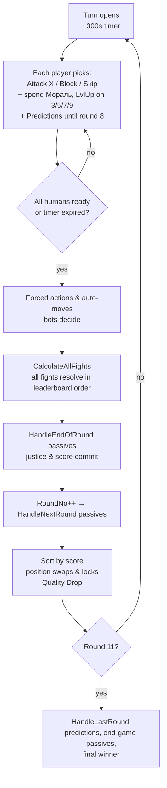
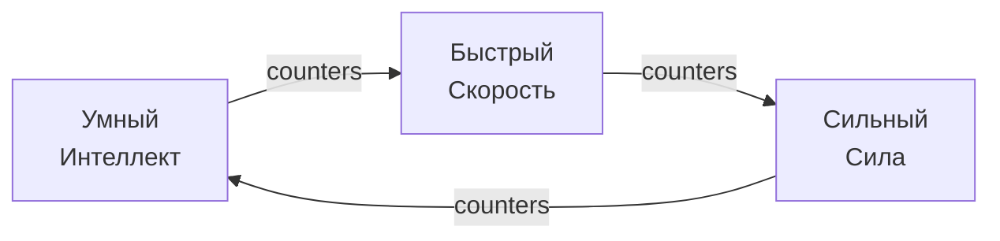
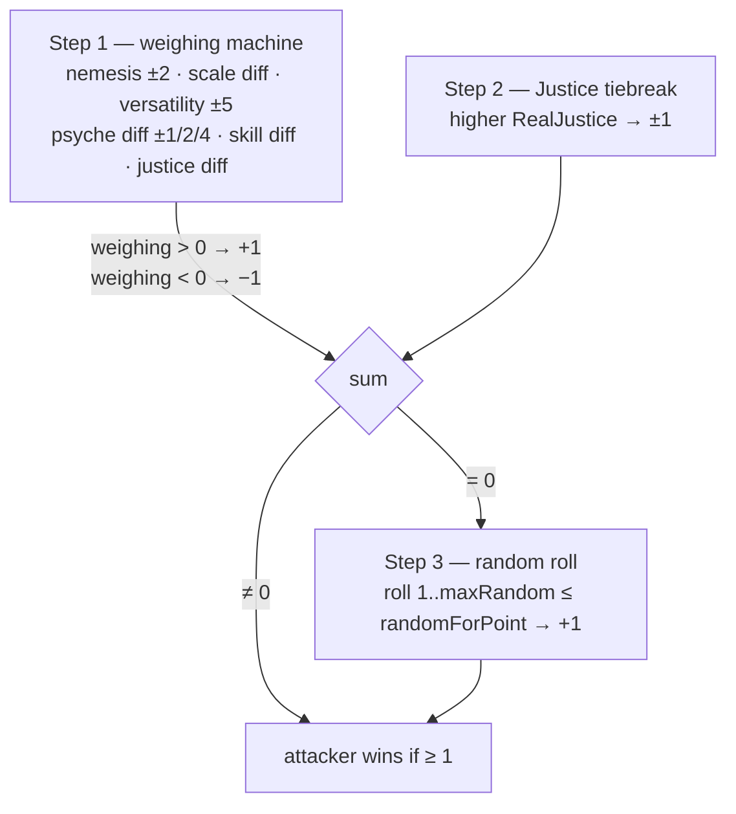

# King of the Garbage Hill — Game Design Document

> Code-verified against the working tree of 2026-07-10 (v4.1.8). Every mechanic below was read from the source, not from player-facing descriptions. File references are `path:line` as of this tree.
>
> Companion docs: [ARCHITECTURE.md](ARCHITECTURE.md) (code structure), [CHARACTERS.md](CHARACTERS.md) (all 39 character definitions, including special-purpose entries), [AUDIT-FINDINGS.md](AUDIT-FINDINGS.md) (design-vs-code audit).

## 1. What the game is

A 6-player simultaneous-turn king-of-the-hill game, 10 rounds long. Each player secretly plays one of ~40 characters (39 defined, some special-purpose) with hidden stats and passive abilities. Each round every player picks one action; all fights resolve at once; the leaderboard re-sorts by score. After round 10 the player with the most points wins ("Король Мусорной Горы").

The fun is information warfare: you see usernames and behaviors, not characters. You infer who is who ("Предположения" — end-game prediction bonuses), read class tells from fight logs, and play around 30 wildly asymmetric passive kits.

Runs as a Discord bot + web client (Vue/SignalR) in one process; humans and bots mix freely (see ARCHITECTURE.md).

## 2. Core loop

- Turn timer: default 300 s (`GameClass.cs:13`); a 100 ms timer polls readiness (`CheckIfReady.cs:63-74`).
- A human who does nothing gets an auto-move (bot picks for them, `CheckIfReady.cs:1087-1098`); a player who can't be auto-moved auto-blocks (`:1253`).
- Round 10 is the last fighting round. `RoundNo >= 11` ⇒ `HandleLastRound` (`CheckIfReady.cs:934`), except during the Kratos resurrection event (hard cap `RoundNo >= 20`, `:937`).

### Actions
| Action | Effect |
|---|---|
| **Attack X** | Fight X this round. You are the attacker; X defends (X keeps their own chosen action). |
| **Block** (Блок) | Fights against you don't happen; each blocked attacker loses 1 bonus point ("Блок"), you gain +1 next-round Justice — same `AddJusticeForNextRoundFromFight` as a fight loss (`DoomsdayMachine.cs:489-491`). |
| **Skip** (Пропуск) | Fights against you don't happen, attacker pays nothing. Mostly forced by passives (sleep, tilt, ban…). Voluntary skip isn't in the normal UI. |

Attackers with `IsArmorBreak` ignore blocks; `IsSkipBreak` ignores skips (granted by specific passives). Several characters can't block/skip or force others to fight (see CHARACTERS.md).

## 3. Stats and the class system

Four visible stats, integer **0–10** (clamps in `CharacterClass.cs:1398-1401` etc.). Exception: Рик's "Гигантские бобы" lets Intelligence exceed 10 (`:1206`).

| Stat | Fight role | Quality resist (see §7) | Stat-10 bonus (permanent flag) |
|---|---|---|---|
| **Интеллект** (Int) | scale + versatility; defines Умный class | pool 1/2/3 → breaking it costs −10% Skill | +10% Skill (`:469`) |
| **Сила** (Str) | scale + versatility; defines Сильный class | pool 1/2/3 → breaking it causes **Drop** | your Harm hits Str pools for −2 (`:482`) |
| **Скорость** (Speed) | scale + versatility; defines Быстрый class | pool 1/2/**5** = your **Harm reach** as attacker (§4/§7); never consumed by incoming Harm | +1 **kite** — shrinks incoming Harm reach (`:495`) |
| **Психика** (Psyche) | scale + own weighing term | pool 1/2/3 → breaking it costs −20% Мораль | +20% Мораль (`:508`, `:1085-1088`) |

### Class (Класс)
Your class = your **highest** of Int/Str/Speed, computed live (`GetSkillClassType`, `CharacterClass.cs:756-765`; ties resolve Int > Str > Speed; all three 0 ⇒ **Буль**/None). Class is never stored in `characters.json`.

- **Nemesis (контр)**: rock-paper-scissors above (`NemesisOf`, `CharacterClass.cs:739-745`). Having nemesis over the opponent: +2 weighing, ×1.5 on your skill term (attacker side), +1 skill multiplier in the fight (`CalculateRounds.cs:74-95`). Losing a fight where nemesis fully decided it leaks your class to the victim's log ("вас обманул/пресанул/обогнал", `DoomsdayMachine.cs:39-53, 1061-1069`).
- **Class perks** (each fight, `DoomsdayMachine.cs:591-601, 754-755`): Умный +6×mult Skill when target has 0 Justice; Быстрый +2×mult Skill in every fight (both roles); Сильный +4×mult Skill on every win.
- **Мишень (class target)**: every player has a private rotating target class (`CurrentSkillTarget`), first randomly rolled, then cycling Int→Str→Speed each round (`RollSkillTargetForNextRound`, `CharacterClass.cs:826-838`). Attacking someone whose class matches your Мишень grants Main-Skill (diminishing 10,9,8…1 — and the same amount again as Extra Skill, so effectively 20,18,…,2 — `AddMainSkill`, `CharacterClass.cs:961-1000`) and writes their class tag into your notes.

## 4. Fight resolution

All in `CalculateRounds.cs` (called from `DoomsdayMachine.cs:607-694`). A fight computes `pointsWined` from the attacker's perspective: **Step 1 (stats)** ±1, **Step 2 (Justice)** ±1; if the sum is 0, **Step 3 (random)** decides ±1. Final ≥1 ⇒ attacker wins.

**Step 1 — weighing machine** (`CalculateRounds.cs:56-410`), accumulator starts at 0, `randomForPoint` starts at 50:
1. **Nemesis**: ±2 weighing; attacker with nemesis also gets `nemesisMultiplier = 1.5` on his skill term; each side with nemesis gets +1 fight skill multiplier.
2. **Scale**: `Int+Str+Speed+Psyche + Skill(mult)/60` per side; add the difference (`:130-132`).
3. **Versatility**: compare Int, Str, Speed head-to-head; majority winner +5 (`:150-184`). Terminology note: historical player-facing texts call *this* bonus «Контр» and call the nemesis RPS «Анти-класс» — the meaning of "контр" flipped between those texts and the code/docs naming.
4. **Psyche diff**: 1–3 → ±1, 4–5 → ±2, ≥6 → ±4 (`:200-220`).
5. **TooGOOD**: |weighing| ≥ 13 ⇒ `randomForPoint` = 70 (or 30 against you) (`:228-251`).
6. **Skill difference**: `scaleMe×(1+mySkill/650×nemesisMult) − scaleTarget×(1+targetSkill/650) − scaleMe + scaleTarget` added to weighing (`:264-282`).
7. **TooSTONK**: |weighing| ≥ 30 ⇒ `randomForPoint` += weighing/2, capped ±20 (`:303-344`).
8. **Justice**: `+ (myJustice − targetJustice)` weighing (`:352`).
9. **Skill random modifier**: `randomForPoint += (mySkill − targetSkill)/60` — uncapped, so huge skill gaps effectively decide Step 3 (`:370-374`).

Madara's own TooGOOD/TooSTONK branches are attacker-count gated: >1 unique incoming enemy enables TooGOOD, >2 enables TooSTONK, and >3 sets his per-fight Skill to 100; the opposing character's thresholds still work normally (`Madara.cs:55-110`; `CalculateRounds.cs:228-344`).

**Step 2** (`:415-436`): +1/−1 to whoever has higher live Justice.

**Step 3** (`:438-492`), only on a tie: `maxRandom = 100 − (myJustice×nemesisMult − targetJustice)×5` (when either side has Justice > 1); roll 1..maxRandom; roll ≤ randomForPoint ⇒ attacker wins. Justice therefore shrinks the loss window *and* shifts the threshold.

**Overrides after the math** (`DoomsdayMachine.cs:623-714`): `IsAbleToWin=false` on a side adds ∓50 (passives use it to force outcomes); Котики's Storm can nudge ±5 and redirect the win point; Осьминожка's Неуязвимость/Itachi's Изанаги can flip the result outright.

### Win/loss consequences (`DoomsdayMachine.cs:747-951`)
- Winner: +1 **regular point** (`AddWinPoints`; Еврей passives may steal it; "Никому не нужен"/"INT" holders get **−1** instead when they attack-and-win, `:775-781`), sets `IsWonThisRound` (Justice reset at end of round).
- **Мораль transfer**: `moral = attackerPlace − defenderPlace`; flows only when the *lower-placed* side wins, and only from round 2 (`:798-815, 920-936`). Winner +moral, loser −moral (Минька deals no moral loss).
- Loser: `AddJusticeForNextRoundFromFight()` (+1 next-round Justice).
- **Вред (Harm)**: winner-attacker applies `LowerQualityResist` to the loser if the leaderboard distance ≤ attacker's Speed-resist range minus defender's kite bonus (`:913-926`). Butcher deals `1 + butcherState.PokerCount` base Harms; СуперМудень doubles the **complete** number, so Кочерга #4 = 5→10 (`DoomsdayMachine.cs:928-964`). Under СуперМудень, every Harm that underflows an Int/Strength/Psyche pool and actually applies its −10% Skill / Drop / −20% Moral effect queues one more Harm; new breaks recursively enqueue more (`CharacterClass.cs:296-345`; `DoomsdayMachine.cs:939-984`). It bypasses enemy Harm interceptors, lets a place-6 victim keep losing Drop points, stops at score 0, and caps at **50 actual Drops across the attacker's whole turn**; the counter resets next turn (`CharacterClass.cs:182-238`; `TheBoys.cs:60-67`; `CP:6181-6184`).
- **Madara exception**: `Воскрешенное тело` rejects incoming Harm and Madara never deals Harm as attacker; Skill, Moral, predictions, level-ups and negative stat mutations are also disabled (`CharacterClass.cs:198-203,781-846,911-1167,1239-1605`; `DoomsdayMachine.cs:831-935`).
- Defender wins: symmetric, but no Harm is dealt (Harm is attacker-only) and the "Никому не нужен"/"INT" negative-win rule is **not** applied on the defense branch (`:901-913`).

## 5. Resources

### Skill (Скилл)
Two internal pools — `SkillMain` (only from Мишень) and `SkillExtra` (everything else). Effective skill = `(Main+Extra) × (SkillFightMultiplier + fight bonuses) × IntelligenceQualitySkillBonus`, hard-capped at 228 for "Skill 228" holders (`CharacterClass.cs:892-908`). Skill enters fights via the scale term (/60), the skill-difference term (/650), and the Step-3 modifier (/60). Multiplier knobs used by passives: `TargetSkillMultiplier` (Мишень gains), `ExtraSkillMultiplier` (extra gains), `ClassSkillMultiplier` (class perk gains), `SkillFightMultiplier` (combat usage).

### Justice (Справедливость)
Clamped **0–5** (`CharacterClass.cs:1677-1712`). Gained (next round) by losing a fight, being attacked into your block, or from skills (`AddJusticeForNextRoundFrom{Fight,Skill}`). **Winning any fight this round zeroes your Justice before the buffer lands** (`HandleEndOfRoundJustice`, `:1631-1689`). Effects: weighing term, Step-2 tiebreak, Step-3 window shrink; "Умный" only milks skill from 0-Justice targets. `SeenJusticeNow` (what enemies can infer) only counts fight-sourced justice. Краборак's "Болевой порог" coin-flips each incoming justice point into a regular point instead (`:1654-1673`).

### Мораль (Moral)
A spendable currency, gained mostly by beating players placed above you (see §4). Spend at any time (`GameReactions.cs:45-133`):
| Мораль spent | → Skill (`HandleMoralForSkill`) | → Bonus points (`HandleMoralForScore`) |
|---|---|---|
| 1 / 2 / 3 | +2 / +6 / +10 | — |
| 5 | +18 | +1 |
| 7 (Еврей only) | +40 | — |
| 8 | +30 | +2 |
| 13 | +50 | +5 |
| 20 | +100 | +10 |

One tier per press, largest affordable tier first. Score conversion stages into `BonusPointsFromMoral`, flushed into real score at the start of the next round's calculation (`DoomsdayMachine.cs:218-224`). On round 10 all moral ≥5 is force-converted to score before the final fights (`CheckIfReady.cs:1298-1301`). Psyche ≥ 10 inflates displayed moral by +20% per bonus tier (`SetMoralBonus`). Blockers: Булькает zeroes moral, Геральт gains none, cancer blocks gains, Привет со дна fixes any gain at +4 and ignores losses, Спокойствие ignores losses (`CharacterClass.cs:1118-1177`).

### Psyche as a resource
No engine rule punishes 0 Psyche — all tilt/skip effects are per-character passives (Дизмораль, Буль, АФКА…). Psyche loss must run through `MinusPsycheLog` (logs "{user} психанул" globally; respects Спокойствие and M.M.'s Оковы immunity, `GamePlayerBridgeClass.cs:91-104`). Безумие (DeepList) bypasses the 0-floor so psyche can go negative (`CharacterClass.cs:1295`).

## 6. Score

Two currencies (`InGameStatusClass.cs`):
- **Regular points** (`AddRegularPoints` / `AddWinPoints`): buffered during the round in `ScoresToGiveAtEndOfRound`, then multiplied and committed at end of round (`CombineRoundScoreAndGameScore:245-300`). **Multiplier: rounds 1–4 ×1, 5–9 ×2, round 10 ×4.** Толя's "Подсчет" forces a victim's multiplier to ×1 for a round.
- **Bonus points** (`AddBonusPoints`): applied to Score immediately, never multiplied. Total score floors at 0 (except HardKitty's "Никому не нужен", which may go negative — including via `HardKittyMinus`).

Leaderboard = players sorted by Score desc; ties keep list order (first-come); a tied top score at game end prints "Ничья". Place matters mechanically: moral transfers, Harm range, many passives (mines at places 1/2/6, "Лежит на дне" neighbors, etc.).

## 7. Quality, Вред (Harm), Скинуть (Drop)

Each character carries per-stat **resist pools** sized by the stat: 0–3→1, 4–7→2, ≥8→3 (Speed: ≥8→**5**) (`SetXResist`, `CharacterClass.cs:459-509`); pools re-arm on stat changes proportionally (`UpdateXResist`). The Speed pool is offense, not defense: it is never consumed by Harm — it sets your attacker-side **Harm reach** (§4), while incoming reach is shrunk by the **kite** bonus (Speed-10 flag +1, plus passive-granted range, `GetSpeedQualityKiteBonus`, `:390-402`). A stat of 10 grants the pool's bonus flag permanently (+10% skill / +1 drop pierce / +1 kite / +20% moral).

One **Вред** = `LowerQualityResist(victim)` (`CharacterClass.cs:195-325`): −1 to Int, Psyche and Str pools (attacker with 10 Str pierces Str for −2). Round 1 is Harm-free. When a pool underflows:
- Int pool → re-arm + **−10% Skill** permanently (`IntelligenceQualitySkillBonus--`);
- Psyche pool → re-arm + **−20% Мораль**;
- Str pool → re-arm + **Drop**: `HandleDrop` = −1 bonus point, global "Они скинули **X**! Сволочи!", and at end of round the player is pushed one leaderboard slot down per Drop (`DoomsdayMachine.cs:1452-1485`). Place 6 can't drop; you can't be dropped onto HardKitty or onto a Ziggurat-locked Goblin. Монстр без имени gains +1 bonus point on *every* drop in the game (`CharacterClass.cs:188-192`).

Immunities/specials: Boole Family rejects ordinary Harm; Kimiko guards TheBoys; Испанец converts ordinary Harm into +1 Мораль for mylorik; Madara's Воскрешенное тело rejects ordinary Harm. **СуперМудень bypasses all four** (`CharacterClass.cs:205-238`). Спартанец's "Это привилегия…" adds extra Str-pool damage vs top-3 targets from round 5 scaling with skill ratio (`CharacterClass.cs:246-295`).

## 8. Exact round pipeline

Order matters constantly; this is the canonical sequence.

**A. Turn close** (`CheckIfReady.cs:1078-1409`): readiness/timeout → auto-move idlers (pickle-Rick and round-8/sealed Madara excluded) → Dopa second-action automove → **AWDKA shoved to last place in the list** (`:1113-1127`, see AUDIT-FINDINGS) → bots + auto-movers act → HardKitty shoved last → Геральт skip→block → Aggress forced random attack → Шэн forced attacks from below → Salldorum first-block cola bury → Штормяк taunt (immunities: dead, Котики vs transferred storm, once-per-enemy for the original) → auto-block do-nothings → Монстр no-escape (block/skip stripped; round-10 ban carve-out for Тигр) → round-8 Madara correct locked predictions append visible duplicate attacks, while his own action is cleared → sealed-Madara targets are sanitized → round-10 moral dump → reset moral bonus/drop counters → `CalculateAllFights` (`CheckIfReady.cs:1376-1397`).

**B. Fight phase** (`DoomsdayMachine.cs:172-1406`): clear web logs, capture replay → flush `BonusPointsFromMoral` → PointFunnel wiring → count Madara's unique queued attackers and arm his all-five condition → **DeepCopy GameCharacter→FightCharacter** → conversions: Медитация skip→block, Огурчик Рик block→pickle (an active pickle strips Block/Skip), **Эрен block→Атакующий Титан (no block remains)**, Портальная пушка cancels external block/skip, Aggress can't block/skip → Геральт contract fight injection (both directions) → Котики storm pre-pick → **fight loop in leaderboard order** (place 1's attacks resolve first): per fight — `HandleDefenseBeforeFight` → `HandleAttackBeforeFight` → active-pickle authority (accept fight + defender wins, `DM:486-499`) → block? (normally attacker −1 bonus; Madara instead +2 regular from Второй метеорит; defender justice) / skip? → Мишень + class skill gains → Steps 1–3 → overrides (IsAbleToWin ±50, Storm ±5, Octopus, Изанаги) → win/loss consequences (§4) → `HandleDefenseAfterFight` → `HandleDefenseAfterBlockOrFight(OrSkip)` → `HandleAttackAfterFight` → `HandleCharacterAfterFight` (both; Madara counts resolved fights/round-8 outcomes) → `HandleShark` → `ResetFight` (ForOneFight resets on both copies, win/weed streaks, exploit counter). Round-8 theme media is then removed. **After the final fight and before every end-of-round passive, round-10 Rumbling projects post-multiplier score and resolves its kills** (`DoomsdayMachine.cs:1405-1406`; `CharacterPassives.cs:3528-3576`).

**C. End of round** (`DoomsdayMachine.cs:1422-1519`): `HandleEndOfRound` (big per-passive dispatcher, after the Rumbling pre-settlement above) → per player: clear flags, auto-ready dead, `SetSpeedResist`, `NormalizeMoral`, **`HandleEndOfRoundJustice`**, **`CombineRoundScoreAndGameScore`** (×1/×2/×4), clear logs, clear PointFunnel → Kratos all-gods-dead check → `RoundNo++`.

**D. Next-round setup** (`DoomsdayMachine.cs:1521-1780`): `HandleNextRound` (Madara: suppress non-combat resources; round 8 global challenge/theme and action lock; round 9 dialogue/seal) → save Storm-bite & Ziggurat position locks → **sort by score** → Тигр-топ swap (skipped if round-10-banned; blocked by Ziggurat on #1) → Portal-Gun swap (blocked by Ziggurat) → HardKitty forced last → **LvlUp++ on rounds 3/5/7/9 except Madara** (DooM Guy maps these to Rune/Shield/Mission/Gun; Let's Roll immediately consumes the point with a random configured module) + place assignment + Мишень roll + place history → restore Ziggurat locks → restore/execute Storm-bite locks & swap → **Quality Drop** → `SortGameLogs` → `HandleNextRoundAfterSorting` (Madara top-1 phrase; entering-round-10 top-1 arms hidden ending) → `HandleBotPredict` → `RollExploit` → restart timer (`CharacterPassives.cs:4913-4943`; `CharacterPassives.cs:6162-6178`; `CharacterPassives.cs:6687`; `DoomsdayMachine.cs:1769-1780`).

**E. Game end** (`HandleLastRound`, `CheckIfReady.cs:266-834`): Геральт-6th pitchfork log → **predictions**: +1 bonus per correct guess (+2 for Великий летописец; Кира and Madara excluded; "Выдуманный персонаж" can't be guessed; needs 6 players, ≤5 bots) → active M.M. компромат multiplies prediction bonus → active Francie virus −2/+2 per infected (both skipped under СуперМудень) → Цукуеми deductions → sort → AWDKA "Произошел троллинг" (bonus = half of top-1's score at his last winning attack + correct predicts) + re-sort → Premade check (both top-2 & support below carry ⇒ support gets carry−support+1 bonus, re-sort — an *enforced* win) → Sakura "Одна из трех" (top-3 ⇒ narrative win only) → post-game phrases → account settlement: history/mastery, ZBS 100/50/40/30/20/10, daily quests, one loot box for an alive reward-place top 2, Achievement V2 evaluation/rewards and character/tier statistics, all under one account lock and immediately saved for real players (`CheckIfReady.cs:648-777`). If Madara's hidden ending is active, only final rendering is per-viewer projected (spectators see no result); real score/rewards/history are unchanged, shared replay/story artifacts are suppressed, and non-Madara achievement evaluation is suppressed so the private result cannot leak (`Madara.cs:219-259`; `GameStateMapper.cs:998-1123`; `AchievementClass.cs:426-439`; `CheckIfReady.cs:811-819`).

Note the **settlement layers before HandleLastRound**: Rumbling is the first layer, directly after the round-10 fight loop; effects keyed to "round 10 end / round 11" then live in `HandleEndOfRound` (Пейзаж конца света, Saitama's Ищет достойного противника…), `HandleNextRound` (Чернильная завеса restore…) and `HandleNextRoundAfterSorting` (Запах мусора…) of the round-10 calculation, which all run *before* `HandleLastRound`. Full per-character map in CHARACTERS.md.

## 9. Predictions (Предположения)

Each player assigns a character guess to each enemy (select menus; `GameReactions.cs:553-613`). Editable until round 8 (`ConfirmedPredict` forced open on round 8, auto-confirmed round 9; `CheckIfReady.cs:1333-1343`). Scored at game end (§8E). Bots predict via `HandleBotPredict` heuristics (`DoomsdayMachine.cs:1777`) — except at AI difficulty 3, where strict bots (`PlayerType == 404`) from `AiFullKnowledgeRound` (default 3) auto-fill correct predictions for every enemy (`CharacterPassives.cs:6302`). That fill deliberately **skips Монстр без имени**: guessing him can't score (`CheckIfReady.cs:301`) and would gift him +3 / turn the guesser into a pawn on round 9. Кира writes Death-Note names instead of predicting; Монстр без имени can't be guessed and turns players who *are* guessed by him into pawns.

## 10. Team mode

`game.Teams` (2v2v2 / 3v3). Fights between teammates exchange **nothing** — no points, moral, justice, Harm (every branch gated by `!teamMate`, `DoomsdayMachine.cs:718-946`). Team win = highest summed score (`CheckIfReady.cs:518-578`; ZBS 100 winners / 50 losers). HardKitty is removed from the roll pool in team games; `TeamModeOnly` characters (Napoleon Wonnafcuk, Таинственный Суппорт) never roll in solo (`StartGameLogic.cs:68-77`).

## 11. Character acquisition (roll system)

Weighted roll by **Tier** (`StartGameLogic.cs:38-52`): range 150/100/90/80/70/60/50/40 for tiers 6/5/4/3/2/1/0/−1. Tier semantics (`CharactersPull.cs:28-50`): **−1 = secret characters** (Sakura, Баг) — rollable at range 40 but hidden from the predictions menu and character lists (and bots never roll them, see below); **−2 = transform templates** (Молодой Глеб) — excluded from the roll pool entirely. Modifiers: per-character account multiplier (store), tier-pity +3% per game without that tier, "Top Laner" holders get progressively rarer within one game's roll (×1.0 → ×0.8 → …), bots roll tier-4 ×3 and never tier <4 except Кира at half tier-1 range. Constraints: LeCrisp and Толя never in the same game; Эрен Йегер and HardKitty never naturally coexist; only one Tier-4 (Boole family) character per game; you don't get your previous game's character (`StartGameLogic.cs:245-250,300-303`). ARAM mode instead deals 4 random visible passives (pool excludes Tier −1 characters, `CharactersPull.cs:59-78`) + random stats; Draft mode deals 3 weighted choices.

**DooM Guy newcomer/meta progression:** for a human with fewer than 10 completed games, when DooM Guy is eligible and was not the previous character, his normal-roll branch is exactly 30%; a miss excludes him from that weighted fallback (`StartGameLogic.cs:177-205`). DooM Guy has a persistent account loadout (`DiscordAccountClass.cs:41`, `DoomGuy.cs:64-104`): four stage categories with four slots each. Finishing as him at place 4/3/2/1 can unlock Rune/Shield/Mission/Gun reward modules respectively, falling back through lower incomplete stages; 5th/6th never roll a module. The drop chance is calculated per category from its live reward registry, linearly 80%→5% as the pool is exhausted (`DoomGuy.cs:227-260`; payout call `CheckIfReady.cs:666-675`).

## 12. Global systemics

- **Exploit**: one non-Баг player is "exploitable" each round, rotating sequentially (`RollExploit`, `GameClass.cs:141-180`). Losing while exploitable increments a global counter; the Баг character cashes it in (`CharacterPassives.cs:1613-1624`). The rotation is gated on a Баг player being in the game (`GameClass.cs:143-146`; m5 fixed — it used to run as harmless no-op bookkeeping in every game).
- **Kratos event** (Возвращение из мертвых): after a round-10 death Kratos resurrects, everyone else is forced to block each extra round, defeated players fall off the board (die); ends when all five are dead or Kratos loses (`CheckIfReady.cs:1019-1029`, `DoomsdayMachine.cs:1249-1255`).
- **Death** (unified: Kira heart attacks, Kratos kills, Монстр pawns): `Passives.IsDead` + `DeathSource`; dead players auto-block/auto-ready, get 0 ZBS and no mastery (`CheckIfReady.cs:1032-1037, 622-624, 665`).
- **Bots** (`BotsBehavior.cs:43-105`): round >10 → block; spend Moral by place/character thresholds; spend pending level-ups; Кира writes notes; then choose attack/block through the per-game `Nanobot` preference model. The model combines Justice gaps, leaderboard position, Мишень/nemesis, prior fight outcomes, visible defense, Harm/Drop reach and character objectives. This whole path also drives auto-moved AFK humans (`CheckIfReady.cs:1172-1184`), who inherit the game's difficulty but do not roll a bot-only persistent playstyle.
- **Bot AI difficulty** (`GameClass.AiDifficulty`, **default 3 everywhere**; sim override `--ai-difficulty N`, range **0-3**): **0** = pure-random sim baseline, still respecting legal actions; **1** = frozen legacy behavior; **2** = stronger use of visible/earned information and one coherent random character plan for the whole match; **3** = L2 plus omniscience from `AiFullKnowledgeRound` (default round 3), auto-predictions (except Монстр) and a side-effect-free estimate of Step-1 fight terms. L2 understands Мишень, nemesis, versatility signals, visible Block/Skip and Armor/SkipBreak, Harm range, primed Strength-pool Drops, Justice economics, Moral conversion tiers and opponent punish-passives; it does **not** get L3's exact hidden-stat/real-Justice read. Кира's Death Note is never omniscient. Full rule/number catalogue: `docs/BALANCE-CONSTANTS.md` → “Bot AI difficulty” (`BotsBehavior.cs:45-70, 858-1080`).
- **Persistent L2/L3 playstyles**: selected once and stored in `AiPlaystyle` (`GamePlayerBridgeClass.cs:57-59`; picker `BotsBehavior.cs:107-175`). Multi-plan roster: Dopa (Стомп/Фарм/Доминация/Роум), Darksci (Stable/Unstable), Глеб (Classic/Young), TheBoys (Francie/Butcher/Kimiko/M.M.), Goblins (Horde/Army/Economy/Ziggurat), Rick (Portal/Beans), Itachi (Crows/Tsukuyomi), Kratos (GodHunter/Ragnarok), Cats (Ambush/Storm), Tolya (Count/Rammus), Monster (Twin/Apocalypse), Support (Carry/Stakes). The plan governs target priorities, block/Moral policy and level-up path for the match; characters without multiple builds use `Adaptive`. Sim reports include the plan so each branch can be A/B-measured (`SimulationRunner.cs:630-643`).
- **Achievement V2**: 33 account achievements observe global mechanics, character stories and seven cross-character interactions. Multi-step progress is the best result from one match, never a cumulative total; unlock rewards are credited exactly once at authoritative game-end settlement (`AchievementClass.cs:182-403,412-560`). Epic/Legendary achievements can award loot boxes into the same inventory as alive top-two finishes. The complete rule/reward/loot catalog is [ACHIEVEMENTS.md](ACHIEVEMENTS.md).
- **Debug/admin**: `PlayerType == 2` grants AdminPlayerType passive at runtime (sees all); a hardcoded Discord id gets TooSTONK debug lines (`CalculateRounds.cs:330`).

**Out of scope of this document** (they exist, deliberately not covered here): daily quests, the ZBS store, character mastery/pity beyond §11, the replay system, the Discord/web rendering layers, and the unrelated side-games (Battleship, Blackjack) that share the process. Achievements and loot boxes are specified separately in [ACHIEVEMENTS.md](ACHIEVEMENTS.md).
