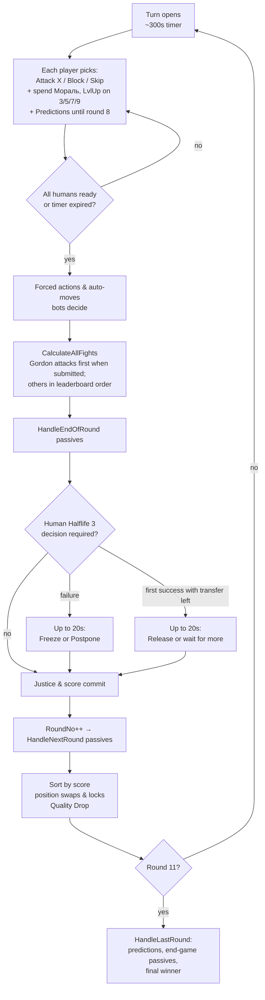
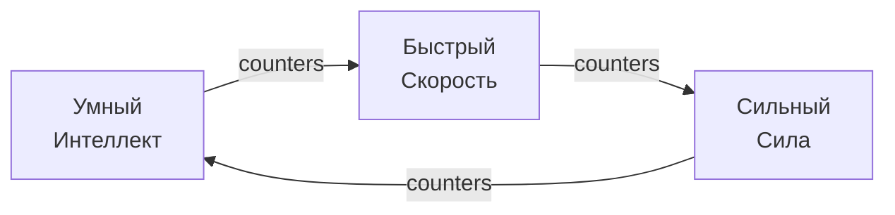
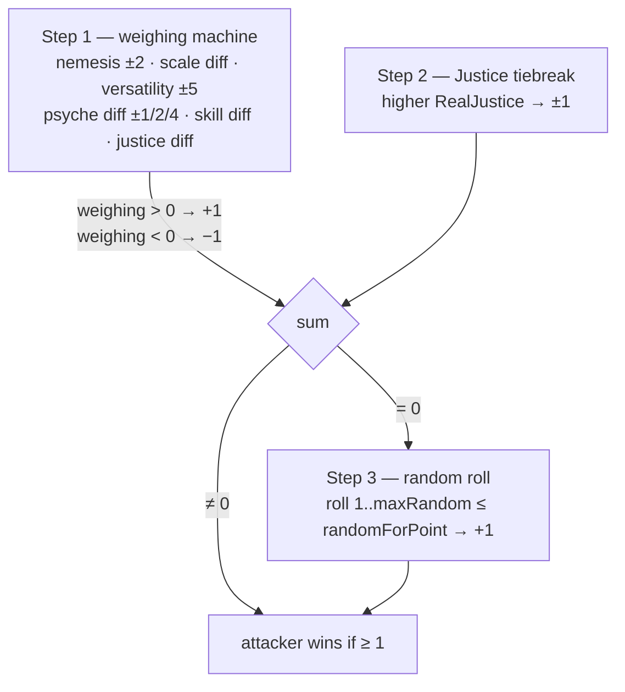

# King of the Garbage Hill — Game Design Document

> Code-verified against the working tree of 2026-07-16 (v4.6.8). Every mechanic below was read from the source, not from player-facing descriptions. File references are `path:line` as of this tree.
>
> Companion docs: [ARCHITECTURE.md](ARCHITECTURE.md) (code structure), [CHARACTERS.md](CHARACTERS.md) (all 42 character definitions, including special-purpose entries), [AUDIT-FINDINGS.md](AUDIT-FINDINGS.md) (design-vs-code audit).

## 1. What the game is

A 6-player simultaneous-turn king-of-the-hill game, 10 rounds long. Each player secretly plays one of 42 defined characters (some special-purpose) with hidden stats and passive abilities. Each round every player picks one action; all fights resolve at once; the leaderboard re-sorts by score. After round 10 the player with the most points wins ("Король Мусорной Горы").

The fun is information warfare: you see usernames and behaviors, not characters. You infer who is who ("Предположения" — end-game prediction bonuses), read class tells from fight logs, and play around wildly asymmetric passive kits.

Runs as a Discord bot + web client (Vue/SignalR) in one process; humans and bots mix freely (see ARCHITECTURE.md).

## 2. Core loop

- Turn timer: default 300 s (`GameClass.cs:13`); a 100 ms timer polls readiness (`CheckIfReady.cs:63-74`).
- A human who does nothing gets an auto-move (bot picks for them, `CheckIfReady.cs:1132-1144`); a player who can't be auto-moved auto-blocks (`:1253`).
- Round 10 is the last fighting round. `RoundNo >= 11` ⇒ `HandleLastRound` (`CheckIfReady.cs:970`), except during the Kratos resurrection event (hard cap `RoundNo >= 20`, `:937`).

### Actions
| Action | Effect |
|---|---|
| **Attack X** | Fight X this round. You are the attacker; X defends (X keeps their own chosen action). |
| **Block** (Блок) | Fights against you don't happen; each blocked attacker loses 1 bonus point ("Блок"), you gain +1 next-round Justice — same `AddJusticeForNextRoundFromFight` as a fight loss. Naruto is the explicit replacement: **Гарем но джутсу** clears Block and instead cancels every fight of each attacker whose finalized queue reaches him (`Naruto.cs` `ResolveHaremQueues`). |
| **Skip** (Пропуск) | Fights against you don't happen, attacker pays nothing. Mostly forced by passives (sleep, tilt, ban…). Voluntary skip isn't in the normal UI. |

Attackers with `IsArmorBreak` ignore blocks; `IsSkipBreak` ignores skips (granted by specific passives). Several characters can't block/skip or force others to fight (see CHARACTERS.md).

## 3. Stats and the class system

Four mechanical stats, integer **0–10** (clamps in `CharacterClass` stat setters). Рик's "Гигантские бобы" lets Intelligence exceed 10. Dopa keeps ordinary mechanical Intelligence but every player-facing surface labels it **IQ** and displays 7/8/9/10 as 200/209/218/228; below 7 each missing Intelligence subtracts one from 200 (`CharacterClass.GetIntelligenceString`; web `PlayerCard.dopaIq`).

| Stat | Fight role | Quality resist (see §7) | Stat-10 bonus (permanent flag) |
|---|---|---|---|
| **Интеллект** (Int) | scale + versatility; defines Умный class | pool 1/2/3 → breaking it costs −10% Skill | +10% Skill (`:469`) |
| **Сила** (Str) | scale + versatility; defines Сильный class | pool 1/2/3 → breaking it causes **Drop** | your Harm hits Str pools for −2 (`:482`) |
| **Скорость** (Speed) | scale + versatility; defines Быстрый class | pool 1/2/**5** = your **Harm reach** as attacker (§4/§7); never consumed by incoming Harm | +1 **kite** — shrinks incoming Harm reach (`:495`) |
| **Психика** (Psyche) | scale + own weighing term | pool 1/2/3 → breaking it costs −20% Мораль | +20% Мораль (`:508`, `:1085-1088`) |

### Class (Класс)
Your class = your **highest** of Int/Str/Speed, computed live (`GetSkillClassType`, `CharacterClass.cs:756-765`; ties resolve Int > Str > Speed; all three 0 ⇒ **Буль**/None). Class is never stored in `characters.json`.

- **Nemesis (контр)**: rock-paper-scissors above (`NemesisOf`, `CharacterClass.cs:739-745`). Having nemesis over the opponent: +2 weighing, ×1.5 on your skill term (attacker side), +1 skill multiplier in the fight (`CalculateRounds.cs:74-95`). Losing a fight where nemesis fully decided it leaks your class to the victim's log ("вас обманул/пресанул/обогнал", `DoomsdayMachine.cs:39-53, 1061-1069`).
- **Class perks** (each fight, `DoomsdayMachine.cs:658-668, 754-755`): Умный +6×mult Skill when target has 0 Justice; Быстрый +2×mult Skill in every fight (both roles); Сильный +4×mult Skill on every win.
- **Мишень (class target)**: every player has a private rotating target class (`CurrentSkillTarget`), first randomly rolled, then cycling Int→Str→Speed each round (`RollSkillTargetForNextRound`, `CharacterClass.cs:826-838`). Attacking someone whose class matches your Мишень grants Main-Skill (diminishing 10,9,8…1 — and the same amount again as Extra Skill, so effectively 20,18,…,2 — `AddMainSkill`, `CharacterClass.cs:961-1000`) and writes their class tag into your notes.

## 4. Fight resolution

All in `CalculateRounds.cs` (called from `DoomsdayMachine.cs:797-938`). A fight computes `pointsWined` from the attacker's perspective: **Step 1 (stats)** ±1, **Step 2 (Justice)** ±1; if the sum is 0, **Step 3 (random)** decides ±1. Final ≥1 ⇒ attacker wins.

**Step 1 — weighing machine** (`CalculateRounds.cs:56-410`), accumulator starts at 0, `randomForPoint` starts at 50:
1. **Nemesis**: ±2 weighing; attacker with nemesis also gets `nemesisMultiplier = 1.5` on his skill term; each side with nemesis gets +1 fight skill multiplier.
2. **Scale**: `Int+Str+Speed+Psyche + Skill(mult)/60` per side; add the difference (`:130-132`).
3. **Versatility**: compare Int, Str, Speed head-to-head; majority winner +5 (`:150-184`). Terminology note: historical player-facing texts call *this* bonus «Контр» and call the nemesis RPS «Анти-класс» — the meaning of "контр" flipped between those texts and the code/docs naming.
4. **Psyche diff**: 1–3 → ±1, 4–5 → ±2, ≥6 → ±4 (`:200-220`).
5. **TooGOOD**: |weighing| ≥ 13 ⇒ `randomForPoint` = 70 (or 30 against you) (`:228-251`).
6. **Skill difference**: `scaleMe×(1+mySkill/650×nemesisMult) − scaleTarget×(1+targetSkill/650) − scaleMe + scaleTarget` added to weighing (`:264-282`).
7. **TooSTONK**: |weighing| ≥ 30 ⇒ `randomForPoint` += weighing/2, capped ±20 (`:303-344`).
8. **Justice**: `+ (myJustice − targetJustice)` weighing (`:352`).
9. **Skill random modifier**: `randomForPoint += (mySkill − targetSkill)/60` — uncapped, so huge skill gaps effectively decide Step 3 (`:370-374`).

Madara's own TooGOOD/TooSTONK branches are attacker-count gated: >1 unique incoming enemy enables TooGOOD, >2 enables TooSTONK, and >3 sets his per-fight Skill to 100; the opposing character's thresholds still work normally (`Madara.cs:55-110`; `CalculateRounds.cs:228-344`).

**Step 2** (`:415-436`): +1/−1 to whoever has higher live Justice.

**Step 3** (`:438-492`), only on a tie: `maxRandom = 100 − (myJustice×nemesisMult − targetJustice)×5` (when either side has Justice > 1); roll 1..maxRandom; roll ≤ randomForPoint ⇒ attacker wins. Justice therefore shrinks the loss window *and* shifts the threshold.

**Overrides after the math**: `IsAbleToWin=false` on a side adds ∓50 (passives use it to force outcomes); Котики's Storm can nudge ±5 and redirect the win point; Осьминожка's Неуязвимость/Itachi's Изанаги can flip the result outright. A successful Naruto **Призыв** is applied after those defensive replacers and is therefore a terminal attacker win (`DoomsdayMachine.cs:816-938`).

### Win/loss consequences (`DoomsdayMachine.cs:815-1024`)
- Winner: +1 **regular point** (`AddWinPoints`; Еврей passives may steal it; "Никому не нужен"/"INT" holders get **−1** instead when they attack-and-win). **На мели** is the defensive exception: Saitama gets no victory point when he wins as defender (`DoomsdayMachine.cs:1199-1220`). Any win sets `IsWonThisRound` (Justice reset at end of round), including an unpaid defensive Saitama win.
- **Мораль transfer**: `moral = attackerPlace − defenderPlace`; flows only when the *lower-placed* side wins, and only from round 2 (`:798-815, 920-936`). Winner +moral, loser −moral (Минька deals no moral loss).
- Loser: `AddJusticeForNextRoundFromFight()` (+1 next-round Justice). A loss staged by Saitama's **Неприметность** is the exception and grants him no Justice (`CharacterPassives.cs:667-690`; `DoomsdayMachine.cs:1061-1062`).
- **Вред (Harm)**: winner-attacker applies `LowerQualityResist` to the loser if the leaderboard distance ≤ attacker's Speed-resist range minus defender's kite bonus (`:913-926`). Butcher deals `1 + butcherState.PokerCount` base Harms; СуперМудень doubles the **complete** number, so Кочерга #4 = 5→10 (`DoomsdayMachine.cs:1001-1037`). Under СуперМудень, every Harm that underflows an Int/Strength/Psyche pool and actually applies its −10% Skill / Drop / −20% Moral effect queues one more Harm; new breaks recursively enqueue more (`CharacterClass.cs:296-345`; `DoomsdayMachine.cs:1012-1057`). It bypasses enemy Harm interceptors, lets a place-6 victim keep losing Drop points, stops at score 0, and caps at **50 actual Drops across the attacker's whole turn**; the counter resets next turn (`CharacterClass.cs:182-238`; `TheBoys.cs:60-67`; `CP:6319-6322`).
- **Madara exception**: `Воскрешенное тело` rejects incoming Harm and Madara never deals Harm as attacker; Skill, Moral, predictions, level-ups and negative stat mutations are also disabled (`CharacterClass.cs:198-203,781-846,911-1167,1239-1605`; `DoomsdayMachine.cs:899-1008`).
- Defender wins: symmetric, but no Harm is dealt (Harm is attacker-only). Toxic Mate's `INT` still applies its negative point; **На мели** suppresses Saitama's defensive victory point (`DoomsdayMachine.cs:1199-1215`).

## 5. Resources

### Skill (Скилл)
Two internal pools — `SkillMain` (only from Мишень) and `SkillExtra` (everything else). Effective skill = `(Main+Extra) × (SkillFightMultiplier + fight bonuses) × IntelligenceQualitySkillBonus`, hard-capped at 228 for "Skill 228" holders (`CharacterClass.cs:892-908`). Skill enters fights via the scale term (/60), the skill-difference term (/650), and the Step-3 modifier (/60). Multiplier knobs used by passives: `TargetSkillMultiplier` (Мишень gains), `ExtraSkillMultiplier` (extra gains), `ClassSkillMultiplier` (class perk gains), `SkillFightMultiplier` (combat usage).

### Justice (Справедливость)
Clamped **0–5** (`CharacterClass.cs:1677-1712`). Gained (next round) by losing a fight, being attacked into your block, or from skills (`AddJusticeForNextRoundFrom{Fight,Skill}`). **Близнец is the block exception**: no generic +1; in the authoritative successful-block branch Monster instead copies the highest attacker's persistent Justice without draining it, so a block-bypassing fight does not count (`DoomsdayMachine.cs:604,658-716`). **Неприметность is the loss exception**: Saitama gains no Justice when he only pretends to lose (`CharacterPassives.cs:667-690`; `DoomsdayMachine.cs:1061-1062`). **Winning any fight this round zeroes your Justice before the buffer lands** (`HandleEndOfRoundJustice`, `CharacterClass.cs:1631-1689`). Effects: weighing term, Step-2 tiebreak, Step-3 window shrink; "Умный" only milks skill from 0-Justice targets. Gordon has no additional Justice-to-stat conversion. `SeenJusticeNow` (what enemies can infer) only counts fight-sourced justice. Краборак's "Болевой порог" coin-flips each incoming justice point into a regular point instead (`CharacterClass.cs:1654-1673`).

### Мораль (Moral)
A spendable currency, gained mostly by beating players placed above you (see §4). Spend at any time (`GameReactions.cs:45-133`):
| Мораль spent | → Skill (`HandleMoralForSkill`) | → Bonus points (`HandleMoralForScore`) |
|---|---|---|
| 1 / 2 / 3 | +2 / +6 / +10 | — |
| 5 | +18 | +1 |
| 7 (Еврей only) | +40 | — |
| 8 | +30 | +2 |
| 13 | +50 | +5 |
| 20 | +100 | +10 |

One tier per press, largest affordable tier first. Score conversion stages into `BonusPointsFromMoral`, flushed into real score at the start of the next round's calculation (`DoomsdayMachine.cs:237-243`). On round 10 all moral ≥5 is force-converted to score before the final fights (`CheckIfReady.cs:1357-1361`). Psyche ≥ 10 inflates displayed moral by +20% per bonus tier (`SetMoralBonus`). Blockers: Булькает zeroes moral, Геральт gains none, cancer blocks gains, Привет со дна fixes any gain at +4 and ignores losses, Спокойствие ignores losses (`CharacterClass.cs:1118-1177`).

### Psyche as a resource
No engine rule punishes 0 Psyche — all tilt/skip effects are per-character passives (Дизмораль, Буль, АФКА…). Psyche loss must run through `MinusPsycheLog` (logs "{user} психанул" globally; respects Спокойствие and M.M.'s Оковы immunity, `GamePlayerBridgeClass.cs:111-128`). Безумие (DeepList) bypasses the 0-floor so psyche can go negative (`CharacterClass.cs:1295`).

## 6. Score

Two currencies (`InGameStatusClass.cs`):
- **Regular points** (`AddRegularPoints` / `AddWinPoints`): buffered during the round in `ScoresToGiveAtEndOfRound`, then multiplied and committed at end of round (`InGameStatusClass.cs` `CombineRoundScoreAndGameScore`, `GetRoundScoreMultiplier`). **Multiplier: rounds 1–4 ×1, 5–9 ×2, round 10 ×4.** Толя's "Подсчет" forces a victim's multiplier to ×1 for a round.
- **Bonus points** (`AddBonusPoints`): applied to Score immediately, never multiplied.

Джон Сноу's active **Король Сервера** is the bonus-path exception: every positive or negative bonus mutation is doubled before the ordinary floor and logged as **королевские** points. The multiplier is blocked while Jon occupies place 4 (`InGameStatusClass.AddBonusPointsCore`; `JonSnow.IsKingActive`).

On a scheduled **Halflife 3** attempt, Gordon replaces only that round's ordinary settlement. If `P` is his raw pending regular score, the committed amount is exactly `P^P` (3 raw → 27 settled; 4 raw → 256 settled), with no extra outer multiplication. Толя's active Подсчет disables this override and commits the ordinary forced ×1 instead. `P ≥ 3` is release-ready. The first successful human attempt with at least one of the three postponements left pauses once for Release/Wait; waiting consumes the next postponement, and every later success releases immediately. Итачи's active Цукуеми steals the transformed settlement; Осьминожка and Сайтама record only their ordinary round-multiplied point ledgers. On `P < 3`, a human match may pause before score commit for a 20-second Freeze/Postpone choice. Postponements 1/2/3 subtract exactly 1/2/3 points from the transformed settlement and retry next round; an unaffordable postponement or the failure after all three cancels (`GordonFreeman.PrepareHalfLifeSettlement`/`ProjectRegularSettlement`/`ResolveHalfLifeDecision`; `DoomsdayMachine.ResumePendingRound`/`CompleteRoundAsync`).

Both ordinary settlement and bonus mutations floor total score at 0. HardKitty's «Никому не нужен» is the general floor breaker; the two explicit lethal −500 changes—Kira's L-arrest and Геральт's pitchfork death—use `AddBonusPointsIgnoringFloor` and may also leave a negative score (`InGameStatusClass.cs` `AddBonusPointsCore`/`AddScoreWithMultiplier`). Transfer-shaped bonus mechanics still credit their full nominal amount when an ordinary victim hits zero; this intentional positive-sum cushion is D12. unknown_bug is the explicit exception: its hostile transfer is rejected before both debit and paired credit/ledger creation.

Leaderboard = players sorted by Score desc; ties keep list order (first-come); a tied top score at game end prints "Ничья" unless a qualifying solo Sakura owns the declared win. Place matters mechanically: moral transfers, Harm range, many passives (mines at places 1/2/6, "Лежит на дне" neighbors, etc.). Final sorts place every dead seat below every living player; dispersed Naruto clones additionally have their score discarded and remain at the bottom. Джон Сноу starts at public `🏰` place 4 with an exact three-action-round hold. Later sorts apply the same active **Черный Замок** restoration before direct movers; without a hold, **Король Сервера** prevents a points-only fall below place 3 (`JonSnow.FinalizeInitialPositions`; `Naruto.OrderLeaderboard`; `JonSnow.ApplyLeaderboardRules`; `GameUpdateMess.CustomLeaderBoardBeforeNumber`).

## 7. Quality, Вред (Harm), Скинуть (Drop)

Each character carries per-stat **resist pools** sized by the stat: 0–3→1, 4–7→2, ≥8→3 (Speed: ≥8→**5**) (`SetXResist`, `CharacterClass.cs:459-509`); pools re-arm on stat changes proportionally (`UpdateXResist`). The Speed pool is offense, not defense: it is never consumed by Harm — it sets your attacker-side **Harm reach** (§4), while incoming reach is shrunk by the **kite** bonus (Speed-10 flag +1, plus passive-granted range, `GetSpeedQualityKiteBonus`, `:390-402`). A stat of 10 grants the pool's bonus flag permanently (+10% skill / +1 drop pierce / +1 kite / +20% moral).

One **Вред** = `LowerQualityResist(victim)` (`CharacterClass.cs:195-325`): −1 to Int, Psyche and Str pools (attacker with 10 Str pierces Str for −2). Round 1 is Harm-free. When a pool underflows:
- Int pool → re-arm + **−10% Skill** permanently (`IntelligenceQualitySkillBonus--`);
- Psyche pool → re-arm + **−20% Мораль**;
- Str pool → re-arm + **Drop**: `HandleDrop` = −1 bonus point, global "Они скинули **X**! Сволочи!", and at end of round the player is pushed one leaderboard slot down per Drop (`DoomsdayMachine.cs:1537-1571`). Place 6 can't drop; you can't be dropped onto HardKitty or onto a Ziggurat-locked Goblin. Монстр без имени gains +1 bonus point on *every* drop in the game (`CharacterClass.cs:188-192`).

Immunities/specials: Boole Family rejects ordinary Harm; Kimiko guards TheBoys; Испанец converts ordinary Harm into +1 Мораль for mylorik; Madara's Воскрешенное тело rejects ordinary Harm. **СуперМудень bypasses all four** (`CharacterClass.cs:205-238`). Спартанец's "Это привилегия…" adds extra Str-pool damage vs top-3 targets from round 5 scaling with skill ratio (`CharacterClass.cs:246-295`).

## 8. Exact round pipeline

Order matters constantly; this is the canonical sequence.

**A. Turn close**: readiness/timeout (plus a live 30-second round-8 Madara bot-reaction gate) → pre-arm an already-active round-10 Вечное Цукуеми round-wide Skip (except unknown_bug) → auto-move idlers → Dopa second-action automove → **AWDKA shoved to last place in the list** → living bots + auto-movers act (L0/L1 receive the historical exact round-8 Madara prediction; strict-bot Naruto/Sakura/Itachi at every level exact-predict and ordinarily attack him; other L2/L3 keep the visible-evidence boundary) → HardKitty shoved last → restore an active Шэн cell hold → Геральт skip→block unless round-wide Цукуеми is active → Aggress/cola/Штормяк/auto-block/Монстр forced-action layers → round-8 living Madara predictors except unknown_bug add their separate clone attack → sealed/Naruto targets sanitized → unless round-wide Цукуеми is active, charged Шэн consumes its holder's next submitted attack; the holder takes the target's exact cell from either direction, only that target's existing primary action is redirected, and the cell is held through the following action round → sealed/Naruto targets are sanitized again; a matching aged cola cell is consumed → Джон Сноу's **Еще один бастард** redirects the first marked-weak target in each enemy queue that Jon attacked, then sealed/Naruto targets are sanitized again → re-snapshot Madara attackers and clear every real action except unknown_bug's if Цукуеми is active → round-10 moral dump → `CalculateAllFights`. In a Kratos event, all non-Kratos/non-unknown_bug queues are cleared/blocked and every forced-action layer is bypassed (`CheckIfReady.TickAsync`; `Madara.MustAcceptRoundEightBotChallenge`; `Salldorum.ResolveShenDashes`/`ApplyShenPositionHolds`; `JonSnow.RedirectBastardAttacks`).

**B. Fight phase**: clear the previous web fight log → capture replay-v2 pre-fight state → flush living players' `BonusPointsFromMoral` → reassert authoritative Цукуеми/Kratos action isolation → **DeepCopy GameCharacter→FightCharacter**. In total Цукуеми, ordinary conversions/injections are bypassed; a Gordon who spent the special round-9 wake reserve and unknown_bug retain their real round-10 actions, while every other ordinary fight disappears. Otherwise the normal path continues: conversions (Медитация, Pickle, Titan, Portal, Aggress) → Геральт contract injection → Naruto setup → Storm pre-pick → Railgun → **fight loop with a submitted Gordon attack queue first, then every non-Gordon attacker in leaderboard order**, skipping dead attackers and dead targets even if a stale queue remains. This narrow priority guarantees that an already charged Монтировка is not consumed by Gordon's defence before his chosen attack. For each resolving Jon fight, current Justice is already added to all stats; Step-1 difficulty and any bastard redirect then add their temporary Justice/stat bonuses immediately before the remaining fight modifiers. Kratos-event rounds suppress ordinary non-Kratos conversion/injection but preserve both Kratos's and unknown_bug's submitted actions. After the loop, Rumbling resolves, then **Теневые**, then living-source `HandleEndOfRound` dispatch (`DoomsdayMachine.CalculateAllFights`; `JonSnow.ApplyBaseJustice`/`ApplyDifficultyJustice`; `GordonFreeman.CanWake`; `Madara.PrepareEternalTsukuyomiRound`).

**C. End of round** (`DoomsdayMachine.CalculateAllFights`/`CompleteRoundAsync`): `HandleEndOfRound` (big per-passive dispatcher, after the Rumbling pre-settlement above) → prepare any scheduled Gordon Halflife 3 settlement → if a living human Gordon failed, or reached the one-time successful Release/Wait offer, store this game's continuation and pause only it for the choice (failure timeout defaults to Freeze; success timeout defaults to Release) → per player: clear flags, auto-ready dead, `SetSpeedResist`, `NormalizeMoral`, **`HandleEndOfRoundJustice`**, **`CombineRoundScoreAndGameScore`** (×1/×2/×4 or Gordon's prepared override), clear logs → Kratos all-gods-dead check → freeze this round's replay fight/global-log stream (with a provisional result fallback) → `RoundNo++`. Ordinary dead seats discard rather than settle their buffer; unknown_bug's receiver guard defensively prevents even stale death-state cleanup from reducing its score. Its selected stream-target ID deliberately survives this boundary so the just-finished web fight projection remains reconstructible; the next `HandleEventsBeforeCalculation` overwrites it.

**D. Next-round setup**: `HandleNextRound` → expire a completed Black-Castle hold → save position locks → **sort by score**, applying Jon's place-4 hold/place-3 King floor → Тигр/Portal/HardKitty movers → level-ups + place/target/history → restore locks → Storm/Drop → post-sort effects, including Dopa's round-10 Permaban only when this authoritative table places him first → cancel a moved-away Castle hold or start/restart three turns on a new place-4 entry; refresh the two `🐺` weakest marks → force dispersed Naruto clones back to score 0 and the bottom → bot predictions/replay finalization → restart timer (`Naruto.cs` `OrderLeaderboard`, `MoveDispersedClonesToBottom`; `JonSnow.ExpireBlackCastleBeforeScoreSort`/`FinalizePositionEffects`; `CharacterPassives.HandleNextRoundAfterSorting`; `Tigr.ApplyRoundTenBan`).

**E. Game end** (`HandleLastRound`): settle any remaining Чернильная завеса ledger → Геральт place-6 flavor line → living predictions (+1, or +2 with Великий летописец) → living M.M. multiplier → living Francie virus → living Итачи Цукуеми → alive-first sort with Jon's score-order rules → AWDKA → Premade → Goblin Ziggurat → active Black-Castle deserved/undeserved place-4 phrase → qualifying solo Sakura → one settled winner's flavor → rewards/replay. Naruto-to-sibling guesses pay 0; dead seats neither source nor satisfy these mechanics. During the same atomic account settlement, an authoritative TheBoys winner at actual place 1 with the active 1/1/1/1 combination gains an additional **69 ZBS** and the personal source receipt `От самого призедента` (`CharacterPassives.RestoreOctopusInk`; `CheckIfReady.HandleLastRound`; `TheBoys.ShouldAwardGovernmentSalary`; `Naruto.OrderLeaderboard`; `JonSnow.HandleFinalPosition`).

Note the **settlement layers before HandleLastRound**: Rumbling is first, Теневые is second, then the ordinary `HandleEndOfRound`, `HandleNextRound` and post-sort layers run. Dispersed clones are death-state seats: later score mutations are discarded rather than transferred a second time, and they cannot receive the round-10 Пейзаж fighter reward (`CharacterPassives.cs` `Пейзаж конца света`; `Naruto.cs` `OrderLeaderboard`). Full map in CHARACTERS.md.

## 9. Predictions (Предположения)

Each player assigns a character guess to each admissible enemy. Editable until round 8 and scored at game end (§8E). Naruto's trio starts with the other two Narutos filled correctly, but those sibling guesses deliberately pay 0; ordinary enemy guesses still score, including clone guesses projected into Теневые settlement (`Naruto.cs` `SeedSiblingPredictions`, `ProjectClonePredictionPoints`). Bots use `HandleBotPredict`; strict L2/L3 bots are routed through `HandleFairBotPredict`, which may consume only the public character catalogue, sanitized global logs, the bot's current/previous personal logs, owner-visible exact reveals and its accumulated `AiKnowledge`. L2 combines stable catalogue priors with earned evidence; L3 uses the same legal evidence with confidence weighting and all-different roster constraints. Neither level normally reads an opponent's real identity to fill a guess, so either can be wrong; exact player-facing reveals are stored at 100% confidence. The explicit scripted exception is the round-8 Madara challenge: strict-bot Naruto/Sakura/Itachi at every level receive that exact row so they can make their mandatory attack (`Madara.MustAcceptRoundEightBotChallenge`). Кира uses the same visibility rule when choosing Death-Note names instead of predictions (`CharacterPassives.HandleFairBotPredict`; `BotInformation.RecordPrediction`; `BotsBehavior.HandleFairBotKira`). **Sakura and unknown_bug are not admissible prediction or Death-Note targets/values**: both are excluded at web, Discord, bot, discovery/reveal and final-settlement boundaries; stale/forged notebook entries resolve nameless and neither can award a prediction point (`Sakura`; `UnknownBug`; `WebGameService.Predict`/`DeathNoteWrite`; `GameStateMapper.MapPlayer`).

## 10. Team mode

`game.Teams` (2v2v2 / 3v3). Fights between teammates exchange **nothing** — no points, moral, justice, Harm. Team win = highest summed score. Sakura's «Одна из трех» is disabled: she receives only her factual individual place/rewards. HardKitty and Naruto are removed from natural team rolls; `TeamModeOnly` characters never roll in solo (`StartGameLogic.HandleCharacterRoll`; `Sakura.HasUncontestedSoloTopThree`).

## 11. Character acquisition (roll system)

Weighted roll by **Tier** uses range 150/100/90/80/70/60/50/40 for tiers 6/5/4/3/2/1/0/−1. A public character's account multiplier is the paid Store component plus permanent loot-box percentage points; the combined effective value stays within ×0.50–×2.00. Epic loot queues its selected Tier 1–2 character and Legendary queues its Tier 1 character in FIFO order for newly created normal games; a consumed reward is the final assignment and skips draft alternatives. Joining an existing game does not consume it (`CharacterChances.GetEffectiveMultiplier`; `QuestService.GenerateLootBox`; `StartGameLogic.HandleCharacterRoll`; `WebGameService.CreateGame`). Naruto is Tier 5 but is eligible only in FFA when a human original has two strict bot seats or a bot original is the third strict bot. Round-0 initialization converts exactly two strict bots to independent clones; web joins reserve those seats. The same final initialization phase moves Джон Сноу to place 4 and arms Черный Замок before callers assign numeric places. Naruto is excluded from natural team rolls and all four passives are excluded from ARAM (`StartGameLogic` `CanNaturallyRollNaruto`/`RollDraftOptions`; `Naruto.InitializeTeam`; `JonSnow.FinalizeInitialPositions`; `CharactersPull.GetAramPassives`). Gordon and Джон Сноу are ordinary Tier-5 roll/draft characters, but their complete kits are also excluded from ARAM (`CharactersPull.GetAramPassives`). unknown_bug remains a minimum-range, human-only natural roll, but cannot be offered as a draft choice: if it is the private natural result in a draft-enabled lobby, that seat is silently auto-confirmed with the rolled character. Its ordinary weight uses the untouched Tier −1 baseline 40 rather than a store or loot multiplier; once every human participant's private history says unknown_bug naturally rolled at least once, the lobby multiplies that weight by 100 (40 → 4000). The bit is persisted only when the natural assignment happens, even if the game is later abandoned; forced/admin selection and the hidden preliminary roll used to assemble a web test game do not set it. Bot seats are ignored and remain unable to roll the character; all other eligibility and previous-character gates are unchanged. Legacy accounts start with no inferred history because old completed-game statistics cannot distinguish natural rolls from forced/admin games; `SeenCharacters` remains untouched (`DiscordAccountClass.HasNaturallyRolledUnknownBug`; `StartGameLogic.HandleCharacterRoll`; `WebGameService.CreateGame`; `General.StartGame`).

**DooM Guy newcomer/meta progression:** for a human with fewer than 10 completed games, when DooM Guy is eligible and was not the previous character, his normal-roll branch is exactly 30%; a miss excludes him from that weighted fallback (`StartGameLogic.cs:201-233`). DooM Guy has a persistent account loadout (`DiscordAccountClass.cs:41`, `DoomGuy.cs` `EnsureFortress`): four stage categories with four slots each. Finishing as him at place 4/3/2/1 can unlock standard Rune/Shield/Mission/Gun reward modules respectively, falling back through lower incomplete stages; 5th/6th never roll a standard module. The drop chance is calculated per category from its standard reward registry, linearly 80%→5% as the pool is exhausted (`DoomGuy.cs` `GetStandardRewardModules`/`TryAwardModule`; payout `CheckIfReady.cs:758-768`). The special Gun **Приручить дракона** never enters those pools or their displayed remaining count/chance: it unlocks deterministically only after DooM Guy wins a round-10 fight against Sirinoks while she carries **Дракон** (`DoomGuy.cs` `TryAwardDragonTaming`; `CP:2469-2479`).

## 12. Global systemics

- **Exploit**: while unknown_bug is alive and the one-shot objective remains open, one living opponent carries a private rotating marker (`GameClass.RollExploit`). The pot gains one stack when either a PointFunnel-copied source winner defeats that carrier or unknown_bug defeats the carrier in a resolved fight as attacker **or defender**. unknown_bug directly attacking the carrier closes the objective globally regardless of win/Block/Skip; an attacking win is observed once before closure and is not counted again by the commit. The raw pot then enters regular score and the current round multiplier. Closure adds `DeepList: Что за баг? Раньше его не было! Раньше было лучше.` when DeepList was in the roster and `mylorik: Это что, опять баг? Надо его пофиксить. ММММ!!!` when mylorik was in the roster, including after his transformation (`UnknownBug.RecordResolvedFight` / `TryCommitExploit`).
- **unknown_bug isolation**: its committed or buffered score cannot decrease through any negative score or death-cleanup path, and Толя's **Подсчет** cannot reduce its ordinary ×1/×2/×4 round multiplier. Receiver-side negative effects—harmful stat/resource/Justice mutations, Harm, kills/marks/fight fan-out and action/position/status control—fail before any paired source reward, progress or use consumption is minted; Rumbling also excludes it from the match-wide victim set. Every resolved fight involving it is finally an unknown_bug win from either direction; Pickle, Octopus, Izanagi, Призыв, Монтировка, BFG and other result replacers cannot reverse that invariant (`InGameStatusClass`; `UnknownBug.Is`; central mutation, terminal outcome and direct target-effect guards; `CharacterPassives.HandleRumblingAfterFights`).
- **Kratos event** (Возвращение из мертвых): only a human Kratos can enter after a round-10 fight loss. Exactly six Kratos actions run on rounds 11–16; ordinary non-Kratos queues are erased and forced-fight/conversion mechanics are disabled. unknown_bug alone retains its own submitted action/control UI, and Kratos cannot break its Block/Skip; if either side produces a resolved fight between them, terminal AutoWin defeats Kratos. The event ends early if all five enemies die or Kratos loses; otherwise living enemies after action six mean event failure (`CharacterPassives` «Возвращение из мертвых»; `DoomsdayMachine.EnforceKratosEventActions`; `UnknownBug.Is`).
- **Death invariant:** dead players auto-ready only to keep the loop moving; they cannot choose or receive fights, dispatch passives, force targets, trigger predictions or reorder the live game. Ordinary dead seats do not settle pending round score. Глаз Шусуи and Боги мне не указ are the two next-round revival dispatch exceptions; Джон Сноу's hidden **Мой дозор окончен** instead intercepts one external kill immediately, keeps the death-source rewards/counters, and leaves him alive as a permanent 0-Int Gordon zombie. Final ordering always places dead seats below living seats (`CharacterPassives.HandleNextRound`; `JonSnow.TryEndWatch`; `DoomsdayMachine.CalculateAllFights`; `Naruto.OrderLeaderboard`).
- **Death** (Kira, Kratos, Монстр, Rumbling, Теневые): ordinarily sets `Passives.IsDead` + `DeathSource`; dead players auto-block/auto-ready, get 0 ZBS and no mastery. Теневые additionally fixes its two dispersed clone seats at zero score/bottom place, while only a newly caused death pays Монстр. Jon's one intercepted death still pays and records as a newly caused death but does not leave the seat dead (`Naruto.cs` `SettleShadowClones`; `JonSnow.TryEndWatch`).
- **Bots** (`BotsBehavior.HandleBotBehavior`): round >10 → block; spend pending level-ups; finalize any forced Skip (including one created by that level-up); spend Moral by place/character thresholds; Кира writes notes; then choose an attack or Block. On Madara's round-8 challenge, strict-bot Naruto/Sakura/Itachi instead exact-predict and submit the ordinary Madara attack before the separate clone fight is injected. L0/L1 Naruto action odds count each living illegal sibling as a virtual attack slot, preventing the reduced menu from inflating Block; no sibling becomes a real target. L2/L3 target selection is isolated in `HandleFairBotAttack`: its opponent inputs are public place/team/menu eligibility, the bot owner's leaderboard annotations, predictions and `BotInformation` memory. It may use the bot's own character/status/passive state, but never an opponent's current Block/Skip/attack choice, true identity, stats, passives, score, Justice or private logs outside that explicit scripted Madara exception. Resolved defense frequency and prior outcomes replace polling current action flags. Auto-moved AFK humans follow the same difficulty policy but do not roll bot-only persistent playstyles or accumulate strict-bot memory. Legitimate forced fights are injected only afterward, so the bot gates do not disable Штормяк/Монстр effects; Шэн instead rewrites an already chosen main attack when its dash resolves (M32).
- **Bot AI difficulty** (`GameClass.AiDifficulty`, **default 3 everywhere**; sim override `--ai-difficulty N`, range **0-3**): **0** = pure-random simulation baseline that still submits legal actions; **1** = frozen legacy control whose historical policy may read privileged internal state; **2** = fair viewer-scoped strategy with coherent match-long playstyles, broad character tactics, owner-visible marks and short resolved-round memory; **3** = the same information boundary with longer memory, confidence-weighted predictions, rule-shaped inference from public patterns, estimated rather than real opponent stats/Justice/fight edge, and best-target selection. L3 has no omniscient round and receives no true-roster prediction fill. The fairness guarantee applies to L2/L3; both may guess wrong and neither knows whether an opponent is currently in Block. Full designer-facing decision catalogue: [BOT-AI-DESIGNER-REVIEW.md](BOT-AI-DESIGNER-REVIEW.md); tunable catalogue: `docs/BALANCE-CONSTANTS.md` → “Bot AI difficulty” (`BotsBehavior.HandleFairBotAttack`; `CharacterPassives.HandleFairBotPredict`; `BotInformation.CaptureVisibleRound`).
- **Persistent L2/L3 playstyles**: selected once and stored in `AiPlaystyle` (`GamePlayerBridgeClass.AiPlaystyle`; picker `BotsBehavior.EnsureBotPlaystyle`). Multi-plan roster: Dopa (Стомп/Фарм/Доминация/Роум), Darksci (Stable/Unstable), Глеб (Classic/Young), TheBoys (Francie/Butcher/Kimiko/M.M.), Goblins (Horde/Army/Economy/Ziggurat), Rick (Portal/Beans), Itachi (Crows/Tsukuyomi), Kratos (GodHunter/Ragnarok), Cats (Ambush/Storm), Tolya (Count/Rammus), Monster (Twin/Apocalypse), Support (Carry/Stakes). Dopa's plan is strategy-only until his second level-up activates the matching meta through the ordinary level-up handler; it is no longer applied at game start. The plan governs target priorities, Block/Moral policy and level-up path for the match; characters without multiple builds use `Adaptive`. Sim reports include the plan so each branch can be A/B-measured (`SimulationRunner.BuildRecord`; `BotsBehavior.HandleLvlUpBot`).
- **Achievement V2**: 110 account achievements observe 12 global mechanics, paired normal/hard stories for the 41 public/eligible character definitions/forms plus Dopa's bonus Permaban card (83 character cards), and 15 secret cross-character interactions. unknown_bug has no achievements and is absent from achievement metadata. Normal/hard describes requirement difficulty; reward rarity is catalogued separately and preserves the original live cards' rewards. Multi-step progress is the best result from one match, never a cumulative total; unlock rewards are credited exactly once at authoritative game-end settlement (`AchievementClass.cs` `AllAchievements`/`TrackGameEnd`). Epic/Legendary achievements can award loot boxes into the same inventory as alive top-two finishes. The complete rule/reward/loot catalog is [ACHIEVEMENTS.md](ACHIEVEMENTS.md).
- **Daily Quests V2**: every UTC day gives one fixed Anchor plus personalized Skirmish/Ambition contracts, all character-neutral. Cards pay immediately; 2/3 completes the day (+20 ZBS and a weekly stamp), 3/3 adds a loot box, one unfinished random card can be rerolled, and any 5/7 days pay +100 ZBS (`QuestClass.cs:200-260,358-474,638-723`). Full contract: [DAILY-QUESTS.md](DAILY-QUESTS.md).
- **Debug/admin**: `PlayerType == 2` grants AdminPlayerType passive at runtime (sees all); a hardcoded Discord id gets TooSTONK debug lines (`CalculateRounds.cs:331-335`).

**Out of scope of this document** (they exist, deliberately not covered here): the ZBS store, character mastery/pity beyond §11, the replay system, the Discord/web rendering layers, and the unrelated side-games (Battleship, Blackjack) that share the process. Daily Quests are specified in [DAILY-QUESTS.md](DAILY-QUESTS.md); Achievements and Loot Boxes in [ACHIEVEMENTS.md](ACHIEVEMENTS.md).
