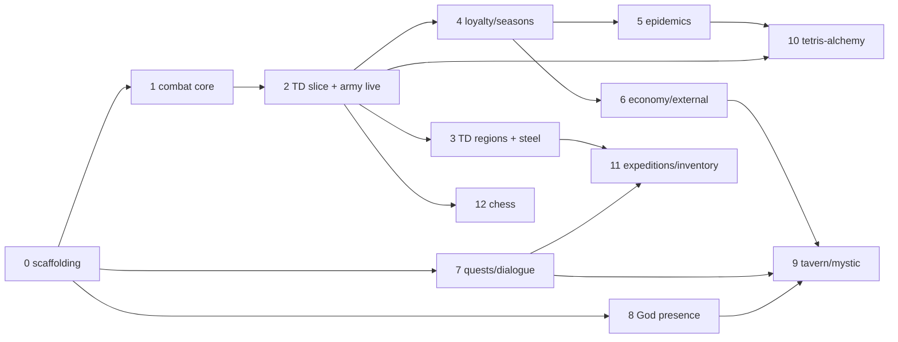

# Empire's Endgame — Completion Program: Prompt-Pack Plan

## Context

Empire's Endgame (`/empires-endgame`, `Web/VueClient/src/features/empires-endgame/`) is a self-contained client-side game (Durak vs the God of Gambling ⇄ empire management). The July 2026 audits (M54–M61, M83–M91, all fixed) made the implementation honest: everything unimplemented carries an explicit `deferredReason` (175 markers, verified today) and engine+UI refuse to spend on it. The designer wants the remaining design built out: TD combat, all five minigames, loyalty/reputation/seasons, epidemics, quests/dialogue, God presence, expeditions, and ~130 deferred content items un-deferred.

**This session produces no game code.** Per the designer (2026-07-16): the deliverable is a **prompt pack** — a directory of self-contained, per-phase executor prompts covering all 13 phases, to be run later as separate sessions **on the designer's machine**, because the design source (`DiscordExports/Empires_Endgame/` + `empire_prompt` + Palach HTML demos) exists only there — it is deliberately not committed (verified absent from the repo). No commits/pushes (strict CLAUDE.md rule); files are written to the working tree only.

### Draft verification results (checked against the repo 2026-07-16)

Every code-level claim in the designer's draft verified exactly:
- 175 `deferredReason` markers in `Web/VueClient/public/empires-endgame/game-config.json`; deferred counts: gifts 10/17, buildings 16/22, units 4/4, techs 38/62 (all 22 steel), events 9/10, card faces 47 normal + 49 inverted.
- Live card faces: ♣2 N + Joker N (live, zero effects), ♣8 both, ♠5 both, ♠8 both (incl. `famineYear`), ♦6 inv, ♦A N. ♥7 both faces deferred **with authored effects** and a live `militaryArson` executor (`engine.ts:1069`, `engine.ts:1240`) — Phase 2 just un-defers it.
- `durak` config: `boutsPerCon: 3`, `fixedTrumpSuit: "clubs"` — vs `docs/WEB-CLIENT.md` §12B text "Ten bouts form a con" (~line 213). Mismatch confirmed; ledger item.
- Config validation hard-rejects `schemaVersion !== 1` (`config.ts:242`) — there is **no migration chain yet**; Phase 0 adds one. Pattern to mirror: `migrateLastChancesConfig` (`last-chances/config.ts:55`, a pre-validation repair pass).
- Save format: `EmpiresSnapshotEnvelope`/`EmpiresCampaignState` both `schemaVersion: 1` (`persistence.ts:8-12`, `types.ts:513-537`); restore path `validateAndCloneSnapshot` (`engine.ts:1002`).
- Engine anchors: `EmpiresEndgameEngine` `engine.ts:208`; `resolveBout` `engine.ts:1122`; `startEmpirePhase` `engine.ts:1193`; `startNextCon` `engine.ts:1371`; `firstMissingDependency` `engine.ts:1477`. Deferral contract: `validateDeferredReasons` `config.ts:119`, `EMPIRES_LIVE_FLAG_ALLOWLIST` `config.ts:150` (20 flags), `validateLiveEffects` `config.ts:173`. `EMPIRES_PHASES` `types.ts:18`.
- QA harness: `digestEmpiresQaState` `qa.ts:464`, stall diagnostics + trace loop `qa.ts:814+`, scenario fixtures (pending-take, divine-gift, target-city-resources, target-meteor-city, empire-council-with-points, destroyed-west, …).
- `features/last-chances/` engine is **rAF-delta** (clamped 50 ms, `last-chances/engine.ts:724`) — confirms the plan's deliberate divergence: TD must be fixed-timestep.
- **Path correction vs draft**: Vue components live in `src/components/empires-endgame/` (11 components incl. `EmpireMap.vue`, `TechTree.vue`, `BuilderDrawer.vue`), not under `features/`. Page: `src/pages/EmpiresEndgame.vue` (1683 lines).
- **Test-wiring gotcha**: `package.json` `test:empires` enumerates the three spec files explicitly, and `test:empires:e2e` pins `--spec cypress/e2e/empires-endgame.cy.ts`. Every phase adding spec files must extend these scripts (or switch `test:empires` to a directory glob once, in Phase 0).

---

## Deliverable of this session

Create `plans/empires-endgame/` in the repo working tree (uncommitted; designer decides its fate):

```
plans/empires-endgame/
  README.md                      # program overview: dependency graph, cornerstones,
                                 # executor rules, verification contract, prompt usage
  phase-00-scaffolding.md
  phase-01-combat-core.md
  phase-02-td-vertical-slice.md
  phase-03-td-regions-steel.md
  phase-04-loyalty-seasons.md
  phase-05-epidemics.md
  phase-06-economy-external.md
  phase-07-quests-dialogue.md
  phase-08-god-presence.md
  phase-09-tavern-mystic.md
  phase-10-tetris-alchemy.md
  phase-11-expeditions-inventory.md
  phase-12-chess.md
```

### Prompt-file template (every phase file follows it)

Each prompt must be runnable as the *opening message of a fresh session* on the designer's machine. Sections:

1. **Mission** — one paragraph: what ships in this change-set.
2. **Design source** — the relevant slice of the design model (from §Design model below, expanded, not just channel names) **plus** the raw export channels to read before implementing (e.g. "read `DiscordExports/Empires_Endgame/` channels `тд`, `сталь`; `Steel-c748ae22139d6401.txt` is the latest steel version; `ZBS MAKING` is outdated — main export wins on conflict"). State explicitly: if the export files are missing in the session's environment, **stop and tell the user** — do not implement from the compression alone.
3. **Repo anchors** — the verified file/line anchors relevant to the phase (from the table above), plus "read these before editing" instructions.
4. **Work items** — ordered, with new-file paths and state/config shape sketches.
5. **Un-deferral list** — exact config item ids to un-defer, with the required allowlist/typed-payload/test additions (rule: substrate + un-deferral + `EMPIRES_LIVE_FLAG_ALLOWLIST` or typed payload + tests in ONE change-set; `validateLiveEffects` must keep rejecting unread flags).
6. **Verification** — the phase's Vitest/QA-scenario/Cypress additions + the standing gate (below).
7. **Docs & ledger contract** — which §12B paragraphs to update, ledger entries to append, commit-message file to write (`docs/commit-messages/<date>.md`, no git commit).
8. **Designer questions** — pre-seeded known unknowns for this phase (from §Ledger seed).

### Standing per-phase gate (goes in README, referenced by every prompt)

- `bash tools/test-empires-endgame.sh` (Vitest + Cypress; new spec files wired into `test:empires` / `test:empires:e2e` scripts).
- `pnpm --dir Web/VueClient build` (NOT `type-check` — broken env-wide).
- `bash tools/verify-docs.sh --changed`.
- Update `docs/WEB-CLIENT.md` §12B; new bugs → `docs/AUDIT-FINDINGS.md` with next free ID.
- Append every invented number to `docs/EMPIRES-ENDGAME-DESIGN-REVIEW.md` (created in Phase 0; append-only; keyed by JSON pointer into `game-config.json`).
- Save-compat: every envelope/schema bump ships a spec restoring a previous-version fixture.
- Determinism: no `Date.now`/`Math.random` in any sim; only the serialized RNG streams (`rng.ts`); minigames replay from `(plan, seed, commandLog)`.

---

## Phase dependency graph



---

## Architecture cornerstones (README content, referenced per phase)

- **One minigame envelope for all five minigames**: `EmpiresMinigameSession {kind, plan, seed, attempt, origin}` / `EmpiresMinigameResult`; new campaign phase `'minigame'` appended to `EMPIRES_PHASES` (`types.ts:18`); engine methods `beginMinigame`/`resolveMinigame`/`abortMinigame` (abort = authored penalty, no save-scumming). Mid-minigame real-time state is NEVER serialized — reload restarts from plan+seed with `attempt+1`.
- **Fixed-timestep TD** (deliberate divergence from last-chances' rAF-delta at `last-chances/engine.ts:724`): `step()` advances exactly `tickMs`; sim consumes only a serialized RNG stream; battle = pure `f(plan, seed, commandLog) → result`; headless QA runs the *same* sim (single resolution path). rAF loop accumulates time; render interpolates.
- **Shared combat module** `features/empires-endgame/combat/` (damage types, armor classes, counter matrix, equipment catalog) consumed by TD, expeditions, events; steel techs pay off as `equipment` entries with tech prerequisites.
- **State discipline**: flags for empire-wide scalars consumed by existing formulas (reputation, seasons via pure `currentSeason()`); first-class typed state for per-entity/lifecycle data (city loyalty, epidemics, army/morale/veterans, quests, minigame session).
- **Config migrations**: `migrateEmpiresConfig` chain applied before `validateEmpiresConfig` (replacing the hard throw at `config.ts:242`), modeled on `migrateLastChancesConfig` (`last-chances/config.ts:55`). Save migrations continue the `validateAndCloneSnapshot` field-normalization style (`engine.ts:1002`); envelope bump only for semantic moves.
- **New component homes**: `src/components/empires-endgame/` (`TdBattle.vue`, `DialogueOverlay.vue`, `QuestJournal.vue`, `DeckMemoryPanel.vue`); new feature modules under `features/empires-endgame/` (`combat/`, `td/`, `quests.ts`, `alchemy/`, `tavern/`, `inventory/`, `chess/`).
- `engine.ts` (2509 lines): extract internal modules (`engine/` dir) only when a phase already touches that cluster; no big-bang refactor.

## Executor rules (README, verbatim in every prompt's header)

1. **Design source discipline**: read the named raw export channels before implementing; main export > `ZBS MAKING` on conflict; `empire_prompt` defines the core loop. Export missing from the environment → stop, don't guess.
2. **Never fabricate silently**: mechanic without export numbers → configurable default in `game-config.json` + ledger entry. Mechanic whose *semantics* are undefined → keep/add `deferredReason` + designer question in the ledger.
3. **Un-deferral discipline** (as in template §5).
4. **Determinism** (as in the standing gate).
5. Card passive *texts* for players stay vague (repo philosophy — never "fix" player-facing descriptions); exact mechanics go in `docs/WEB-CLIENT.md` §12B.
6. Git: no commit/push; write the commit message to `docs/commit-messages/<date>.md` (one file per change-set, `-2`/`-3` suffixes same-day).

---

## Design model (README §A — the compressed spec each prompt slices from)

Carry over the draft's section A **verbatim** (A1 core loop, A2 cards/God behaviors, A3 map/regions/cities, A4 city economy/loyalty/army/buildings catalog, A5 tech/doctrines/steel/damage-types, A6 minigames, A7 expeditions/events/relics/gifts/morale/quests) into `plans/empires-endgame/README.md`, unchanged, with its channel-name parentheses intact — it is the navigation layer into the raw export. Scope confirmations (TD-direct combat, all minigames, configurable defaults + ledger, quests+God in / sound+tutorial+lore out, client-side only) also carry over.

---

## The 13 phases (content for each prompt file)

### Phase 0 — Scaffolding + review ledger (no behavior change)
- `migrateEmpiresConfig` chain + config `schemaVersion 2` injecting empty `combat`/`td`/`god`/`quests`/`empire.seasons`/`empire.loyalty` sections; replace the `config.ts:242` hard throw.
- Snapshot normalization defaults in `validateAndCloneSnapshot`: `minigame:null`, `minigameResultLog`, `army`, `external`, `epidemics`, `quests`, city `loyalty:0`, `durak.godInterventions:0`.
- Create `docs/EMPIRES-ENDGAME-DESIGN-REVIEW.md` (append-only invented-numbers ledger, keyed by JSON pointer) seeded with §Ledger items.
- Switch `test:empires` to a directory glob (or document the append rule).
- Verify: suites green; v1 save + v1 config import round-trip.

### Phase 1 — Combat core
`combat/types.ts` + `combat/damage.ts` (pure `resolveDamage`, `autoSelectDamageType`, `isCountered` per the A5 counter matrix: Ударные>Кольчуга>Режущие; Рубящее>Бригантина>Ударное; Тканевые>Ударные+Режущие; Эсток/Ледоруб контрят всё; щиты выключают стрелы, топоры опускают щиты; контра выключает пассивки; смешанные не контрятся; двухтиповые контрятся обеими). Config `combat` section (damageTypes, armorClasses, counters, equipment[]). Table-driven `combat/damage.spec.ts` from the design counter list. Channels: `сталь`, `тд`. Nothing player-visible.

### Phase 2 — TD vertical slice → army goes live
`td/` module (`types.ts`, `engine.ts` fixed-timestep, `qa.ts` headless autoplay with scripted policies, specs); minigame envelope in campaign engine (`'minigame'` phase); wave scheduler (`external.allianceThreat`, `waveEveryCons:2` ≈ каждые 4 месяца); `settleBattleOutcome` (unit losses → recruitment penalties; ≥10% loss → loyalty hook stub; veterans); `TdBattle.vue` (canvas + HUD + grade drawer + QA fast-resolve button). One central battlefield, generic tower 4 grades × 4 choices, castle, Alliance wave table. Channels: `тд`, EE_TD sketch.
**Un-defer**: units ×4, building-barracks, building-smithy (кузнецы → `army.equipmentStock`), doctrine-war, card-hearts-7 both faces (executor live at `engine.ts:1069/1240`), gift-combat-spirit (minimal morale scalar).

### Phase 3 — TD regional depth + steel tree
5 battlefields with region rules (болото — недосягаемые вышки; лес — лучники на деревьях; север — только катапульты/требушеты + ТД против кораблей; пустыня — иссушение при дэфе); full regional→common→common→ultra grade matrix; assault mode (for expeditions later). Channels: `тд`, `Steel-c748ae22139d6401.txt`.
**Un-defer**: all 22 steel techs (equipment payoffs; развилка = вход в соседнюю ветку с ×2 цены исходной; −/+ полушаги поколений, + бесплатно через пару ходов; |Элитное| gated военной элитой; gear/method prerequisites), building-foundry, building-military-academy, relic-spirit-floor, event-northern-raids.

### Phase 4 — Loyalty, reputation, seasons, tech dark sides
First-class city `loyalty` (−9..+9) + `regionLoyalty` + `applyLoyaltyDelta` funnel + workforce divisor config table (−9→/19, 0→/9, +9→/1 — raw note, ledger) + betrayal → `rebelliousRegionIds` (reversible; TD/quest hook); TD-loss→loyalty wiring; population-class loyalty gates (кузня требует лояльности мещан); reputation scalar (gates trade/unions); seasons derived from con via pure `currentSeason()` (`foodMultiplier` лето/зима ×2, парники equalize) + greenhouse tech; `darkSide` framework on techs (раскрытие → рейтинг падает; культурная пассивка отключает тёмные) + `chronicle` log; new `loyalty` effect kind. Save envelope v3. Channels: `застройка`, `Технологии_*`.
**Un-defer**: municipal-capital-forum (лояльность ×2 в обе стороны), ♣2 inverted (`streetCleanliness`), Народ-suit loyalty faces defined in the export.

### Phase 5 — Epidemics + medical chain
`epidemics: EmpiresEpidemicState[]` + `settleEpidemics()` ordered before the famine roll in `finishEmpireInternal`; protection stack (hospital/quarantine/Фармацевтика/relic — multiplicative); typed `startEpidemic` resolution payload (mirror `EmpiresGiftResolution`). Channels: `здания`, `события`, `Технологии_*`.
**Un-defer**: building-hospital, building-medical-academy, building-alchemy (passive form), relic-epidemic-ward, event-city-gates-epidemic, Дженна ♣A inverted, hidden combo Амбар+Алхимия→чума.

### Phase 6 — Economy & external-market buildings
External-world lite: Людовик authored recurring trade offers; Alliance-threat interplay. Channels: `здания`, `экономика`, `события`.
**Un-defer**: bank (credit + гонения via loyalty), jewish-bank (страховка 3 хода; «окружение» ≈ lost home-region battle — ledger item), fair (Карнавал→Артисты→Табор chain), tavern (morale source; Phase-9 minigame hook), stable, customs, sea-port, remaining trade techs, gifts tailwind/fish-currents/meteor-iron/desert-tsunami/earthquake, relics tithe/resource-exemption, events lumber-concession/customs-smuggling/horse-theft/bank-insurance/white-stone.

### Phase 7 — Quest/dialogue engine
Config `quests[]` (trigger / stages / dialogue node graph / choices with `requires`/`costs`/`effects`/`goto`; reuse `firstMissingDependency` `engine.ts:1477`); state `quests: Record<id,{stageId,nodeId,status,memory}>`; `quests.ts` (`evaluateQuestTriggers` from `startEmpirePhase` + after `resolveMinigame`; `advanceDialogue`); `DialogueOverlay.vue` + `QuestJournal.vue`; reuse `TechTree.vue` node-editor pattern for dialogue graphs in the Builder. Порт квеста Палач from the `Palach*.html` demos in the export (local machine only). Config schemaVersion 3. Channels: `квесты`.
**Un-defer**: event-golden-idol, event-witch-apprenticeship.

### Phase 8 — God presence
Deck-memory (`DeckMemoryPanel.vue` + `canInspectDeck()` gate; data already serialized in `state.durak.deck`); anti-bito in `resolveBout` (`engine.ts:1122`): `applyAntiBito` returns N random discards to the deck below `minimumCons`, `godInterventions` cap → guaranteed termination; God dialogue lines config (`god.lines` per trigger); Милость confirmation dialog with persisted "don't show again" (UI prefs, not campaign state). Channels: `общее`, `карты`.

### Phase 9 — Tavern minigame + mystic cards
`'mystic'` suit + rank `'none'` (excluded from legality/trump/win checks — touches `legalAttackCardIds`/`canCardBeat`/53-card validation at `config.ts:246`); `mysticCardTick()` in `startNextCon` (`engine.ts:1371`); explicit `handOrder` (Пиковая Дама inverts *neighbors*); tavern spawn rules (not on 1st run; 100% on 2nd, then 33%); `tavern/` minigame via envelope (Лист/Лорик/Анатолий trio + Мария Брауз 33% encounter, карты 2×2 → комбо 3-7-Т → Пиковая Дама spawn). Depends on 6+7+8. Channels: `таверна`, `карты`.

### Phase 10 — Tetris-alchemy
`alchemy/` module (fixed-timestep; Сбор — фигуры с 4 сторон к центральной конструкции, управление ближайшей, нельзя двигать назад, ускорение ×3 к центру; Разбор; реагенты — убрать цвет/добавить серые/сброс ускорения; ускорение арифм. прогрессией, cap 400% → взрыв → `startEpidemic` near lab via envelope result); science-branch payoffs; poison-craft path со стенками. Channels: `тетрис-алхимия`.

### Phase 11 — Expeditions + tetris-inventory
`expeditions` campaign state; TD assault-mode reuse (border forts as `EmpiresMapObjectDefinition` fortress objects — убийство крепости открывает зону); провизия-экипировка (разовое снижение); жалобы регионов; Ветеран rules (>50% hp → veteran; second wound → out); enemies by damage type (юг голые, запад кость/кожа, болото твари); `inventory/` packing minigame (тележка, real-time falling) → provision efficiency (`provisionEfficiencyPercent` flag already allowlisted). Channels: `экспедиции`, `чо-добавить`.

### Phase 12 — Chess (sketch-level)
Cards-as-pieces board behind config toggle `chess.enabled` (казна/чистые улицы = ладьи, семья = фигуры, Антон = конь под управлением обоих раз в 2 хода; у врага нет короля); expect designer redesign; heaviest ledger phase. Channel: `шахматы`.

---

## Verification contract (README §G)

- Per phase: focused Vitest (`pnpm --dir Web/VueClient run test:empires` — extend the script's file list/glob), new QA scenarios (`battle-defense`, `battle-assault`, `epidemic-outbreak`, `quest-dialogue`, `mystic-tavern`, `anti-bito`) + QA actions (`resolve-minigame` with policy, `advance-dialogue`), Cypress specs per surface via `?qa=1&scenario=…&seed=…` (never plays real-time; asserts HUD + uses the QA fast-resolve; new `.cy.ts` files added to `test:empires:e2e`), `bash tools/test-empires-endgame.sh`, `pnpm build`.
- TD determinism gate: same `(plan, seed, commandLog)` twice → identical result digest, asserted in `td/engine.spec.ts`; headless autoplay terminates under a tick cap for 3 seeds × 3 policies.
- Full-campaign autoplay across battles/quests without stalls = standing integration test (digest/trace stall detector already in `qa.ts:814+`).
- Save-compat: every envelope bump ships a spec restoring a previous-version fixture.

## Ledger seed (README §H — pre-seeded designer questions, distributed into phase prompts)

1. Loyalty→workforce divisor curve (/19, /9, /1) — raw note, needs tuning (P4).
2. Wave cadence: «каждые 4 месяца» ⇒ `waveEveryCons:2` — confirm clock (P2).
3. All tower stats (4×4 grades; «208 билдов» combinatorics) — invented defaults (P2/P3).
4. Anti-bito thresholds; deck-memory availability (always vs N/con) (P8).
5. Пиковая Дама spawn combo + neighbor-inversion period; hand order becoming gameplay-relevant (P9).
6. Per-weapon damage-type levels — partial in export (Клевец 6/4/3 etc.), rest invented (P1/P3).
7. Steel pricing (развилка ×2, элитное gating) — notation complete, numbers absent (P3).
8. Jewish-bank «окружение» proxy — no siege system (P6).
9. Epidemic severity/spread; alchemy explosion consequences (P5/P10).
10. Morale scale (ZBS-era) — minimal scalar + floor now (P2).
11. Alliance strength curve — linear default (P2).
12. Chess — designer's own sketch; expect redesign (P12).
13. Battle-abort penalty values (P2).
14. `boutsPerCon` 3 (config) vs "Ten bouts form a con" (`docs/WEB-CLIENT.md` §12B ~line 213) — reconcile config, doc, and design intent (P0 ledger entry; fix text or number per designer).

---

## Execution steps for THIS session (after approval)

1. `mkdir plans/empires-endgame/`.
2. Write `README.md`: program overview, how to run a phase prompt (fresh session, designer's machine, export present), the dependency mermaid graph, architecture cornerstones, executor rules, standing gate, design model §A carried over verbatim from the draft, verification contract, ledger seed.
3. Write the 13 phase prompts per the template, each self-contained (repeating the executor-rules header and its repo-anchor slice; embedding its design-model slice + raw channel reading list + un-deferral list + verification + docs/ledger contract + pre-seeded designer questions).
4. No git operations, no code changes, no docs/ changes (the review ledger itself is created by Phase 0's executor, not now).
5. Verify: every phase file names ≥1 raw export channel, every un-deferral item id matches an actual `deferredReason` carrier in `game-config.json` (cross-check with a quick script against the JSON), README graph matches phase files present.

## Files created (only these)

- `plans/empires-endgame/README.md`
- `plans/empires-endgame/phase-00-scaffolding.md` … `phase-12-chess.md` (13 files)

Nothing else is touched: no code, no `docs/`, no commits.