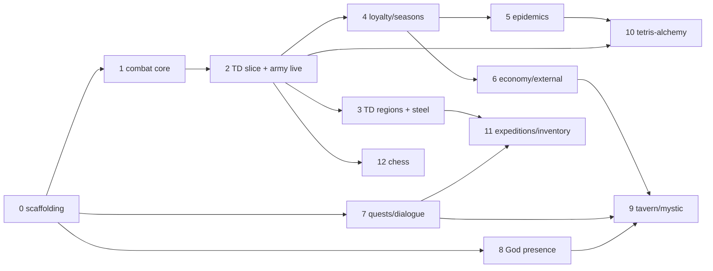

# Empire's Endgame — Completion Program (Prompt Pack)

This directory is a 13-phase execution program that finishes Empire's Endgame
(`/empires-endgame`, `Web/VueClient/src/features/empires-endgame/`) against the designer's
full intent. Each `phase-NN-*.md` file is a **self-contained prompt**: open a fresh
Codex task using **5.6 Sol** on the designer's machine and paste one phase file as the
opening instruction. Phases are separate change-sets; run them in dependency order.

**Hard requirement**: the raw design export `DiscordExports/Empires_Endgame/`
(+ `DiscordExports/empire_prompt`, the Palach HTML demos, the `EE_TD` sketch) exists only
on the designer's machine and is deliberately NOT committed. If a phase's named export
files are missing from the session's environment, **stop and tell the user** — do not
implement from the compressed model in this README alone. The compression (A below) is
navigation and scope; the raw channels are the source of truth for numbers and semantics.

Verified state as of 2026-07-16: the July audit wave (M54–M61, M83–M91, all fixed) made the
implementation honest — 175 explicit `deferredReason` markers in
`Web/VueClient/public/empires-endgame/game-config.json`; engine + UI refuse to spend on
deferred content (`validateDeferredReasons` / `validateLiveEffects` in
`features/empires-endgame/config.ts`). "Finishing" = building the absent substrate systems
and un-deferring content onto them, phase by phase.

Scope decisions confirmed by the designer (2026-07-16):

1. **Combat = Tower Defense minigame directly** — no interim abstract combat; army content goes live through TD.
2. **All minigames in scope**: TD, Tetris-alchemy, Tavern + mystic cards, Chess, Tetris-inventory (expedition packing).
3. **Missing numbers**: implement mechanics with configurable defaults in `game-config.json` + maintain a designer-review ledger of every invented number (`docs/EMPIRES-ENDGAME-DESIGN-REVIEW.md`, append-only).
4. **Also in scope**: quest/dialogue engine, God presence (deck memory, anti-bito, God lines, Милость confirmations). **Out of scope**: sound, scripted tutorial staging, lore/secret endings.
5. Everything stays client-side (localStorage), consistent with current architecture.

## Phase order and dependencies

| File | Ships |
|---|---|
| `phase-00-scaffolding.md` | Config/save migration chains, empty new sections, review ledger, test-glob fix. No behavior change. |
| `phase-01-combat-core.md` | Pure damage-type/armor/counter module + `combat` config section. Not player-visible. |
| `phase-02-td-vertical-slice.md` | Minigame envelope, fixed-timestep TD, wave scheduler, battle settlement; units/barracks/smithy/ironwork/war-doctrine/♥7 go live. |
| `phase-03-td-regions-steel.md` | 5 regional battlefields + grade matrix + assault mode; reconciles the full latest steel source and the 22 existing nodes, foundry, academy, and morale relic. |
| `phase-04-loyalty-seasons.md` | City/region loyalty, reputation, seasons, tech dark sides + chronicle; owns the loyalty-only northern-raids event. |
| `phase-05-epidemics.md` | Epidemic lifecycle + medical protection chain; exact medical candidates and vaccination faces, with ambiguous Дженна mapping kept honest. |
| `phase-06-economy-external.md` | Bank/insurance/fair/tavern/stable/customs/sea-port/temple; Людовик trade offers; economy cards/resources and trade gifts/relics/events. |
| `phase-07-quests-dialogue.md` | Quest + dialogue-graph engine, journal/overlay UI, Палач quest port. |
| `phase-08-god-presence.md` | Deck-memory, anti-bito, God lines, Милость confirmation. |
| `phase-09-tavern-mystic.md` | Mystic suit cards, hand order, Пиковая Дама, tavern minigame. |
| `phase-10-tetris-alchemy.md` | Assembly/disassembly tetris, reagents, configured explosion → typed epidemic. |
| `phase-11-expeditions-inventory.md` | Expeditions via TD assault, veterans/provisions, logistics tech/card closure, packing minigame. |
| `phase-12-chess.md` | Cards-as-pieces chess sketch behind a config toggle. |

## Executor rules (binding for every phase)

1. **Design source discipline**: read the phase's named raw export channels in `DiscordExports/Empires_Endgame/` before implementing. On conflict: main export > `ZBS MAKING` (outdated background); `empire_prompt` defines the core loop. Export missing from the environment → stop and tell the user; do not guess.
2. **Never fabricate silently**: a mechanic without export numbers → implement with a configurable default in `game-config.json` + append a ledger entry. A mechanic whose *semantics* are undefined → keep/add `deferredReason` and add a designer question to the ledger.
3. **Un-deferral discipline**: substrate + un-deferral (delete `deferredReason`, add executable effects) + `EMPIRES_LIVE_FLAG_ALLOWLIST` additions or typed payloads + tests, all in ONE change-set. `validateLiveEffects` must keep rejecting flags nothing reads.
4. **Determinism**: no `Date.now`/`Math.random` in any simulation — only the serialized RNG streams (`features/empires-endgame/rng.ts`). Minigames replay from `(plan, seed, commandLog)`; mid-minigame real-time state is never serialized.
5. Player-facing card/passive *texts* stay deliberately vague (repo philosophy — never "fix" them; the designer writes new player wording). Exact mechanics are documented in `docs/WEB-CLIENT.md` §12B.
6. Git: do NOT commit or push. Write the commit message to `docs/commit-messages/<date>.md` (one file per change-set; `-2`, `-3` suffixes for further change-sets the same day).

An item named by a phase is an ownership target, not permission to fake readiness. If the
raw export still lacks semantics (as opposed to only a number), that phase must keep the
carrier deferred, record the blocker in the ledger, and test that it remains unavailable.

Card faces follow the same rule side-by-side. Baseline named carriers are routed to the
phase that creates their substrate (military/TD in P2–P3, loyalty/influence in P4,
epidemics in P5, economy/trade in P6, quests in P7, Tavern/mystics in P9, and world-map
logistics in P11). Generic placeholder faces are never un-deferred by suit/rank alone:
the raw `карты`/`персонажи` source must uniquely identify the current config ID and side.

## Codex 5.6 Sol execution protocol

- Start by reading the repository `AGENTS.md`, this README, the selected phase prompt, and
  every phase-specific document/source named by that prompt. The phase prompt overrides
  this overview if the two ever drift.
- Run `git status --short` before editing. Preserve all pre-existing and unrelated worktree
  changes; do not reset, discard, commit, or push them.
- Maintain a live task plan. Verify the named prerequisite phase from actual files, types,
  config, and tests instead of assuming it landed cleanly. If a prerequisite is absent or
  only partly implemented, stop and report the concrete gap rather than silently merging
  two phase change-sets.
- Use Codex sub-agents for bounded, independent reading/audit/test tasks when that improves
  speed. Keep a single owner for overlapping hotspots such as `engine.ts`, `types.ts`,
  `config.ts`, `game-config.json`, and `EmpiresEndgame.vue`.
- Use `apply_patch` for hand edits and keep changes scoped to the selected phase. Follow the
  docs-first repository workflow; do not load the whole game codebase when symbol anchors
  and targeted searches suffice.
- Do not stop at scaffolding. Complete implementation, docs, migration coverage, QA, UI,
  the sequential `GameVersion` patch bump, the commit-message file, and all feasible gates.
  If raw design exports are missing, that is an intentional hard stop before code edits.

## Architecture cornerstones

- **One minigame envelope for all five minigames**: `EmpiresMinigameSession {kind, plan, seed, attempt, origin}` / `EmpiresMinigameResult`; new campaign phase `'minigame'` appended to `EMPIRES_PHASES` (`types.ts`); engine methods `beginMinigame` / `resolveMinigame` / `abortMinigame` (abort = authored penalty, no save-scumming). A reload during a minigame restarts it from `plan + seed` with `attempt + 1`.
- **Fixed-timestep sims** (deliberate divergence from last-chances' rAF-delta loop at `features/last-chances/engine.ts:724`): `step()` advances exactly `tickMs`; battle result = pure `f(plan, seed, commandLog)`; headless QA runs the *same* sim — a single resolution path. The rAF loop only accumulates time and interpolates rendering.
- **Shared combat module** `features/empires-endgame/combat/` (damage types, armor classes, counter matrix, equipment catalog) consumed by TD, expeditions, and events; steel techs pay off as `equipment` entries with tech prerequisites.
- **State discipline**: keep flags for empire-wide scalars consumed by existing formulas (reputation, seasons via a pure `currentSeason()`); use first-class typed state for per-entity/lifecycle data (city loyalty, epidemics, army/morale/veterans, quests, the minigame session).
- **Config migrations**: `migrateEmpiresConfig` chain applied before `validateEmpiresConfig` (replacing the hard `schemaVersion !== 1` throw), modeled on `migrateLastChancesConfig` (`features/last-chances/config.ts:55`). Save migrations continue the `validateAndCloneSnapshot` field-normalization style; bump the envelope version only for semantic moves.
- **Compatibility sequence**: Phase 0 moves config v1→v2 and adds disabled future
  sections. Later phases backfill additive section fields before validation or advance to
  the next sequential config version when semantics demand it. Phase 2 moves campaign/
  envelope v1→v2 for the real minigame phase; Phase 4 targets the next version for loyalty.
  Never reuse a hard-coded version if the executed repository is already farther ahead.
- **New component homes**: `src/components/empires-endgame/` (`TdBattle.vue`, `DialogueOverlay.vue`, `QuestJournal.vue`, `DeckMemoryPanel.vue`, …); new feature modules under `features/empires-endgame/` (`combat/`, `td/`, `quests.ts`, `alchemy/`, `tavern/`, `inventory/`, `chess/`).
- `engine.ts` (~2.5k lines): extract internal modules (an `engine/` dir) only when a phase already touches that cluster; no big-bang refactor.

## Standing per-phase gate

Every phase ends with ALL of:

- `bash tools/test-empires-endgame.sh` green (Vitest + Cypress). New spec files must be wired into `package.json` `test:empires` / `test:empires:e2e` — both currently enumerate explicit files (Phase 0 switches the Vitest side to a glob).
- `pnpm --dir Web/VueClient build` (NOT `type-check` — broken env-wide).
- `bash tools/verify-docs.sh --changed`.
- `docs/WEB-CLIENT.md` §12B updated for changed behavior; new bugs get findings in `docs/AUDIT-FINDINGS.md` (next free ID).
- Every invented number appended to `docs/EMPIRES-ENDGAME-DESIGN-REVIEW.md`, keyed by JSON pointer into `game-config.json`.
- Save-compat: every envelope/schema bump ships a spec restoring a previous-version fixture.
- Commit message written to `docs/commit-messages/<date>.md`; no git commit.
- Sequential patch increment of `GameVersion` in
  `King-of-the-Garbage-Hill/Game/Classes/GameClass.cs` after the
  phase implementation is complete.

## Verification contract (program-wide)

- Focused unit tests per phase: `pnpm --dir Web/VueClient run test:empires`.
- New QA scenarios as the program progresses: `battle-defense`, `battle-assault`, `epidemic-outbreak`, `quest-dialogue`, `mystic-tavern`, `anti-bito`; new QA actions `resolve-minigame` (with a scripted policy) and `advance-dialogue`. The QA harness lives in `features/empires-endgame/qa.ts` (`digestEmpiresQaState`, trace + stall diagnostics, autoplay loop).
- Cypress specs drive each new surface via `?qa=1&scenario=…&seed=…` — never play real-time; assert HUD state and use the QA fast-resolve control.
- TD determinism gate: the same `(plan, seed, commandLog)` run twice yields an identical result digest (asserted in `td/engine.spec.ts`); headless autoplay terminates under a tick cap for 3 seeds × 3 policies.
- Standing integration test: full-campaign autoplay across battles/quests without stalls (the digest/trace stall detector already exists in `qa.ts`).

## Key repo anchors (verified 2026-07-16 — re-locate by symbol name if lines drift)

| What | Where |
|---|---|
| Engine class / restore | `features/empires-endgame/engine.ts:208` `EmpiresEndgameEngine`; `validateAndCloneSnapshot` `:1002` |
| Bout/phase pipeline | `resolveBout` `engine.ts:1122`; `startEmpirePhase` `:1193`; `startNextCon` `:1371` |
| Dependency gate | `firstMissingDependency` `engine.ts:1477` |
| Live ♥7-inverted executor | `militaryArson` reads `engine.ts:1069`, applied `:1240` |
| Deferral contract | `validateDeferredReasons` `config.ts:119`; `EMPIRES_LIVE_FLAG_ALLOWLIST` `config.ts:150` (20 flags); `validateLiveEffects` `config.ts:173` |
| Schema hard-checks | config `schemaVersion !== 1` throw `config.ts:242`; 53-card check `config.ts:246`; save envelope checks `persistence.ts:8-12` |
| State model | `EMPIRES_PHASES` `types.ts:18`; `EmpiresCampaignState` `types.ts:513`; envelope `types.ts:533` |
| QA harness | `digestEmpiresQaState` `qa.ts:464`; autoplay/stall loop `qa.ts:814+`; fixtures for pending-take/divine-gift/targeting/empire/destroyed-west |
| UI | page `src/pages/EmpiresEndgame.vue` (~1.7k lines); components in `src/components/empires-endgame/` (incl. `EmpireMap.vue` object editor, `TechTree.vue` node editor, `BuilderDrawer.vue`) |
| Patterns to mirror (not modify) | `features/last-chances/`: `migrateLastChancesConfig` `config.ts:55`; rAF-delta loop `engine.ts:724` (what sims must NOT copy) |
| Test wiring | `Web/VueClient/package.json` scripts `test:empires` / `test:empires:e2e`; `tools/test-empires-endgame.sh` |
| Docs | `docs/WEB-CLIENT.md` §12B (note: its "Ten bouts form a con" contradicts config `boutsPerCon: 3` — ledger item #14) |

---

## A. Design source model (compressed from the export; channel names in parentheses)

### A1. Core loop (empire_prompt, общее)
1. **Durak vs God** — 53-card deck (2..A ×4 + Joker "Шут"); card = suit, rank, name, time-cost, value, art, passive; every card has an **inverted form** (taken from God's attack → gothic art, negative mirror passive). Kon = several bouts (configurable); configurable scoring → points; points spent on card upgrade or un-inverting. After kon → **divine gift** draft 1-of-3, value scales with performance.
2. **Empire phase**: hand cards' passives apply; budget 59 days minus hand time-costs; actions cost days; random events. Loop until durak ends or empire dies. 1 kon ≈ 2 empire months.
3. Meta: scripted 3-stage tutorial → roguelike (OUT OF SCOPE); meta-ladder region lore → advisor finales → secret ending (OUT OF SCOPE).

### A2. Cards (карты, персонажи, таверна; ZBS for older card drafts)
- Suit themes: ♥ королевская семья/влияние; ♠ прогресс/науч.советник; ♦ экономика+дипломатия/торг.советник; ♣ народ. Trump crits; trump+advisor same suit = min-max. Крести trump only when Grand Advisor opened.
- Documented cards (details in channels): К♥ Легитимность Томаса; В♥ похищение сына; Т♥ Mr.G/дед-квесты; 7♥ Зазывалы (inverted = Поджог: −1 lvl военного здания, лок на ход, юнит-потери) [executor exists, face deferred until army]; Т♦ банкир/валюта; 8♦ подати; 10♦ сателлит; 3♠ карты мира/логистика; 5♠ Образование; 8♠ 200% ферм; К♠ Конрад (очки улучшений); Д♠ Мария Брауз (порох); В♠ Антон де Лорян (интел; необнаружимый переворот; работает в любой руке); Т♣ Дженна (рождаемость/болезни); 8♣ Стандарт питания ±50%; категории Экономика/Влияние/Народ/Прогресс с нумерованными парами светлая/тёмная.
- Lifecycle: бито = потеря (персонаж выбыл); отдано богу = неактивен; перевёрнута в руке = вредит. Draw from deck → +1 upgrade. Card upgrade example: effect persists 1 round after loss.
- Mystic cards (таверна): Лист/Лорик/Анатолий — без масти/ранга, возвращаются сами перевёрнутыми; Пиковая Дама (спавн после Марии Брауз + комбо 3-7-Т на столе) периодически переворачивает соседние карты.
- God behaviors: face-up shuffle → Том запоминает порядок колоды (deck-memory feature); anti-bito (возврат части бито в колоду если игра кончается слишком быстро); реплики бога; подтверждение траты Божественной Милости с "не показывать больше".

### A3. Map, regions, cities (застройка, дома, регионы, лор)
- 5 regions (N лёд / W лес / S пустыня / E болото / C Тетракор) + 10 subregions; fixed oblique camera; minimap. Resource asymmetry: W/E мало шахт; N/S нет лесопилок; W лошади; S нет воды (кактусовые фермы).
- 13 cities: 2/region периметр (500k) + 4 Тетракор (3M) + столица (8M); перст-губернатор → доп. точки застройки (2>2>1); морские города → слот Морской порт (max 4); столица: Тетракорархос, Форум, Колизей, Военная академия, шахта белого камня.
- Region great houses ×4 с шаблоном черт + выходка-ивент; уникальные расы; региональная лояльность → восстание; late-game предательства → региональные жертвы-дары.

### A4. City economy (застройка, здания, экономика, общее)
- Slots: ферма, лесопилка, шахта, военная кузница (Оружейник/Бронник), казарма, unique 6th, municipal. Food/pop rules (implemented). Busy-locks (implemented for mine/lumber). Seasons: лето/зима ×2 лимит еды; парники выравнивают. 50% населения не работает; worker shortage shutdown mine→lumber→farm by level (implemented).
- **Loyalty**: −9..+9 city + region modifier; effective workforce divisor −9→/19, 0→/9, +9→/1; отрицательная лояльность выключает здания; классы (крестьяне/мещане/дворяне/духовенство) привязаны к зданиям (кузня требует лояльности мещан). **Reputation**: −9..+9, gates trade/unions.
- **Army** (застройка message-d27f1e9af25bf194.txt): 7 типов (регулярка-подписка, пограничные феодалы, региональные феодалы за ресурсы, наёмники, дружина по типам городов, ополчение, пороховые солдаты); прирост через казарма←кузня←шахта; потери → −призыв/прирост (×множители), 10%+ потерь → лояльность −1; % армии от населения 1→5→+5→20; кузнецы: 10/город, годовые объёмы (5000 стрел…5 великих мечей).
- Buildings catalog (здания): Банк (кредит/гонения), Еврейский банк (страховка 3 хода, окружение → самоликвидация), Амбар 2 ступени, Храм (5 веток + тёмные), Алхимическая лавка, Конюшня, Трактир, Ярмарка (Карнавал→Артисты→Табор→барон), Мастерская, Чёрный рынок, Посольство, Внешний рынок, Военная/Медицинская академии, Таможня, Больница, Книгопечатный пресс, Малый храм (реализован), Литейная, Баллиста, Пристань/Морской порт, Столичный Форум (лояльность ×2 в обе стороны), Двор Гвардейской Дружины, Торговый сбор (реализован).

### A5. Tech/doctrines/reforms/steel (Технологии_*)
- 4 ветки + Культура; советники: 3 в начале, "2 казнить 1 помиловать"; теократия→технократия. Rules: техи ≤1/ход/ветвь (реализовано), реформы ≤1/ход/доктрина (реализовано); реформы = технологические + муниципальные.
- **Каждая технология имеет светлую и тёмную сторону**; раскрытие тёмной → падение рейтинга; культурная пассивка отключает тёмные; скрытые комбо (Амбар+Алхимия=чума; +Дрессировщики=чумные крысы; химера).
- Общая ветка: Образование → (Ремесло, Фермерство, Плотничество, Сталелитейное, Рынок, Церковь, Репутация, Посольство, Корабли, Ментовка, Тюрьмы, Храм); разовые: Амбар, Госпиталь, Карантин, Книгопечатанье, Дрессировщики. Логистика вкладка (частично реализована). Кав. таран chain. Гвардейская/стенная ветвь. Мельницы: ветряная vs водяная (реализованы базово; водяная gates кузню 4+; тёмная сторона воробьёв). Именованные реформы: Казначейство (реализована), Принуждение, Геройские похороны, Городские врата, Контроль кузнецов, Фармацевтика.
- **Сталь** (Steel-c748ae22139d6401.txt = latest v; полное дерево): 6 веток оружия (Ударные — закрыта, крадётся; Древковые; Рубящие; Клинковые; Стрелковые; Пудра) + Особые изобретения + 3 ветки брони (Кольчуга/Доспехи/Поддоспешник); развилка = вход в соседнюю ветку, исходная ×2 цены; поколения (−/+ полушаги, + бесплатно через пару ходов); |Элитное| gated военной элитой; gear/method prerequisites (водяной молот и т.д.).
- **Damage-type system** (сталь, тд): ударное/дробящее/рубящее/режущее/колющее с уровнями per weapon; авто-приоритет (режущее по голым; колющее если уровень > общего уровня брони); контр-матрица: Ударные>Кольчуга>Режущие; Рубящее>Бригантина>Ударное; Тканевые>Ударные+Режущие; Эсток/Ледоруб контрят всё; щиты выключают стрелы, топоры опускают щиты; контра выключает пассивки; смешанные не контрятся; двухтиповые (Лютеранский молот) контрятся обеими.

### A6. Minigames (тд, тетрис-алхимия, чо-добавить, шахматы, таверна)
- **ТД**: attack/defense на границах регионов vs Альянс; волны каждые 4 месяца (≈2 кона); башни 4 последовательных грейда (региональный→общий→общий→региональный ультра) × 4 варианта, стакаются; тир-схема (башня/стрелковый тип/снаряды/региональное); регион-правила: болото — недосягаемые вышки, лес — лучники на деревьях, север — только катапульты/требушеты + ТД против кораблей, пустыня — иссушение при дэфе; замковый дэф; юниты на дэф, заслоны, крепость-пост, партизаны/наёмники-кемпы (EE_TD sketch); Эдемская катапульта.
- **Тетрис-алхимия**: Сбор (фигуры с 4 сторон к центральной конструкции; управление ближайшей; нельзя двигать назад; ускорение ×3 к центру) и Разбор; реагенты (убрать цвет, добавить серые, сброс ускорения); ускорение арифм. прогрессией, cap 400% → взрыв → эпидемия/мутанты у лаборатории; poison-craft путь со стенками.
- **Тетрис-инвентарь**: паковка экспедиции, тележка, вещи падают в реальном времени.
- **Шахматы**: важные карты = фигуры (казна/чистые улицы = ладьи, семья = фигуры, Антон = конь под управлением обоих раз в 2 хода); у врага нет короля. Sketch-level.
- **Таверна**: спавн ближе к лейту (не в 1-м прохождении; 100% на 2-м, потом 33%); две секции; найм наёмников, спиртное, слухи; Мария Брауз 33% (карты 2×2 → комбо 3-7-Т → Пиковая Дама).

### A7. Other systems (экспедиции, события, реликвии, божественные-награды, квесты)
- **Экспедиции**: убийство пограничной крепости открывает зону; провизия-экипировка (разовое снижение); жалобы регионов; Ветеран (>50% hp → ветеран; второе ранение → выбывает); враги по типам урона (юг голые, запад кость/кожа, болото твари).
- **События**: reigns-подобные с последствиями; известные: голод (реализовано), северные набеги, концессия, контрабанда, золотой идол, эпидемия у врат, кража коней, страховка, белый камень, ведьмы.
- **Реликвии**: слоты Храма; 25% от эпидемий, боевой дух min 2, десятина +50%, кузня/конюшня без ресурсов, +1 lvl ферм/лесопилок (последняя реализована).
- **Божественные награды**: землетрясение, муссоны/ветер, +макс очко боевого духа, рыбные течения, метеор (реализован) + метеоритное железо, региональные жертвы (реализованы), цунами в пустыне.
- **Боевой дух**: очки на юнитах → повтор активки; источники трактир/вино/реликвии; шкала дезертирства (ZBS, minimal).
- **Квесты**: Палач (готовые интерактивные HTML-демо в экспорте: `Palach*.html`), золотой идол → Маг, крестоносцы-вёдра (6 фаз), воробьи/саранча/Людовик, север↔лес, упыри Аматы, титановая рыба, руда в лесу; лвл-апы регионов.

---

## §H. Designer-review ledger seed (known unknowns; Phase 0 copies these into the ledger)

1. Loyalty→workforce divisor curve (/19, /9, /1) — raw note, needs tuning (P4).
2. Wave cadence: «каждые 4 месяца» ⇒ `waveEveryCons: 2` — confirm clock (P2).
3. All tower stats (4×4 grades; «208 билдов» combinatorics) — invented defaults (P2/P3).
4. Anti-bito thresholds; deck-memory availability (always vs N/con) (P8).
5. Пиковая Дама spawn combo + neighbor-inversion period; hand order becoming gameplay-relevant (P9).
6. Per-weapon damage-type levels — partial in export (Клевец 6/4/3 etc.), rest invented (P1/P3).
7. Steel pricing (развилка ×2, элитное gating) — notation complete, numbers absent (P3).
8. Jewish-bank «окружение» proxy (no siege system) (P6).
9. Epidemic severity/spread; alchemy explosion consequences (P5/P10).
10. Morale scale (ZBS-era) — minimal scalar + floor now (P2).
11. Alliance strength curve — linear default (P2).
12. Chess — designer's own sketch; expect redesign (P12).
13. Battle-abort penalty values (P2).
14. `boutsPerCon: 3` (config) vs "Ten bouts form a con" (`docs/WEB-CLIENT.md` §12B) vs "десять раундов" design text — reconcile all three (P0 ledger entry; designer decides).

---

## Appendix: deferred-content inventory (verified against `game-config.json` 2026-07-16)

**Live card faces** (everything else is deferred): `card-clubs-2` N (no effects), `card-clubs-8` both, `card-spades-5` both, `card-spades-8` both, `card-diamonds-6` inverted, `card-diamonds-ace` N, `card-joker-jester` N (no effects). Named/authored deferred faces already in config: `card-clubs-2` inv (`streetCleanliness`), `card-hearts-5` (Агитаторы), `card-hearts-7` (Зазывалы/Поджог — effects authored, executor live), `card-hearts-king` (Легитимность Томаса), `card-hearts-ace`, `card-spades-3` (карты мира), `card-spades-10` (Прививки), `card-diamonds-6` N. All other ranks are placeholder faces («Тройка треф»…) — авторские карты для них берутся из каналов `карты`/`персонажи`.

**Deferred gifts** (10): `gift-earthquake`, `gift-tailwind`, `gift-combat-spirit`, `gift-fish-currents`, `gift-meteor-iron`, `gift-desert-tsunami`, `relic-epidemic-ward`, `relic-spirit-floor`, `relic-tithe`, `relic-resource-exemption`.

**Deferred resources** (2): `carpentry`, `whiteStone`.

**Deferred buildings** (16): `building-smithy`, `building-barracks`, `building-temple`, `building-bank`, `building-fair`, `building-tavern`, `building-stable`, `building-alchemy`, `building-hospital`, `building-customs`, `building-medical-academy`, `building-military-academy`, `building-foundry`, `building-sea-port`, `building-jewish-bank`, `municipal-capital-forum`.

**Deferred units** (4): `unit-light`, `unit-regular`, `unit-heavy`, `unit-knight`.

**Deferred technologies** (38): `doctrine-war`; non-steel: `tech-fair`, `tech-ironwork`, `tech-compass`, `tech-merchant-guilds`, `tech-banking`, `tech-generals`, `tech-foundry`, `tech-military-logistics`, `tech-supply-corps`, `reform-coercion`, `reform-heroic-funerals`, `reform-control-smiths`, `reform-theocracy`, `reform-technocracy`, `reform-city-gates`; steel (22): `steel-laurel-spearhead`, `steel-lancet-spearhead`, `steel-diamond-spearhead`, `steel-cross-spearhead`, `steel-voulge`, `steel-halberd`, `steel-lance`, `steel-butted-mail`, `steel-riveted-mail`, `steel-full-mail`, `steel-double-mail`, `steel-steel-mail`, `steel-nasal-helm`, `steel-bucket-helm`, `steel-kettle-hat`, `steel-iron-breastplate`, `steel-steel-cuirass`, `steel-water-hammer`, `steel-heavy-water-hammer`, `steel-ship-cannon`, `steel-hand-bombard`, `steel-arquebus`.

**Deferred events** (9): `event-northern-raids`, `event-lumber-concession`, `event-customs-smuggling`, `event-golden-idol`, `event-city-gates-epidemic`, `event-horse-theft`, `event-bank-insurance`, `event-white-stone`, `event-witch-apprenticeship`.

**Absent systems** (no code at all): combat/TD, expeditions, epidemics, diplomacy/external world, loyalty/reputation, seasons, advisors/persts, quests/dialogue, tavern/chess/tetris minigames, mystic cards, deck-memory, anti-bito, God dialogue/confirmations, morale, damage-type system.
