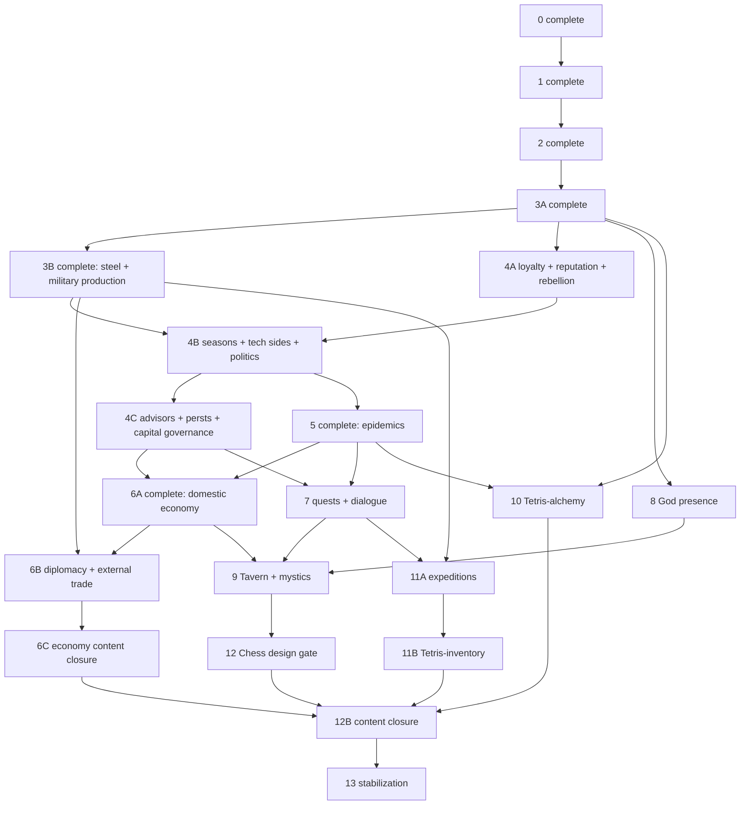

# Empire's Endgame — confirmed completion program (prompt pack)

This directory is an execution program for the designer-confirmed Empire's Endgame
completion tranche (`/empires-endgame`, `Web/VueClient/src/features/empires-endgame/`). It
does not silently equate every raw sketch with committed scope: every known system and
catalog item has an owner, conditional gate, review status, or explicit exclusion in
`COVERAGE-MATRIX.md`.

Each remaining phase/subphase file is the opening prompt for a fresh Codex task using
**5.6 Sol** on the designer's machine. Read it with `COMMON-EXECUTION-CONTRACT.md`.
Subphases are separate change-sets and must run in dependency order.

**Hard requirement**: the raw design export `DiscordExports/Empires_Endgame/`
(+ `DiscordExports/empire_prompt`, the Palach HTML demos, the `EE_TD` sketch) exists only
on the designer's machine and is deliberately NOT committed. If a phase's named export
files are missing from the session's environment, **stop and tell the user** — do not
implement from the compressed model in this README alone. The compression (A below) is
navigation and scope; the raw channels are the source of truth for numbers and semantics.

Baseline verified 2026-07-16: the July audit wave (M54–M61, M83–M91, all fixed) made the
implementation honest — 175 explicit `deferredReason` markers in
`Web/VueClient/public/empires-endgame/game-config.json`; engine + UI refuse to spend on
deferred content (`validateDeferredReasons` / `validateLiveEffects` in
`features/empires-endgame/config.ts`). Counts after completed phases come from the actual
config/tests, not this historical baseline.

Current execution status supplied by the designer on 2026-07-17:

- **Phase 0 — complete.** Its prompt is historical; do not amend/re-run it.
- **Phase 1 — complete.** Its prompt is historical; do not amend/re-run it.
- **Phase 2 — complete.** Its prompt is historical; do not amend or re-run it. Phase 3A
  regression-checked the landed baseline before applying its explicit post-P2 hardening.
- **Phase 3A — complete.** Rules identity, bounded replay/history, accessible real-input TD,
  five regional fields and reusable assault landed as one change-set.
- **Phase 3B — complete.** Schema-v4 steel research, four exact spearhead production
  payoffs, equipped cohorts, shared Smithy capacity, Foundry, the morale floor and the
  complete latest-source/deferral ledger landed as one change-set.
- **Phase 4A — complete.** Schema-v5 typed loyalty/reputation, workforce and class gates,
  reversible regional rebellion, bounded political chronicle, exact-once TD-loss pressure
  and northern raids landed as one change-set. Capital Forum and inverted club 2 retain
  explicit blockers for their undefined mechanics.
- **Phase 4B — complete.** Schema-v6 seasons, typed technology sides and hidden
  combinations, complete political reforms, smith specialization and explicit crime/content
  deferrals landed as one change-set.
- **Phase 4C — complete.** Schema-v7 advisor/perst/capital governance, save-envelope v5,
  canonical trump critical effects, exact advisor judgment, permanent named-перст region
  expansion and the capital/review manifest landed as one change-set.
- **Phase 5 — complete.** Schema-v8 typed epidemics/medical configuration, save-envelope
  v6, deterministic settlement/spread/containment, medical buildings and healer/recovery,
  vaccination faces, epidemic relic, hidden plague combination and epidemic UI/QA landed
  as one change-set. City Gates remains honestly deferred on its undefined crime side.
- **Phase 6A — complete.** Schema-v9 domestic-economy configuration, save-envelope v7,
  scheduled Bank debt/default/гонения, calm-turn insurance, ordered Fair activities,
  Temple preaching/relic slots, passive Tavern army hooks and economy UI/QA landed as one
  change-set. Capability-level blockers retain every undefined market, siege, Temple-branch,
  baron and Tavern-minigame behavior.
- **Phase 6B — complete.** Schema-v10 external-economy configuration, save-envelope v8,
  deterministic weighted offers, explicit accept/decline history, trusted-resource trade
  and transfers, Customs tariffs, western Stable consumers, coastal Sea Ports and
  diplomacy UI/QA landed as one change-set. Unauthored unions, relationship actions,
  player fleet/shipbuilding and the three reviewed absent buildings remain explicit.
- **Next prompt: Phase 6C** (`phase-06c-economy-content.md`).

Scope decisions confirmed by the designer (2026-07-16):

1. **Combat = Tower Defense minigame directly** — no interim abstract combat; army content goes live through TD.
2. **All minigames in scope**: TD, Tetris-alchemy, Tavern + mystic cards, Chess, Tetris-inventory (expedition packing).
3. **Missing numbers**: implement mechanics with configurable defaults in `game-config.json` + maintain a designer-review ledger of every invented number (`docs/EMPIRES-ENDGAME-DESIGN-REVIEW.md`, append-only).
4. **Also in scope**: quest/dialogue engine, God presence (deck memory, anti-bito, God lines, Милость confirmations). **Out of scope**: sound, scripted tutorial staging, lore/secret endings.
5. Everything stays client-side (localStorage), consistent with current architecture.

## Phase order and dependencies



| File | Ships |
|---|---|
| `phase-00-scaffolding.md` | **Complete/historical.** Config/save migrations, ledger, test discovery. |
| `phase-01-combat-core.md` | **Complete/historical.** Pure combat/damage/counter catalog. |
| `phase-02-td-vertical-slice.md` | **Complete/historical.** Central TD, envelope, army. |
| `phase-03-td-regions-steel.md` | **Complete/historical.** P2 baseline regression, replay/config identity, input/accessibility hardening, five regional TD fields, castle/naval enemy variants, assault. |
| `phase-03b-steel-equipment.md` | **Complete/historical.** Latest steel inventory, schema-v4 research state, exact spear equipment/cohorts, Smithy capacity, Foundry/relic closure and military-building deferral audit. |
| `phase-04-loyalty-seasons.md` | **Complete/historical. 4A:** loyalty, reputation, rebellion, class gates, chronicle, northern raids. |
| `phase-04b-seasons-tech-sides.md` | **Complete/historical. 4B:** seasons, technology sides, political reforms, honest crime deferral. |
| `phase-04c-advisors-persts-capital.md` | **Complete/historical. 4C:** advisor flow, suit/Grand Advisor rules, governor персты, capital slot governance. |
| `phase-05-epidemics.md` | **Complete/historical.** Typed epidemic lifecycle, medical chain, vaccination faces, relic/combo closure and honest City Gates/Pharmaceuticals/Quarantine deferrals. |
| `phase-06-economy-external.md` | **Complete/historical. 6A:** Bank/insurance/Fair/Temple and passive Tavern substrate. |
| `phase-06b-diplomacy-external.md` | **6B:** real diplomacy/external trade, Людовик, Stable/Customs/Sea Port, missing trade buildings. |
| `phase-06c-economy-content.md` | **6C:** economy gifts, relics, events, resources, technologies, and card faces. |
| `phase-07-quests-dialogue.md` | Quest + dialogue-graph engine, journal/overlay UI, Палач quest port. |
| `phase-08-god-presence.md` | Deck-memory, anti-bito, God lines, Милость confirmation. |
| `phase-09-tavern-mystic.md` | Separate mystic-card catalog, hand order, Пиковая Дама, tavern minigame. |
| `phase-10-tetris-alchemy.md` | Assembly/disassembly tetris, reagents, configured explosion → typed epidemic. |
| `phase-11-expeditions-inventory.md` | **11A:** expeditions, forts/zones, provisions, veterans, TD assault. |
| `phase-11b-tetris-inventory.md` | **11B:** deterministic falling-cart packing minigame. |
| `phase-12-chess.md` | Chess design gate; implementation stays disabled until the rules table is executable. |
| `phase-12b-content-closure.md` | Raw-source/config carrier closure sweep; no new substrate. |
| `phase-13-stabilization.md` | Earliest-to-latest compatibility, all-minigame integration, storage/performance stabilization. |

## P3B handoff

- The compatibility baseline is config schema 4 and campaign/save envelope 3. Old aggregate
  unit counts migrate once into equipped cohorts; schema-v2 regulars alone are grandfathered
  to a frozen `legacy-default` laurel profile without consuming new stock. New regular
  recruitment has no invented pre-steel weapon and remains blocked until a live steel spear
  loadout is researched and produced. Later phases must preserve cohort identity and cannot
  infer loadouts from the latest researched technology.
- Four exact Древковые nodes are live through produced stock and TD. This is deliberately
  not “the full steel tree”: 18 old carriers and 51 latest-source named items remain
  deferred/absent with per-row blockers in `docs/EMPIRES-ENDGAME-DESIGN-REVIEW.md`.
- Research and recruitment availability/cost are engine quotes, not UI rules. TD identity
  covers combat, TD, technologies, units, buildings and steel settings; later changes to any
  of those inputs must continue to invalidate mismatched active sessions.
- Foundry defaults and Smithy capacity splits remain open ledger values. Foundry is live in
  non-capital cities, while `capital-sixth-slot` is a visible deferred subfeature because the
  capital's unswappable Temple occupies its unique slot. TechTree and building details expose
  subfeature reasons. Military Academy, ♥A, Ударные, Мастерская, Баллиста and Двор
  Гвардейской Дружины are not follow-up cleanup; their exact missing semantics/substrate must
  arrive through the owning later phase or a designer verdict.
- Compatible old saves migrate deterministically. If an active old-rule minigame cannot
  satisfy current rules identity, the UI rejects reinterpretation and offers an explicit
  discard-and-restart recovery.

## P4A handoff

- The compatibility baseline is config schema 5 and campaign/save envelope 4. Loyalty and
  reputation are typed state; legacy political flags and the schema-v3 pending battle-loss
  queue migrate once and are removed. Later phases must use the mutation/dependency helpers,
  not recreate magic loyalty or reputation flags.
- City loyalty plus the regional modifier feeds one effective-value reader used by the
  configured workforce divisor, building operation, construction, recruitment, production
  and settlement. Smithy also has the separate Мещане class gate. Rebellion is reversible
  and blocks the shared region-access path without entering `destroyedRegionIds`.
- Political history is sequence-numbered, bounded and newest-first in the UI. Canonical TD
  loss identities and event provenance survive restore; later sources must enter through
  `applyLoyaltyDelta`, `applyReputationDelta`, or `consumeBattleLoss`.
- `event-northern-raids` is live. Capital Forum remains bundled-deferred until its progress
  effect is executable, though its temporal positive/negative loyalty reader is tested.
  Inverted club 2 remains deferred for missing numeric effect, scaling and cleanup. Seasons,
  technology sides, reforms and crime remain P4B scope.

## P4B handoff

- The compatibility baseline is config schema 6 and campaign/save envelope 4. Seasons are
  derived from con rather than saved twice. Technology-side selection, disclosure,
  suppression and hidden-combination triggers are persisted exact-once state.
- Принуждение, Геройские похороны, Контроль кузнецов and Теократия are live whole
  contracts. Advisor prerequisites added by P4C must remain real engine dependencies on
  those reforms, not UI badges or replacement flags.
- Crime/public order, Technocracy civil war, City Gates effects, Hearts political faces and
  printing remain explicitly deferred. P5 owns epidemic consequences and must consume the
  existing typed epidemic-policy boundary without inventing crime.

## P4C handoff

- The compatibility baseline is config schema 7 and campaign/save envelope 5. Advisor
  status, transition sequence/source/con and permanent governor assignments are canonical
  state. Schema-4 saves already using ♣ trump are narrowly grandfathered to an active Grand
  Advisor; other old saves retain unresolved starting advisors.
- Научный, Торговый and Военный advisor roles enter one exact `1` pardon / `2` execution
  funnel and gate `reform-theocracy`, `reform-treasury` and `reform-coercion`. Trump card
  effects use the configured critical multiplier through the engine effect path. ♣ is never
  a fresh trump until `advisor-grand` receives an authored, source-ID-bearing access grant.
- A permanent assignment of Четвёртый Перст Однорукий Трэвор or Десятый opens all three
  gated city sites in that region, producing the sourced five-city `2 > 2 > 1` topology.
  Every city action and preview uses `cityAccessBlockedReason`; later phases must not bypass
  it for economy, epidemic, quest or diplomacy targets.
- Forum (P4A), Military Academy (P3B), white stone (P6C), Колизей and Тетракорархос
  (P4C/P12B review) remain explicitly deferred in the capital manifest. P6B made the
  raw coastal city markers authoritative for dedicated Sea Port slots. Great houses and
  unique races remain P7/P12B review rather
  than anonymous governance flags.

## P5 handoff

- The compatibility baseline is config schema 8 and campaign/save envelope 6. Epidemic
  definitions, protection inputs and medical rules are config data; instances, source
  provenance, containment, spread memory, exact impact con and army recovery are canonical
  saved state. Schema-v7 custom configs migrate with epidemics and medicine disabled.
- `finishEmpireInternal` settles epidemics before it refreshes population/production and
  evaluates fresh famine eligibility. A single typed start funnel serves cards, gifts,
  events, hidden combinations and later alchemy/quest results; epidemic rules identity
  prevents an active instance from being reinterpreted under changed definitions.
- Hospital's authored local 10% reduction and one-con post-battle recovery are live, along
  with Hospital-gated healers. Medical Academy's half-consequence protection, three-con
  free secondary technology cadence and once-per-con 50%-fatal treatment are live. Numeric
  epidemic stages, class weights, healer combat stats and deterministic free-tech choice
  are configurable defaults retained in the designer-review ledger.
- Alchemy is live only for its plague-combination substrate; `alchemyMinigame` remains a
  visible deferred capability owned by P10. The Granary+Alchemy plague trigger consumes
  P4B's exact-once hidden-combination memory and selects the lowest stable operational
  Alchemy city. Trainers/rats remain deferred without a stable carrier or consequences.
- Both `card-spades-10` faces and the epidemic relic are live. Raw `персонажи` uniquely
  identifies `card-clubs-ace` as Дженна, but both faces remain deferred because their
  numerical disease/birth/autonomy effects are incomplete. Quarantine and Фармацевтика
  are validated protection hooks only; no carrier ID was invented, and the farm-production
  tradeoff remains deferred.
- City Gates' seal/open epidemic choices are typed and executable, including exact-once
  containment and already-spread behavior, but the bundled reform/event remain unavailable
  because the light crime/public-order contract is still undefined. No generic epidemic
  recruitment or facility lock was invented; stage fields exist and bundled values are
  explicitly empty/false.

## P6A handoff

- The compatibility baseline is config schema 9 and campaign/save envelope 7. Domestic
  economy definitions are config data; loan/installment identity, insurance provenance,
  Fair activity/cooldown memory, persecution, Temple assignments and bounded obligation
  histories are canonical saved state. Schema-v8 custom configs migrate with the section
  disabled, and legacy saves migrate claimed relics without leaving old always-on flags.
- Bank principal and every installment freeze the current trusted gold income at
  origination. Scheduled settlement, manual repayment, default and гонения share one typed
  obligation model and P4A's loyalty/reputation/chronicle funnels. Later price systems may
  consume the retained persecution market blocker, but must not recreate debt as a flag.
- Insurance activates after three calm settlements and covers only typed epidemic and
  meteor incidents. Raid, nuclear and `окружение` remain explicit capability blockers;
  neither a home TD loss nor enemy naval categories are a siege proxy. P11 must supply
  real incident state before adding those coverages.
- Fair progression is `Карнавал → Подкуп бродячих артистов → Пустить в Империю циганский
  табор → барон` with persisted cooldown/activity identity. The baron is an integration
  point only; exchange, auctions, external market and baron trade remain deferred to their
  named owners.
- Temple preaching/tithe and operational relic slots are live. Relic flags are effective
  only while assigned to an accessible operational Temple; already-claimed legacy relics
  migrate without duplicate one-time resolution. P6C owns further economy relic content,
  not the slot lifecycle. Tavern levels feed the canonical army recruitment and maximum
  morale readers; `tavernMinigame` alone remains P9-owned.

## P6B handoff

- The compatibility baseline is config schema 10 and campaign/save envelope 8. External
  actor relationships, offer lifecycle/history, Customs trade memory and city-transfer
  history are canonical saved state. Schema-v9 custom configs migrate with external
  economy disabled; schema-v7 saves receive the disabled/default external state without
  changing prior campaign outcomes.
- Offer refresh is serialized-RNG weighted selection without replacement. Stable instance
  IDs, a canonical rules digest, expiry and bounded accepted/declined/expired history
  prevent reload rerolls, reinterpretation or duplicate resolution. Every acceptance
  rechecks phase, stock, expiry, relationship,
  reputation, region access, technology/dependencies and the existing city/shared/Temple
  resource payment plan.
- Customs tariffs, Sea Port trade price/knowledge effects, Bank persecution pricing,
  `tech-merchant-guilds` and Compass transfer timing are one config-driven quote path.
  Stable is western-livestock-only with Farm II; the live knight requires a same-city
  Stable and spends horses. The exact review defaults remain in the designer ledger.
- Seven cities with authored coastal governance metadata receive a dedicated maritime slot;
  placement and upgrade share the coastal rule and the empire-wide cap of four. No player
  fleet was inferred from enemy naval TD, so fleet, shipbuilding and expedition-return
  capabilities remain blocked.
- Чёрный рынок, Посольство and Внешний рынок remain config-absent reviewed identities. No
  unions, relationship-changing actions or refusal consequences were invented. P6C owns
  the Customs smuggling event and remaining economy content, not the external offer core.

## How to execute the remaining prompts

Run **one phase/subphase file per fresh Codex task and per change-set**. Do not combine
`3A`+`3B`, `4A`+`4B`+`4C`, `6A`+`6B`+`6C`, `11A`+`11B`, or `12`+`12B` in one prompt.
Finish, review, and let the user commit (or otherwise cleanly isolate) one change-set before
starting its dependent prompt. The lettered files are dependency boundaries, not chapters
to paste into one large task.

The graph permits some separate-worktree parallelism, but these phases commonly touch the
same config, types, engine, docs, and version file. The safest single-worktree order is:

`6B → 6C → 7 → 8 → 9 → 10 → 11A → 11B → 12 → 12B → 13`.

Use this opening prompt, replacing `<phase-file>` with exactly one file:

```text
Execute plans/empires-endgame/<phase-file>.md completely as one change-set.
Read AGENTS.md, plans/empires-endgame/README.md,
plans/empires-endgame/COMMON-EXECUTION-CONTRACT.md, and
plans/empires-endgame/COVERAGE-MATRIX.md first. Treat the selected phase file as
authoritative for phase scope and ownership, its named raw design sources as authoritative
for mechanics and numbers, and the common execution contract as binding.

Verify prerequisites and prior-phase handoffs from the current code, tests, documentation,
migrations, and git status. Preserve unrelated work. Do not reopen completed phases or begin
later subphases. In Ultra, use subagents only for bounded audits/tests and retain one writer
for shared implementation files.

Complete the implementation, affected documentation, sequential GameVersion patch bump,
commit-message preparation, coverage/deferred-ledger updates, and all feasible verification
gates. Do not commit or push.
```

## Binding execution and coverage contracts

- `COMMON-EXECUTION-CONTRACT.md` owns source hierarchy, preflight, honest un-deferral,
  replay/config identity, migration, accessibility, QA, docs, version, and git rules for
  every remaining phase. Phase prompts contain only phase-specific deltas.
- `COVERAGE-MATRIX.md` owns program scope and routing, including design items absent from
  current `game-config.json`. A phase may update the matrix but may not silently omit an item.
- Phase prompts override this overview only for a narrower, explicitly named contract.

## Architecture cornerstones

- **One minigame envelope for all five minigames**: `EmpiresMinigameSession {kind, plan, seed, attempt, origin, rulesIdentity}` / `EmpiresMinigameResult`; campaign methods `beginMinigame` / `resolveMinigame` / `abortMinigame` (abort = authored penalty, no save-scumming). A reload restarts from immutable `plan + seed` with `attempt + 1`.
- **Fixed-timestep sims** (deliberate divergence from last-chances' rAF-delta loop at `features/last-chances/engine.ts:724`): `step()` advances exactly `tickMs`; battle result = pure `f(plan, seed, commandLog)`; headless QA runs the *same* sim — a single resolution path. The rAF loop only accumulates time and interpolates rendering.
- **Replay identity**: plans embed resolved simulation data or carry an immutable config/rules digest; commands use tick/turn indices. Config changes cannot mutate an active session.
- **Shared combat module** `features/empires-endgame/combat/` (damage types, armor classes, counter matrix, equipment catalog) consumed by TD, expeditions, and events; steel techs pay off as `equipment` entries with tech prerequisites.
- **State discipline**: reputation and loyalty are first-class typed political state. Keep flags only for temporary/configured scalar modifiers; seasons use a pure `currentSeason()`. Other per-entity/lifecycle data (epidemics, army/morale/veterans, quests, the minigame session) also remains typed.
- **Config migrations**: `migrateEmpiresConfig` chain applied before `validateEmpiresConfig` (replacing the hard `schemaVersion !== 1` throw), modeled on `migrateLastChancesConfig` (`features/last-chances/config.ts:55`). Save migrations continue the `validateAndCloneSnapshot` field-normalization style; bump the envelope version only for semantic moves.
- **Compatibility sequence**: Phase 0 moves config v1→v2 and adds disabled future
  sections. Later phases backfill additive section fields before validation or advance to
  the next sequential config version when semantics demand it. Phase 2 moves campaign/
  envelope v1→v2 for the real minigame phase; P3A moves config v2→v3; P3B moves config
  v3→v4 and campaign/envelope v2→v3 for equipped cohorts; P4A moves config v4→v5 and
  campaign/envelope v3→v4 for typed political state, consuming legacy loyalty/reputation
  flags and the pending TD-loss queue exactly once. P4B moves config to v6; P4C moves config
  to v7 and saves to v5; P5 moves config/save to v8/v6; P6A moves them to v9/v7 for typed
  domestic economy and migrates old relic flags into Temple-owned activation; P6B moves
  them to v10/v8 for typed external relationships, offers, trades and transfers. Never reuse a hard-coded version if
  the executed repository is already farther ahead.
- **New component homes**: `src/components/empires-endgame/` (`TdBattle.vue`, `DialogueOverlay.vue`, `QuestJournal.vue`, `DeckMemoryPanel.vue`, …); new feature modules under `features/empires-endgame/` (`combat/`, `td/`, `quests.ts`, `alchemy/`, `tavern/`, `inventory/`, `chess/`).
- `engine.ts` (~2.5k lines): extract internal modules (an `engine/` dir) only when a phase already touches that cluster; no big-bang refactor.

## Standing per-phase gate

Use `COMMON-EXECUTION-CONTRACT.md` §7. In particular: focused tests, the complete Empires
gate, production build, changed-doc verification, exact remaining-deferred manifest,
sequential version bump, and commit-message proposal are mandatory for each subphase.

## Verification contract (program-wide)

- Focused unit tests per phase: `pnpm --dir Web/VueClient run test:empires`.
- New QA scenarios as the program progresses: `battle-defense`, `battle-assault`, `epidemic-outbreak`, `quest-dialogue`, `mystic-tavern`, `anti-bito`; new QA actions `resolve-minigame` (with a scripted policy) and `advance-dialogue`. The QA harness lives in `features/empires-endgame/qa.ts` (`digestEmpiresQaState`, trace + stall diagnostics, autoplay loop).
- Cypress specs drive settlement via `?qa=1&scenario=…&seed=…`; deterministic component
  tests must also prove real keyboard/pointer input reaches the production simulator.
- TD determinism gate: the same `(plan, seed, commandLog)` run twice yields an identical result digest (asserted in `td/engine.spec.ts`); headless autoplay terminates under a tick cap for 3 seeds × 3 policies.
- Standing integration test: full-campaign autoplay across battles/quests without stalls (the digest/trace stall detector already exists in `qa.ts`).

## Key repo anchors (verified 2026-07-16 — re-locate by symbol name if lines drift)

| What | Where |
|---|---|
| Engine class / restore | `features/empires-endgame/engine.ts:208` `EmpiresEndgameEngine`; `validateAndCloneSnapshot` `:1002` |
| Bout/phase pipeline | `resolveBout` `engine.ts:1122`; `startEmpirePhase` `:1193`; `startNextCon` `:1371` |
| Dependency gate | `firstMissingDependency` `engine.ts:1477` |
| Live ♥7-inverted executor | `militaryArson` reads `engine.ts:1069`, applied `:1240` |
| Deferral contract | `validateDeferredReasons` `config.ts:119`; `EMPIRES_LIVE_FLAG_ALLOWLIST` `config.ts:150` (20 flags); `validateLiveEffects` `config.ts:173` |
| Schema hard-checks | config `schemaVersion !== 1` throw `config.ts:242`; 53-card check `config.ts:246`; save envelope checks `persistence.ts:8-12` |
| State model | `EMPIRES_PHASES` `types.ts:18`; `EmpiresCampaignState` `types.ts:513`; envelope `types.ts:533` |
| QA harness | `digestEmpiresQaState` `qa.ts:464`; autoplay/stall loop `qa.ts:814+`; fixtures for pending-take/divine-gift/targeting/empire/destroyed-west |
| UI | page `src/pages/EmpiresEndgame.vue` (~1.7k lines); components in `src/components/empires-endgame/` (incl. `EmpireMap.vue` object editor, `TechTree.vue` node editor, `BuilderDrawer.vue`) |
| Patterns to mirror (not modify) | `features/last-chances/`: `migrateLastChancesConfig` `config.ts:55`; rAF-delta loop `engine.ts:724` (what sims must NOT copy) |
| Test wiring | `Web/VueClient/package.json` scripts `test:empires` / `test:empires:e2e`; `tools/test-empires-endgame.sh` |
| Docs | `docs/WEB-CLIENT.md` §12B (note: its "Ten bouts form a con" contradicts config `boutsPerCon: 3` — ledger item #14) |

---

## A. Design source model (compressed from the export; channel names in parentheses)

### A1. Core loop (empire_prompt, общее)
1. **Durak vs God** — 53-card deck (2..A ×4 + Joker "Шут"); card = suit, rank, name, time-cost, value, art, passive; every card has an **inverted form** (taken from God's attack → gothic art, negative mirror passive). Kon = several bouts (configurable); configurable scoring → points; points spent on card upgrade or un-inverting. After kon → **divine gift** draft 1-of-3, value scales with performance.
2. **Empire phase**: hand cards' passives apply; budget 59 days minus hand time-costs; actions cost days; random events. Loop until durak ends or empire dies. 1 kon ≈ 2 empire months.
3. Meta: scripted 3-stage tutorial → roguelike (OUT OF SCOPE); meta-ladder region lore → advisor finales → secret ending (OUT OF SCOPE).

### A2. Cards (карты, персонажи, таверна; ZBS for older card drafts)
- Suit themes: ♥ королевская семья/влияние; ♠ прогресс/науч.советник; ♦ экономика+дипломатия/торг.советник; ♣ народ. Trump crits; trump+advisor same suit = min-max. Крести trump only when Grand Advisor opened.
- Documented cards (details in channels): К♥ Легитимность Томаса; В♥ похищение сына; Т♥ Mr.G/дед-квесты; 7♥ Зазывалы (inverted = Поджог: −1 lvl военного здания, лок на ход, юнит-потери) [executor exists, face deferred until army]; Т♦ банкир/валюта; 8♦ подати; 10♦ сателлит; 3♠ карты мира/логистика; 5♠ Образование; 8♠ 200% ферм; К♠ Конрад (очки улучшений); Д♠ Мария Брауз (порох); В♠ Антон де Лорян (интел; необнаружимый переворот; работает в любой руке); Т♣ Дженна (рождаемость/болезни); 8♣ Стандарт питания ±50%; категории Экономика/Влияние/Народ/Прогресс с нумерованными парами светлая/тёмная.
- Lifecycle: бито = потеря (персонаж выбыл); отдано богу = неактивен; перевёрнута в руке = вредит. Draw from deck → +1 upgrade. Card upgrade example: effect persists 1 round after loss.
- Mystic cards (таверна): Лист/Лорик/Анатолий — без масти/ранга, возвращаются сами перевёрнутыми; Пиковая Дама (спавн после Марии Брауз + комбо 3-7-Т на столе) периодически переворачивает соседние карты.
- God behaviors: face-up shuffle → Том запоминает порядок колоды (deck-memory feature); anti-bito (возврат части бито в колоду если игра кончается слишком быстро); реплики бога; подтверждение траты Божественной Милости с "не показывать больше".

### A3. Map, regions, cities (застройка, дома, регионы, лор)
- 5 regions (N лёд / W лес / S пустыня / E болото / C Тетракор) + 10 subregions; fixed oblique camera; minimap. Resource asymmetry: W/E мало шахт; N/S нет лесопилок; W лошади; S нет воды (кактусовые фермы).
- 13 cities: 2/region периметр (500k) + 4 Тетракор (3M) + столица (8M); перст-губернатор → доп. точки застройки (2>2>1); морские города → слот Морской порт (max 4); столица: Тетракорархос, Форум, Колизей, Военная академия, шахта белого камня.
- Region great houses ×4 с шаблоном черт + выходка-ивент; уникальные расы; региональная лояльность → восстание; late-game предательства → региональные жертвы-дары.

### A4. City economy (застройка, здания, экономика, общее)
- Slots: ферма, лесопилка, шахта, военная кузница (Оружейник/Бронник), казарма, unique 6th, municipal. Food/pop rules (implemented). Busy-locks (implemented for mine/lumber). Seasons: лето/зима ×2 лимит еды; парники выравнивают. 50% населения не работает; worker shortage shutdown mine→lumber→farm by level (implemented).
- **Loyalty**: −9..+9 city + region modifier; effective workforce divisor −9→/19, 0→/9, +9→/1; отрицательная лояльность выключает здания; классы (крестьяне/мещане/дворяне/духовенство) привязаны к зданиям (кузня требует лояльности мещан). **Reputation**: −9..+9, gates trade/unions.
- **Army** (застройка message-d27f1e9af25bf194.txt): 7 типов (регулярка-подписка, пограничные феодалы, региональные феодалы за ресурсы, наёмники, дружина по типам городов, ополчение, пороховые солдаты); прирост через казарма←кузня←шахта; потери → −призыв/прирост (×множители), 10%+ потерь → лояльность −1; % армии от населения 1→5→+5→20; кузнецы: 10/город, годовые объёмы (5000 стрел…5 великих мечей).
- Buildings catalog (здания): Банк (кредит/гонения), Еврейский банк (страховка 3 хода, окружение → самоликвидация), Амбар 2 ступени, Храм (5 веток + тёмные), Алхимическая лавка, Конюшня, Трактир, Ярмарка (Карнавал→Артисты→Табор→барон), Мастерская, Чёрный рынок, Посольство, Внешний рынок, Военная/Медицинская академии, Таможня, Больница, Книгопечатный пресс, Малый храм (реализован), Литейная, Баллиста, Пристань/Морской порт, Столичный Форум (лояльность ×2 в обе стороны), Двор Гвардейской Дружины, Торговый сбор (реализован).

### A5. Tech/doctrines/reforms/steel (Технологии_*)
- 4 ветки + Культура; советники: 3 в начале, "2 казнить 1 помиловать"; теократия→технократия. Rules: техи ≤1/ход/ветвь (реализовано), реформы ≤1/ход/доктрина (реализовано); реформы = технологические + муниципальные.
- **Каждая технология имеет светлую и тёмную сторону**; раскрытие тёмной → падение рейтинга; культурная пассивка отключает тёмные; скрытые комбо (Амбар+Алхимия=чума; +Дрессировщики=чумные крысы; химера).
- Общая ветка: Образование → (Ремесло, Фермерство, Плотничество, Сталелитейное, Рынок, Церковь, Репутация, Посольство, Корабли, Ментовка, Тюрьмы, Храм); разовые: Амбар, Госпиталь, Карантин, Книгопечатанье, Дрессировщики. Логистика вкладка (частично реализована). Кав. таран chain. Гвардейская/стенная ветвь. Мельницы: ветряная vs водяная (реализованы базово; водяная gates кузню 4+; тёмная сторона воробьёв). Именованные реформы: Казначейство (реализована), Принуждение, Геройские похороны, Городские врата, Контроль кузнецов, Фармацевтика.
- **Сталь** (Steel-c748ae22139d6401.txt = latest v; полное дерево): 6 веток оружия (Ударные — закрыта, крадётся; Древковые; Рубящие; Клинковые; Стрелковые; Пудра) + Особые изобретения + 3 ветки брони (Кольчуга/Доспехи/Поддоспешник); развилка = вход в соседнюю ветку, исходная ×2 цены; поколения (−/+ полушаги, + бесплатно через пару ходов); |Элитное| gated военной элитой; gear/method prerequisites (водяной молот и т.д.).
- **Damage-type system** (сталь, тд): ударное/дробящее/рубящее/режущее/колющее с уровнями per weapon; авто-приоритет (режущее по голым; колющее если уровень > общего уровня брони); контр-матрица: Ударные>Кольчуга>Режущие; Рубящее>Бригантина>Ударное; Тканевые>Ударные+Режущие; Эсток/Ледоруб контрят всё; щиты выключают стрелы, топоры опускают щиты; контра выключает пассивки; смешанные не контрятся; двухтиповые (Лютеранский молот) контрятся обеими.

### A6. Minigames (тд, тетрис-алхимия, чо-добавить, шахматы, таверна)
- **ТД**: attack/defense на границах регионов vs Альянс; волны каждые 4 месяца (≈2 кона); башни 4 последовательных грейда (региональный→общий→общий→региональный ультра) × 4 варианта, стакаются; тир-схема (башня/стрелковый тип/снаряды/региональное); регион-правила: болото — недосягаемые вышки, лес — лучники на деревьях, север — только катапульты/требушеты + ТД против кораблей, пустыня — иссушение при дэфе; замковый дэф; юниты на дэф, заслоны, крепость-пост, партизаны/наёмники-кемпы (EE_TD sketch); Эдемская катапульта.
- **Тетрис-алхимия**: Сбор (фигуры с 4 сторон к центральной конструкции; управление ближайшей; нельзя двигать назад; ускорение ×3 к центру) и Разбор; реагенты (убрать цвет, добавить серые, сброс ускорения); ускорение арифм. прогрессией, cap 400% → взрыв → эпидемия/мутанты у лаборатории; poison-craft путь со стенками.
- **Тетрис-инвентарь**: паковка экспедиции, тележка, вещи падают в реальном времени.
- **Шахматы**: важные карты = фигуры (казна/чистые улицы = ладьи, семья = фигуры, Антон = конь под управлением обоих раз в 2 хода); у врага нет короля. Sketch-level.
- **Таверна**: спавн ближе к лейту (не в 1-м прохождении; 100% на 2-м, потом 33%); две секции; найм наёмников, спиртное, слухи; Мария Брауз 33% (карты 2×2 → комбо 3-7-Т → Пиковая Дама).

### A7. Other systems (экспедиции, события, реликвии, божественные-награды, квесты)
- **Экспедиции**: убийство пограничной крепости открывает зону; провизия-экипировка (разовое снижение); жалобы регионов; Ветеран (>50% hp → ветеран; второе ранение → выбывает); враги по типам урона (юг голые, запад кость/кожа, болото твари).
- **События**: reigns-подобные с последствиями; известные: голод (реализовано), северные набеги, концессия, контрабанда, золотой идол, эпидемия у врат, кража коней, страховка, белый камень, ведьмы.
- **Реликвии**: слоты Храма; 25% от эпидемий, боевой дух min 2, десятина +50%, кузня/конюшня без ресурсов, +1 lvl ферм/лесопилок (последняя реализована).
- **Божественные награды**: землетрясение, муссоны/ветер, +макс очко боевого духа, рыбные течения, метеор (реализован) + метеоритное железо, региональные жертвы (реализованы), цунами в пустыне.
- **Боевой дух**: очки на юнитах → повтор активки; источники трактир/вино/реликвии; шкала дезертирства (ZBS, minimal).
- **Квесты**: Палач (готовые интерактивные HTML-демо в экспорте: `Palach*.html`), золотой идол → Маг, крестоносцы-вёдра (6 фаз), воробьи/саранча/Людовик, север↔лес, упыри Аматы, титановая рыба, руда в лесу; лвл-апы регионов.

---

## §H. Designer-review ledger seed (known unknowns; Phase 0 copies these into the ledger)

1. Loyalty→workforce divisor curve (/19, /9, /1) — raw note, needs tuning (P4).
2. Wave cadence: «каждые 4 месяца» ⇒ `waveEveryCons: 2` — confirm clock (P2).
3. All tower stats (4×4 grades; «208 билдов» combinatorics) — invented defaults (P2/P3).
4. Anti-bito thresholds; deck-memory availability (always vs N/con) (P8).
5. Пиковая Дама spawn combo + neighbor-inversion period; hand order becoming gameplay-relevant (P9).
6. Per-weapon damage-type levels — partial in export (Клевец 6/4/3 etc.), rest invented (P1/P3).
7. Steel pricing (развилка ×2, элитное gating) — notation complete, numbers absent (P3).
8. Jewish-bank «окружение» proxy (no siege system) (P6).
9. Epidemic severity/spread; alchemy explosion consequences (P5/P10).
10. Morale scale (ZBS-era) — minimal scalar + floor now (P2).
11. Alliance strength curve — linear default (P2).
12. Chess — designer's own sketch; expect redesign (P12).
13. Battle-abort penalty values (P2).
14. `boutsPerCon: 3` (config) vs "Ten bouts form a con" (`docs/WEB-CLIENT.md` §12B) vs "десять раундов" design text — reconcile all three (P0 ledger entry; designer decides).

---

## Appendix: historical deferred-content baseline (verified 2026-07-16)

This appendix records the pre-program baseline only. Use actual config/spec output plus
`COVERAGE-MATRIX.md` for current closure; do not copy these counts into a later phase.

**Live card faces** (everything else is deferred): `card-clubs-2` N (no effects), `card-clubs-8` both, `card-spades-5` both, `card-spades-8` both, `card-diamonds-6` inverted, `card-diamonds-ace` N, `card-joker-jester` N (no effects). Named/authored deferred faces already in config: `card-clubs-2` inv (`streetCleanliness`), `card-hearts-5` (Агитаторы), `card-hearts-7` (Зазывалы/Поджог — effects authored, executor live), `card-hearts-king` (Легитимность Томаса), `card-hearts-ace`, `card-spades-3` (карты мира), `card-spades-10` (Прививки), `card-diamonds-6` N. All other ranks are placeholder faces («Тройка треф»…) — авторские карты для них берутся из каналов `карты`/`персонажи`.

**Deferred gifts** (10): `gift-earthquake`, `gift-tailwind`, `gift-combat-spirit`, `gift-fish-currents`, `gift-meteor-iron`, `gift-desert-tsunami`, `relic-epidemic-ward`, `relic-spirit-floor`, `relic-tithe`, `relic-resource-exemption`.

**Deferred resources** (2): `carpentry`, `whiteStone`.

**Deferred buildings** (16): `building-smithy`, `building-barracks`, `building-temple`, `building-bank`, `building-fair`, `building-tavern`, `building-stable`, `building-alchemy`, `building-hospital`, `building-customs`, `building-medical-academy`, `building-military-academy`, `building-foundry`, `building-sea-port`, `building-jewish-bank`, `municipal-capital-forum`.

**Deferred units** (4): `unit-light`, `unit-regular`, `unit-heavy`, `unit-knight`.

**Deferred technologies** (38): `doctrine-war`; non-steel: `tech-fair`, `tech-ironwork`, `tech-compass`, `tech-merchant-guilds`, `tech-banking`, `tech-generals`, `tech-foundry`, `tech-military-logistics`, `tech-supply-corps`, `reform-coercion`, `reform-heroic-funerals`, `reform-control-smiths`, `reform-theocracy`, `reform-technocracy`, `reform-city-gates`; steel (22): `steel-laurel-spearhead`, `steel-lancet-spearhead`, `steel-diamond-spearhead`, `steel-cross-spearhead`, `steel-voulge`, `steel-halberd`, `steel-lance`, `steel-butted-mail`, `steel-riveted-mail`, `steel-full-mail`, `steel-double-mail`, `steel-steel-mail`, `steel-nasal-helm`, `steel-bucket-helm`, `steel-kettle-hat`, `steel-iron-breastplate`, `steel-steel-cuirass`, `steel-water-hammer`, `steel-heavy-water-hammer`, `steel-ship-cannon`, `steel-hand-bombard`, `steel-arquebus`.

**Deferred events** (9): `event-northern-raids`, `event-lumber-concession`, `event-customs-smuggling`, `event-golden-idol`, `event-city-gates-epidemic`, `event-horse-theft`, `event-bank-insurance`, `event-white-stone`, `event-witch-apprenticeship`.

**Absent systems** (no code at all): combat/TD, expeditions, epidemics, diplomacy/external world, loyalty/reputation, seasons, advisors/persts, quests/dialogue, tavern/chess/tetris minigames, mystic cards, deck-memory, anti-bito, God dialogue/confirmations, morale, damage-type system.
